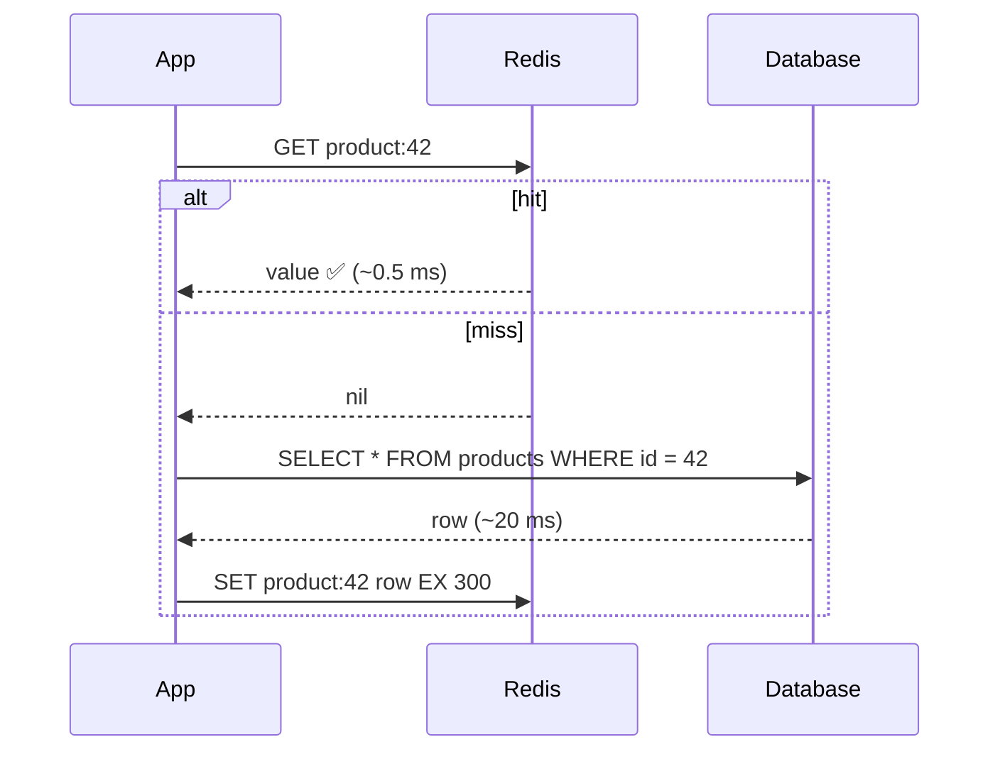
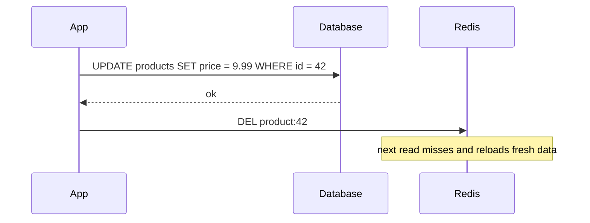
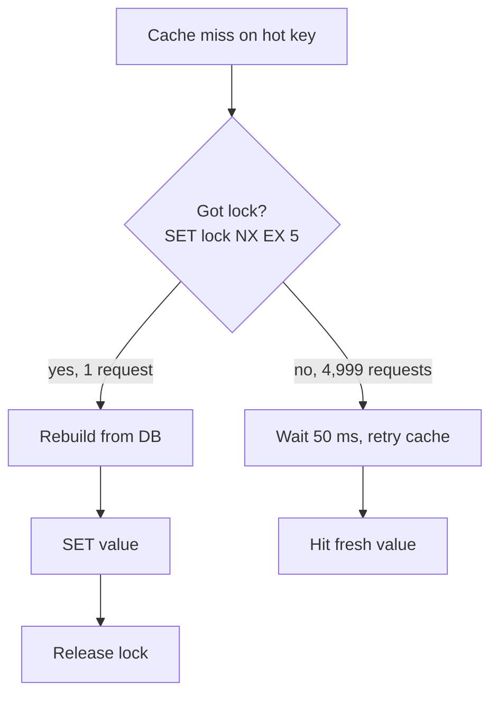
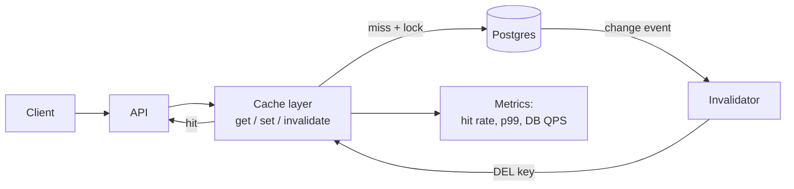
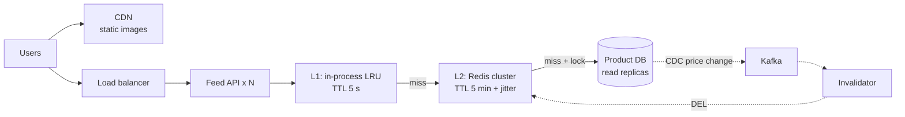

# Chapter 5 — Caching Strategies

> **Volume 4 — High-Level Design** · [Contents](index.md) · ← [Chapter 4 — Load Balancing](ch04-load-balancing.md) · Next → [Chapter 6 — Rate Limiting, Throttling & Backpressure](ch06-rate-limiting-throttling-and-backpressure.md)

---

## Concept

Cache-aside, write-through/write-around/write-back, invalidation, TTLs, stampedes, cache coherence.

**In one sentence:** a cache is a small, fast copy of slow data, and every caching strategy is a different answer to one question — *when the data changes, who updates the copy?*

**Mental model — the kitchen counter.** The database is the pantry in the basement: it holds everything, but a trip takes time. The cache is the counter next to the stove: small, fast, and only holds what you use often. Every strategy below is a rule for how food moves between pantry and counter.

**Why it matters — the latency ladder**

| Source | Typical latency | Relative to RAM cache |
|--------|-----------------|-----------------------|
| In-process memory (dict/LRU) | ~100 ns | 1× |
| Redis / Memcached (same region) | ~0.5 ms | ~5,000× |
| Database query (indexed) | ~5 ms | ~50,000× |
| Database query (complex join) | ~50–500 ms | ~1,000,000× |
| Cross-region call | ~70–150 ms | ~1,000,000× |

A 95% hit rate turns a 50 ms average read into roughly `0.95 × 0.5 + 0.05 × 50 ≈ 3 ms`.

**The four write strategies**

| Strategy | Read path | Write path | Good for | Risk |
|----------|-----------|------------|----------|------|
| **Cache-aside** (lazy loading) | App checks cache → miss → reads DB → fills cache | App writes DB, then **deletes** the cache key | Most read-heavy apps; default choice | First read after change is slow; race windows |
| **Write-through** | Read from cache | App writes cache **and** DB together (synchronously) | Data read right after write | Every write pays double latency; caches cold data |
| **Write-around** | Like cache-aside | App writes DB only; cache fills on next read | Write-once, read-rarely data (logs, uploads) | Recent writes always miss |
| **Write-back** (write-behind) | Read from cache | App writes cache only; cache flushes to DB later | Very high write rate (counters, metrics) | **Data loss** if cache dies before flush |

**Key terms**

* **TTL (time to live)** — how long a key lives before it expires. A safety net for missed invalidations.
* **Invalidation** — removing or updating a cached value when the source changes. Famously one of the two hard problems in computer science.
* **Stampede** (thundering herd, dog-piling) — a hot key expires, and thousands of requests miss at once and all hit the database.
* **Cache coherence** — keeping many copies (many cache nodes, many app servers with local caches) in agreement.
* **Hit rate** — `hits / (hits + misses)`. The single most important cache metric.
* **Eviction** — what gets thrown out when the cache is full (LRU, LFU, random).

---

## Prereqs

* [Vol 1 Ch 49 — Redis, Elasticsearch, Neo4j & Vector Databases](../volume-1-cs-foundations/ch49-redis-elasticsearch-neo4j-and-vector-databases.md) (Redis).

---

## Diagram

**Cache-aside: read path**



**Cache-aside: write path** — update the DB, then *delete* (not update) the key.



**Where each write strategy sends data**

```
 Cache-aside            Write-through          Write-around           Write-back
 ───────────            ─────────────          ────────────           ──────────
   App                     App                    App                    App
   │  write               │  write               │  write               │  write
   ▼                      ▼                      │                      ▼
   DB ──► DEL cache      Cache ──sync──► DB      ▼                     Cache
                                                 DB   (cache untouched)  │ async, batched
                                                                         ▼
                                                                         DB (later)
```

**The stampede, and three ways to stop it**

```
  t = 0          hot key "feed:home" expires
  t = 0 + 1 ms   ┌──────────────────────────────────────────────┐
                 │ 5,000 requests ── miss ── miss ── miss ──►   │ DB 💥
                 └──────────────────────────────────────────────┘
```



| Fix | Idea |
|-----|------|
| **Lock / single-flight** | Only one request rebuilds; the rest wait for its result. |
| **TTL jitter** | `ttl = 300 + random(0, 60)` so keys created together don't expire together. |
| **Early refresh** (probabilistic) | Refresh slightly *before* expiry; the closer to expiry, the more likely a request refreshes it. |

---

## Example

**Cache-aside in Python with Redis**

```python
import json, random
import redis

r = redis.Redis()
BASE_TTL = 300  # seconds

def get_product(product_id: int) -> dict:
    key = f"product:{product_id}"

    cached = r.get(key)
    if cached is not None:                       # 1. hit
        return json.loads(cached)

    row = db.fetch_product(product_id)           # 2. miss → go to DB
    ttl = BASE_TTL + random.randint(0, 60)       # 3. jitter the TTL
    r.set(key, json.dumps(row), ex=ttl)          # 4. fill the cache
    return row

def update_price(product_id: int, price: float) -> None:
    db.update_price(product_id, price)           # 1. source of truth first
    r.delete(f"product:{product_id}")            # 2. then invalidate
```

**Stampede protection with a lock**

```python
import time

def get_product_safe(product_id: int) -> dict:
    key, lock = f"product:{product_id}", f"lock:product:{product_id}"

    for _ in range(20):                          # ~1 s of retries
        cached = r.get(key)
        if cached is not None:
            return json.loads(cached)

        if r.set(lock, "1", nx=True, ex=5):      # only one caller wins
            try:
                row = db.fetch_product(product_id)
                r.set(key, json.dumps(row), ex=BASE_TTL + random.randint(0, 60))
                return row
            finally:
                r.delete(lock)

        time.sleep(0.05)                          # losers wait, then re-check

    return db.fetch_product(product_id)           # fallback: never fail the read
```

**Why "delete" beats "update" on write** — two writers racing:

```
 Writer A: UPDATE db price=10      Writer B: UPDATE db price=12
 Writer B: SET cache price=12
 Writer A: SET cache price=10      ← cache now says 10, DB says 12 ❌ (stale forever, until TTL)

 With DEL instead of SET, both writers just delete. The next read loads 12 from the DB. ✅
```

---

## Exercises

1. **Implement cache-aside.** Wrap a slow function (`time.sleep(0.2)` then return a value) with cache-aside using a Python `dict` plus expiry timestamps. Measure average latency for 1,000 reads over 50 keys.

   <details><summary>Hint</summary>Store <code>(value, expires_at)</code>. On read, treat <code>time.time() &gt; expires_at</code> as a miss. You should see the average drop from ~200 ms to under 10 ms.</details>

2. **Fix cache stampede with locking or jitter.** Start 200 threads that all read the same expired key. Count how many reach the "database". Then add a lock and count again.

   <details><summary>Solution sketch</summary>Without protection the count is close to 200. With a <code>threading.Lock</code> per key plus a second cache check after acquiring the lock (double-checked locking), the count drops to 1.</details>

3. **Pick a strategy.** For each, choose cache-aside, write-through, write-around, or write-back: (a) product catalog, (b) page-view counter, (c) uploaded audit logs, (d) user profile shown right after editing.

   <details><summary>Answer</summary>(a) cache-aside · (b) write-back · (c) write-around · (d) write-through.</details>

---

## Mini project

**A cache layer with invalidation + stampede protection.**



**Steps**

1. Build a `CacheLayer` class with `get(key, loader)`, `invalidate(key)`, and a configurable TTL + jitter.
2. Add single-flight locking so concurrent misses on one key call `loader` once.
3. Invalidate on write: every DB update calls `invalidate`.
4. Export three numbers: hit rate, p99 latency, DB queries per second.
5. Load-test with 10,000 requests where 20% of keys get 80% of traffic.

**Done when:** hit rate stays above 90%, and killing a hot key under load causes exactly one DB query.

---

## Design

**Design a caching layer for a product feed.**

Requirements: 10 M daily users; the home feed shows 50 products; prices change a few times a day; the feed must load in under 100 ms p99.



**Decisions to justify**

* **Two layers.** L1 absorbs hot-key traffic with no network hop. A short TTL keeps its staleness bounded.
* **Cache the feed *and* the products separately.** `feed:home → [ids]` and `product:{id} → details`. A price change invalidates one product, not every feed.
* **Invalidation via change-data-capture (CDC).** The DB change stream drives deletes, so no code path can "forget" to invalidate.
* **Capacity.** 1 M products × ~2 KB ≈ 2 GB. That fits in a small Redis cluster, with replicas for reads and failover.
* **Failure mode.** If Redis is down, fall back to replicas with a circuit breaker, and serve a stale L1 copy rather than an error.

---

## Open source

* [`redis/redis`](https://github.com/redis/redis) — read `src/expire.c` to see how Redis expires keys (lazy on access + active sampling), and `src/evict.c` for approximated LRU/LFU.
* [`memcached/memcached`](https://github.com/memcached/memcached) — read `items.c` and the slab allocator to see a pure cache with no persistence at all.

---

## Interview

1. **"Cache-aside vs write-through?"**
   <details><summary>Answer</summary>Cache-aside: the app manages the cache, loads lazily on miss, and deletes on write. It is simple, only caches what is read, and survives cache failure, but the first read is slow and there are race windows. Write-through: every write updates cache and DB together, so reads after writes are always fresh, but writes are slower and the cache fills with data nobody reads. Default to cache-aside; use write-through where read-after-write freshness matters.</details>

2. **"How do you invalidate safely?"**
   <details><summary>Answer</summary>Write the DB first, then delete (not set) the key. Always keep a TTL as a safety net. Drive invalidation from the DB's change stream (CDC) so no code path is missed. For strict cases, use versioned keys (<code>product:42:v7</code>) so old values can never be read as new. Add jitter and single-flight to survive the resulting misses.</details>

---

## Checklist

- [ ] set TTLs with jitter
- [ ] avoid stampedes
- [ ] treat cache coherence as a problem to solve, not ignore

---

> [Contents](index.md) · ← [Chapter 4 — Load Balancing](ch04-load-balancing.md) · Next → [Chapter 6 — Rate Limiting, Throttling & Backpressure](ch06-rate-limiting-throttling-and-backpressure.md)
