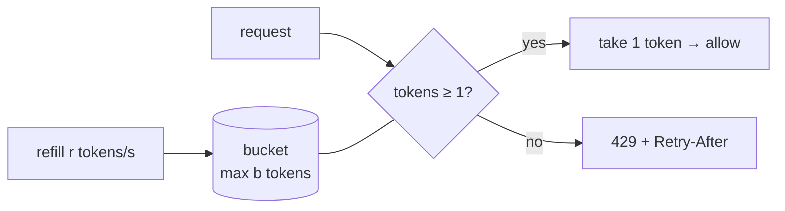
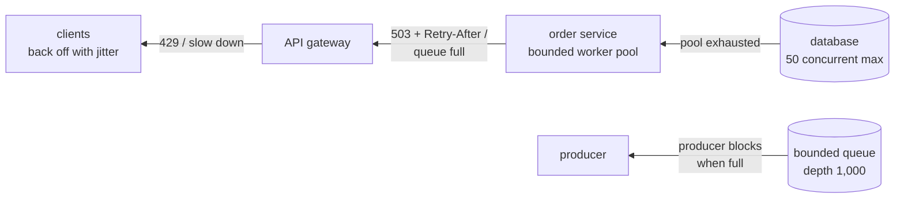
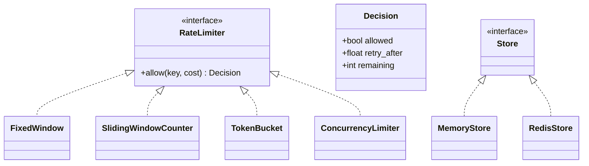
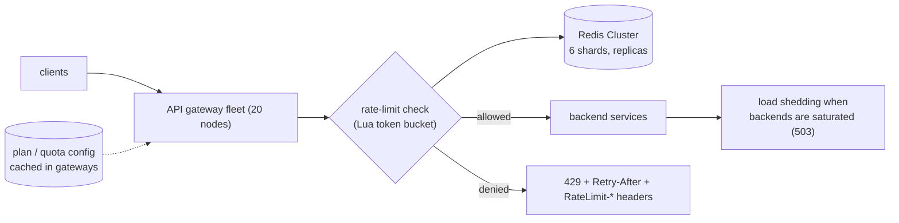

# Chapter 6 — Rate Limiting, Throttling & Backpressure

> **Volume 4 — High-Level Design** · [Contents](index.md) · ← [Chapter 5 — Caching Strategies](ch05-caching-strategies.md) · Next → [Chapter 7 — Message Queues & Streaming (Kafka, SQS, Pub/Sub)](ch07-message-queues-and-streaming-kafka-sqs-pub.md)

---

## Concept

Token bucket, leaky bucket, sliding window; distributed limits; backpressure upstream.

**In one sentence:** rate limiting caps how fast any one caller can use a resource, throttling slows callers down instead of failing them, and backpressure is the downstream system telling upstream "slow down, I'm full" — together they keep one noisy client or one traffic spike from taking everyone down.

**Mental model — a nightclub door.** The token bucket is a bouncer with a stack of wristbands that refills at a steady rate: a group can rush in if wristbands are saved up (a burst), but once they're gone, people wait. The leaky bucket is a turnstile that lets exactly one person through every few seconds no matter how many are queued. Backpressure is the bar inside telling the door "we're at capacity — stop letting people in."

**Algorithms**

| Algorithm | How | Bursts | Memory per key | Accuracy |
|-----------|-----|--------|----------------|----------|
| Fixed window counter | count per clock minute; reset at :00 | up to 2× at window edges | 1 counter | edge spikes |
| Sliding window log | store every timestamp; count those in the last 60 s | exact | O(requests) | exact |
| Sliding window counter | weighted mix of current and previous window counts | smooth | 2 counters | ~approximate, very good |
| **Token bucket** | tokens refill at rate r up to capacity b; each request takes one | **allows bursts up to b** | 2 numbers (tokens, last time) | exact for its model |
| Leaky bucket (as a queue) | requests enter a queue drained at a fixed rate | smooths bursts into a steady flow | queue | exact |
| Concurrency limit | at most N requests in flight | — | 1 counter | protects slow backends |

**Where to limit**

| Layer | Example | Protects against |
|-------|---------|------------------|
| Edge / API gateway | 100 req/min per API key | abuse, scraping, credential stuffing |
| Per tenant / plan | free: 10 rps, pro: 100 rps | noisy neighbors ([Ch 12](ch12-multi-tenancy.md)) |
| Per endpoint | login: 5/min per account+IP | brute force |
| Service to service | client-side limits, retry budgets | cascading retries |
| Around a dependency | max 50 concurrent DB queries | overload of shared resources |

**Distributed rate limiting** — with 20 gateway nodes, a limit of 100/min must be shared.

| Approach | How | Trade-off |
|----------|-----|-----------|
| Central store (Redis) | atomic `INCR` + `EXPIRE`, or a Lua script for a token bucket | accurate; adds ~1 ms and a dependency (fail open or closed?) |
| Local limits = global ÷ N | each node enforces its share | no coordination; inaccurate when traffic is uneven |
| Local + periodic sync | nodes gossip or report counts every second | approximate, fast |
| Dedicated limit service | Envoy's global rate-limit service | central policy, a gRPC hop |

**Good 429s** — return `429 Too Many Requests` with `Retry-After`, plus headers like `RateLimit-Limit`, `RateLimit-Remaining`, `RateLimit-Reset`. Clients must back off with jitter; retrying immediately makes it worse.

**Backpressure** — every buffer between producer and consumer must be **bounded**. When a queue fills: block the producer (TCP flow control, bounded channels), reject new work early (load shedding with 503), drop low-priority work, or scale consumers. An unbounded queue just converts overload into latency, then into out-of-memory crashes.

---

## Prereqs

* [Vol 1 Ch 44 — Delivery: Load Balancing, Reverse Proxies & CDN](../volume-1-cs-foundations/ch44-delivery-load-balancing-reverse-proxies-and-cdn.md)

---

## Diagram

**A token bucket filling and draining**

```
 capacity b = 5 tokens, refill r = 1 token/s
 time  0s   1s   2s   3s   3.1s  3.2s  3.3s  4s   5s
 bucket ●●●●● ●●●●● ●●●●● ●●●●●  ●●●●   ●●     ○     ●    ●●
 event                        burst of 5 requests:     one refills per second
                              5 accepted, the 6th →  429 Retry-After: 1
 long-run rate ≤ r, but a burst up to b is allowed
```



**Fixed-window edge spike vs sliding window**

```
 limit 100/min, fixed window
 12:00:59 → 100 requests ✓   12:01:00 → 100 requests ✓   = 200 in 2 seconds ✗
 sliding window counter at 12:01:15:
   estimate = current_count + previous_count × (45/60)   → blocks the second burst
```

**Backpressure signal flowing upstream**



---

## Example

```python
import time

class TokenBucket:
    def __init__(self, rate: float, capacity: int):
        self.rate, self.capacity = rate, capacity
        self.tokens, self.last = float(capacity), time.monotonic()

    def allow(self, cost: float = 1.0) -> tuple[bool, float]:
        now = time.monotonic()
        self.tokens = min(self.capacity, self.tokens + (now - self.last) * self.rate)
        self.last = now
        if self.tokens >= cost:
            self.tokens -= cost
            return True, 0.0
        return False, (cost - self.tokens) / self.rate      # seconds until allowed → Retry-After

b = TokenBucket(rate=1, capacity=5)
print([b.allow()[0] for _ in range(6)])    # [True, True, True, True, True, False]
```

```lua
-- Redis Lua token bucket: atomic across all gateway nodes
-- KEYS[1] = bucket key, ARGV = rate, capacity, now_ms, cost
local rate, cap, now, cost = tonumber(ARGV[1]), tonumber(ARGV[2]), tonumber(ARGV[3]), tonumber(ARGV[4])
local b = redis.call("HMGET", KEYS[1], "tokens", "ts")
local tokens = tonumber(b[1]) or cap
local ts = tonumber(b[2]) or now
tokens = math.min(cap, tokens + (now - ts) / 1000 * rate)
local allowed = tokens >= cost
if allowed then tokens = tokens - cost end
redis.call("HSET", KEYS[1], "tokens", tokens, "ts", now)
redis.call("PEXPIRE", KEYS[1], math.ceil(cap / rate * 1000))
return { allowed and 1 or 0, tostring(tokens) }
```

```python
# Simple fixed window with INCR + EXPIRE (good enough for many APIs)
def allow(r, key, limit=100, window=60):
    k = f"rl:{key}:{int(time.time() // window)}"
    n = r.incr(k)
    if n == 1:
        r.expire(k, window)
    return n <= limit
```

```http
HTTP/1.1 429 Too Many Requests
Retry-After: 12
RateLimit-Limit: 100
RateLimit-Remaining: 0
RateLimit-Reset: 12
Content-Type: application/json

{"error": "rate_limited", "message": "100 requests per minute. Retry in 12 s."}
```

---

## Exercises

1. Implement a token bucket.

   <details><summary>Solution</summary>See <code>TokenBucket</code>: lazy refill on each call (no background timer), a monotonic clock, fractional tokens, and it returns the wait time for <code>Retry-After</code>. Test with a fake clock: a burst of <code>capacity</code> passes, the next fails, and after <code>1/rate</code> seconds one more passes.</details>

2. Design a distributed rate limiter with Redis.

   <details><summary>Solution</summary>Each gateway calls a Lua script (atomic) keyed by <code>rl:{api_key}</code> implementing a token bucket or sliding window counter; keys expire when idle. Redis Cluster shards keys automatically. Decide the failure mode: fail open for general APIs (availability), fail closed for login or payment endpoints (security). Add a small local cache or local token pre-allocation for very high rates to cut Redis round trips.</details>

3. Why is an unbounded in-memory queue in front of a slow service dangerous?

   <details><summary>Solution</summary>Under sustained overload it grows without limit: latency rises until requests time out (so the work is wasted), memory grows until the process crashes, and on restart all work is lost. Bound it and reject or shed load when full, so callers get fast, clear feedback.</details>

---

## Mini project

**A rate limiter library with multiple algorithms.**



**Steps**

1. A common interface returning allowed, remaining, and retry-after.
2. Four algorithms, each with an in-memory and a Redis (Lua) store.
3. ASGI middleware that applies a policy per route and per API key and emits standard headers.
4. Tests with a fake clock: edge-of-window bursts, refill, concurrency limits.
5. Benchmark overhead per request (local vs Redis) and show the fixed-window edge spike on a chart.

**Done when:** all algorithms share one interface, the middleware returns correct 429 headers, and the chart shows sliding window and token bucket smoothing the edge spike.

---

## Design

**Design a rate limiter for a public API.**

Requirements: 50k API keys, plans (free 10 rps / pro 100 rps / enterprise custom), 200k total RPS at peak, < 2 ms added latency, limits accurate within ~5%.



**Capacity:** 200k checks/s ÷ 6 Redis shards ≈ 33k ops/s per shard — well within one Redis node (~100k+ ops/s). Memory: 50k keys × ~100 B ≈ 5 MB. Latency: one round trip ≈ 0.5–1 ms in the same zone.

**Decisions to justify**

* **Token bucket** per API key: allows short bursts (good developer experience) while enforcing the long-run rate.
* **Central Redis with Lua** for accuracy; keys hash-sharded; local pre-fetching of tokens for the few very high-volume enterprise keys.
* **Fail open** if Redis is unreachable (keep serving, rely on backend load shedding), but **fail closed** for auth endpoints.
* **Multiple layers:** per key (fairness), per IP at the edge (abuse), per endpoint for expensive operations, plus concurrency limits in front of the DB.
* **Transparent to clients:** standard headers and docs so SDKs back off correctly.

---

## Open source

* [`envoyproxy/envoy`](https://github.com/envoyproxy/envoy) (rate limiting) — local token-bucket filter plus the external global rate-limit service (`envoyproxy/ratelimit`, backed by Redis).
* [`redis/redis`](https://github.com/redis/redis) (INCR+EXPIRE) — atomic counters and Lua scripting are the basis of most distributed limiters; see also Stripe's and Cloudflare's engineering posts on rate limiting.

---

## Interview

1. **"Token bucket vs sliding window?"**
   <details><summary>Answer</summary>A token bucket enforces an average rate but allows bursts up to the bucket size — good for APIs where short bursts are fine. It's cheap: two numbers per key. A sliding window enforces "at most N in any rolling window" — no bursts beyond N; the log version is exact but stores every timestamp, while the counter version approximates with two counters. Pick the bucket when bursts are acceptable, the window when strict per-window caps matter.</details>

2. **"How do you rate-limit across nodes?"**
   <details><summary>Answer</summary>Share state: an atomic operation in a central store such as Redis (a Lua script for a token bucket, or INCR+EXPIRE for fixed windows), sharded by key. Or approximate: split the limit across N nodes, or sync local counters periodically. Decide the fail-open/fail-closed behavior, keep the extra latency low (same-zone Redis, pipelining, local token pre-allocation), and return consistent headers from every node.</details>

---

## Checklist

- [ ] bound every public endpoint
- [ ] return clear 429s
- [ ] propagate backpressure

---

> [Contents](index.md) · ← [Chapter 5 — Caching Strategies](ch05-caching-strategies.md) · Next → [Chapter 7 — Message Queues & Streaming (Kafka, SQS, Pub/Sub)](ch07-message-queues-and-streaming-kafka-sqs-pub.md)
