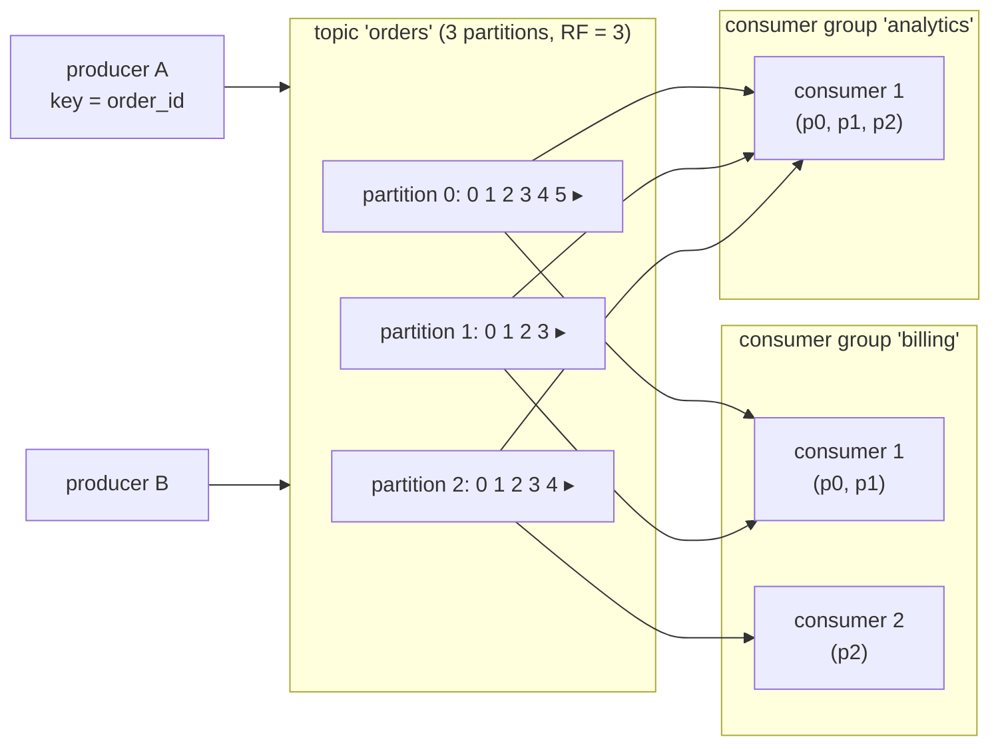
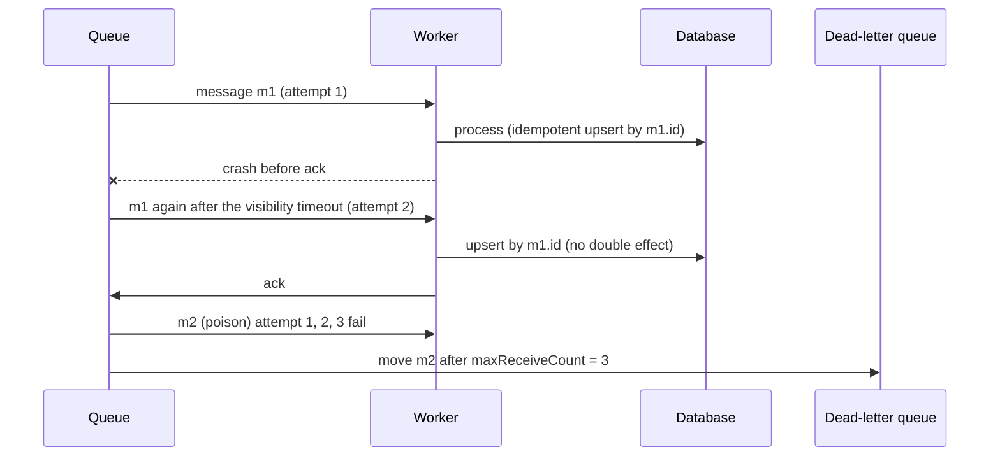
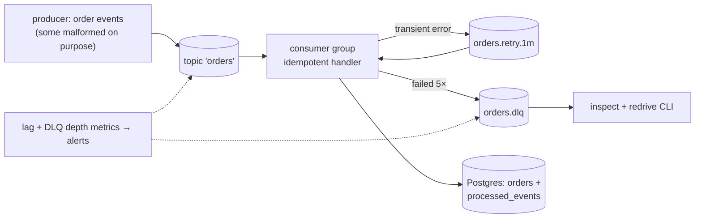
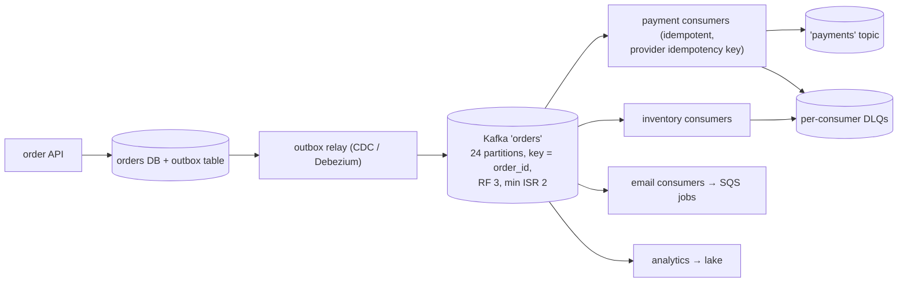

# Chapter 7 — Message Queues & Streaming (Kafka, SQS, Pub/Sub)

> **Volume 4 — High-Level Design** · [Contents](index.md) · ← [Chapter 6 — Rate Limiting, Throttling & Backpressure](ch06-rate-limiting-throttling-and-backpressure.md) · Next → [Chapter 8 — Service Mesh & Service Discovery](ch08-service-mesh-and-service-discovery.md)

---

## Concept

Queues vs logs, at-least/at-most/exactly-once, ordering, DLQs, and stream processing.

**In one sentence:** a message broker lets producers hand off work or events without waiting for consumers — a *queue* hands each message to one worker and forgets it, a *log* keeps an ordered history that many consumers read at their own pace — and every design must decide what happens when a message is lost, duplicated, or out of order.

**Mental model — a bakery's order tickets vs a newspaper archive.** A queue (SQS, RabbitMQ) is the ticket spike in a kitchen: each ticket is taken by exactly one cook and thrown away when done. A log (Kafka, Pulsar, Kinesis) is a newspaper archive: every edition is kept in order, and each reader (consumer group) has a bookmark (offset) — they can read at different speeds or start again from the beginning.

**Queue vs log**

| | Queue (SQS, RabbitMQ) | Log / stream (Kafka, Kinesis, Pulsar) |
|-|-----------------------|----------------------------------------|
| After consumption | deleted (acked) | **retained** (hours to forever) |
| Consumers | competing workers share the messages | many independent **consumer groups**, each sees everything |
| Ordering | none (SQS standard) or FIFO per group | **per partition** |
| Replay | no | yes: reset the offset |
| Scaling | add workers | add partitions (≤ one consumer per partition per group) |
| Per-message features | visibility timeout, delays, priorities, per-message ack | offsets, compaction, very high throughput |
| Best for | job/task queues, work distribution | event streams, CDC, analytics, event sourcing, fan-out to many systems |

**Delivery semantics**

| Semantic | How | Risk |
|----------|-----|------|
| At most once | ack/commit *before* processing | a crash loses the message |
| **At least once** (the usual default) | ack *after* processing | a crash after processing → redelivery → duplicates |
| "Exactly once" | at-least-once delivery + **idempotent processing** (dedup by message ID, upserts, offsets stored with results), or Kafka transactions for read-process-write within Kafka | only end-to-end if every side effect is idempotent or transactional |

**Rule:** design every consumer to be idempotent. "Exactly once" at the broker doesn't cover your database or the email you sent.

**Ordering** — Kafka guarantees order only *within a partition*. Pick the partition key so that everything needing order shares it (`order_id`, `account_id`). A global order means one partition = no parallelism. SQS FIFO orders within a `MessageGroupId`.

**Failures and DLQs** — after N failed attempts, move the message to a **dead-letter queue** so one poison message doesn't block the rest; alert on DLQ depth; provide a redrive tool. Use exponential backoff between retries (delay queues or retry topics).

**Consumer-group rebalance (Kafka)** — when a consumer joins, leaves, or stops heartbeating, partitions are reassigned among the group. During a rebalance consumption pauses and uncommitted work may be redone (another reason for idempotency). Cooperative-sticky assignment and static membership reduce the disruption.

---

## Prereqs

* [Vol 1 Ch 43 — WebSockets, gRPC, MQTT & SSE](../volume-1-cs-foundations/ch43-websockets-grpc-mqtt-and-sse.md)
* [Vol 1 Ch 49 — Redis, Elasticsearch, Neo4j & Vector Databases](../volume-1-cs-foundations/ch49-redis-elasticsearch-neo4j-and-vector-databases.md)

---

## Diagram

**Producer → broker → consumer group with partitions and offsets**



```
 partition 0:  [0][1][2][3][4][5] ▸ new messages append here
                        ▲ billing committed offset = 3  (lag = 2)
                              ▲ analytics committed offset = 5 (lag = 0)
 each group keeps its own bookmark; messages stay until retention expires
```

**At-least-once with a DLQ**



---

## Example

```python
# Kafka consumer: at-least-once + idempotent processing (confluent-kafka)
from confluent_kafka import Consumer
import json

c = Consumer({
    "bootstrap.servers": "localhost:9092",
    "group.id": "billing",
    "enable.auto.commit": False,                 # commit only after processing
    "auto.offset.reset": "earliest",
    "partition.assignment.strategy": "cooperative-sticky",
})
c.subscribe(["orders"])

while True:
    msg = c.poll(1.0)
    if msg is None or msg.error():
        continue
    event = json.loads(msg.value())
    with db.transaction():
        # idempotent: the unique constraint on event_id makes redelivery harmless
        db.execute("INSERT INTO processed_events (event_id) VALUES (%s) ON CONFLICT DO NOTHING RETURNING 1",
                   (event["event_id"],))
        if db.rowcount == 1:
            charge(event)                        # side effect only on first delivery
    c.commit(message=msg, asynchronous=False)
```

```python
# SQS with a DLQ (boto3)
import boto3, json
sqs = boto3.client("sqs")
dlq_arn = sqs.get_queue_attributes(QueueUrl=DLQ_URL, AttributeNames=["QueueArn"])["Attributes"]["QueueArn"]
sqs.set_queue_attributes(QueueUrl=JOBS_URL, Attributes={
    "RedrivePolicy": json.dumps({"deadLetterTargetArn": dlq_arn, "maxReceiveCount": "5"}),
    "VisibilityTimeout": "60",                   # longer than the worst-case processing time
})

while True:
    resp = sqs.receive_message(QueueUrl=JOBS_URL, MaxNumberOfMessages=10, WaitTimeSeconds=20)  # long polling
    for m in resp.get("Messages", []):
        handle(json.loads(m["Body"]))            # must be idempotent
        sqs.delete_message(QueueUrl=JOBS_URL, ReceiptHandle=m["ReceiptHandle"])   # the "ack"
```

```bash
kafka-topics.sh --create --topic orders --partitions 12 --replication-factor 3 --config min.insync.replicas=2
kafka-consumer-groups.sh --describe --group billing        # lag per partition
```

---

## Exercises

1. Design exactly-once processing for a payment.

   <details><summary>Solution</summary>You can't get exactly-once <i>delivery</i>, so make the <i>effect</i> happen once. Each payment event has a stable <code>payment_id</code>. The consumer writes a row keyed by <code>payment_id</code> (unique constraint) and the charge record in one DB transaction, and passes <code>payment_id</code> as the idempotency key to the payment provider. Only then commit the offset. A redelivery hits the unique constraint and the provider returns the original result. Use the outbox pattern ([Ch 10](ch10-event-driven-systems.md)) for publishing follow-up events.</details>

2. Explain a consumer-group rebalance.

   <details><summary>Solution</summary>The group coordinator tracks members through heartbeats. When one joins, leaves, or misses heartbeats (or exceeds <code>max.poll.interval.ms</code>), a rebalance reassigns partitions. With the eager protocol all consumers stop and give up their partitions; with cooperative-sticky only the moved partitions pause. Uncommitted offsets on moved partitions are reprocessed by the new owner — hence idempotency. Static membership (<code>group.instance.id</code>) avoids rebalances on quick restarts.</details>

3. You need per-customer ordering but high throughput. How do you partition?

   <details><summary>Solution</summary>Partition by <code>customer_id</code>: each customer's events stay ordered in one partition, while different customers spread across many partitions and consumers. Watch for hot customers and choose enough partitions up front (increasing them later changes the key → partition mapping).</details>

---

## Mini project

**A producer/consumer pipeline with retries and a dead-letter queue.**



**Steps**

1. Run Redpanda or Kafka locally (or LocalStack SQS).
2. A producer emits order events keyed by `order_id`, 2% malformed and 5% "transient failure".
3. A consumer with manual commits and idempotent writes (dedup table).
4. Retry topics with increasing delays; after 5 attempts send the message to a DLQ with the error attached.
5. A CLI to inspect and redrive DLQ messages after a fix.
6. Chaos: kill consumers mid-batch and add consumers during load (rebalance); verify no duplicates and no loss.

**Done when:** after chaos runs, every valid order is in the DB exactly once, every poison message is in the DLQ with a reason, and lag returns to zero.

---

## Design

**Design an order-processing pipeline on a queue.**

Requirements: 5,000 orders/s at peak, each order triggers payment, inventory, email, and analytics; per-order ordering; no lost or double-charged orders.



**Capacity:** 5,000 events/s × ~1 KB = 5 MB/s in; with 4 consumer groups ≈ 20 MB/s out — small for Kafka. Partitions: if one payment consumer handles ~250 events/s (payment API latency), 5,000 ÷ 250 = 20 consumers → **24 partitions** for headroom. Retention of 7 days: 5 MB/s × 604,800 s ≈ 3 TB × 3 replicas ≈ 9 TB.

**Decisions to justify**

* **Log (Kafka) over a queue** because four independent systems each need every order and replay is valuable.
* **The outbox pattern** so the DB write and the event publish can't disagree.
* **Key by `order_id`** for per-order ordering; no global ordering needed.
* **At-least-once everywhere + idempotent consumers**; payment uses the provider's idempotency key.
* **Retry topics + DLQs** per consumer group so one failing integration doesn't stall the others; alerts on consumer lag and DLQ depth.

---

## Open source

* [`apache/kafka`](https://github.com/apache/kafka) — partitions, replication (ISR), consumer groups, transactions; the "Design" section of the docs is essential reading.
* [`aws/aws-sdk`](https://github.com/aws/aws-sdk) (SQS) — SQS semantics: visibility timeouts, long polling, FIFO groups, and redrive policies.

---

## Interview

1. **"Queue vs stream (Kafka vs SQS)?"**
   <details><summary>Answer</summary>A queue (SQS) distributes tasks: each message goes to one consumer and is deleted on ack; it offers per-message retries, visibility timeouts, and easy scaling of workers, but no replay and little ordering. A stream (Kafka) is a retained, partitioned log: many consumer groups read independently, can replay, and keep order per partition, with very high throughput — but you manage partitions, offsets, and rebalances, and per-message retry is DIY. Use queues for jobs, logs for events that many systems consume.</details>

2. **"How do you guarantee ordering?"**
   <details><summary>Answer</summary>Only within a partition (Kafka) or message group (SQS FIFO). Route all messages that must be ordered relative to each other with the same key, process each partition with a single consumer at a time, and keep retries from reordering (retry in place or park the key). Avoid needing a global order — it removes all parallelism. Consumers can also use sequence numbers to detect gaps and out-of-order events.</details>

---

## Checklist

- [ ] pick delivery semantics explicitly
- [ ] use DLQs
- [ ] keep consumers idempotent

---

> [Contents](index.md) · ← [Chapter 6 — Rate Limiting, Throttling & Backpressure](ch06-rate-limiting-throttling-and-backpressure.md) · Next → [Chapter 8 — Service Mesh & Service Discovery](ch08-service-mesh-and-service-discovery.md)
