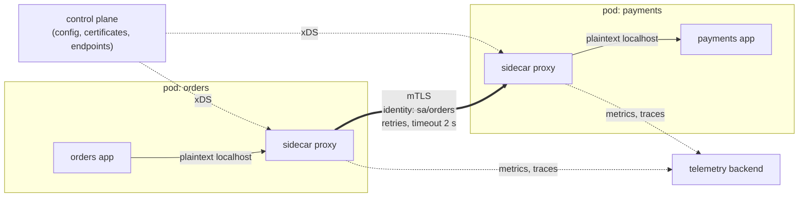
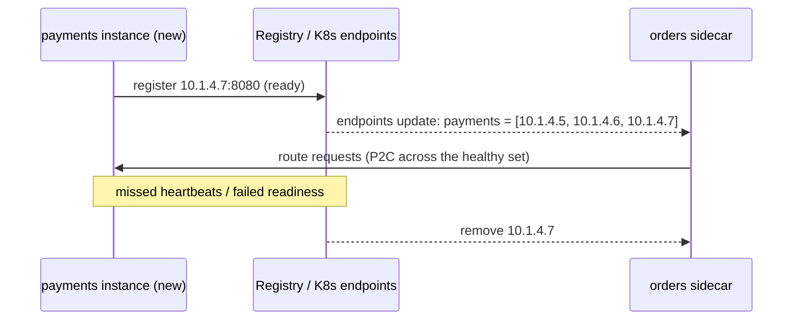
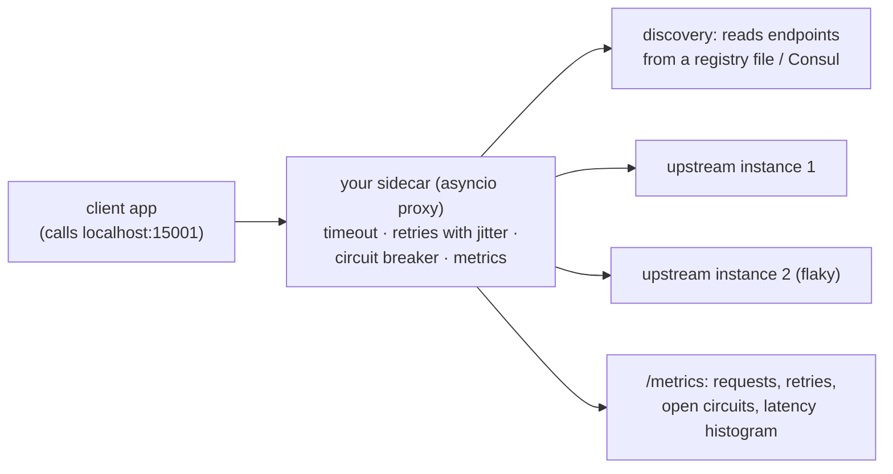
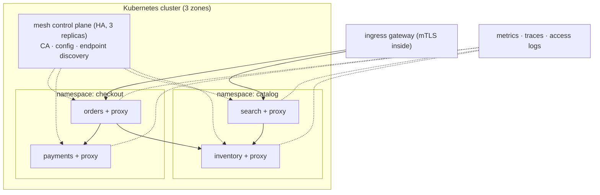

# Chapter 8 — Service Mesh & Service Discovery

> **Volume 4 — High-Level Design** · [Contents](index.md) · ← [Chapter 7 — Message Queues & Streaming (Kafka, SQS, Pub/Sub)](ch07-message-queues-and-streaming-kafka-sqs-pub.md) · Next → [Chapter 9 — Database Scaling](ch09-database-scaling.md)

---

## Concept

Sidecars, discovery, mTLS, retries/timeouts/circuit breaking at the mesh layer; when a mesh earns its cost.

**In one sentence:** service discovery answers "where are the healthy instances of service X right now?", and a service mesh moves the networking plumbing every service needs — encryption, identity, retries, timeouts, circuit breaking, metrics — out of application code into a proxy next to each service, configured centrally.

**Mental model — a city's taxi dispatch.** Discovery is the dispatch radio that always knows where each taxi is. A service mesh gives every business its own trained driver (a sidecar proxy) who knows the routes, checks IDs at the door (mTLS), takes a different road when one is blocked (retries), and reports every trip to the city office (telemetry). The businesses (services) just say "take me to billing".

**Service discovery**

| Approach | How | Examples |
|----------|-----|----------|
| DNS-based | a name resolves to the current instances | Kubernetes Services (`billing.default.svc.cluster.local`), Consul DNS |
| Client-side registry | the client queries a registry and picks an instance | Eureka, Consul API, gRPC xDS |
| Server-side (LB) | the client calls a fixed LB that knows the instances | AWS ALB target groups |
| Registration | instances register and heartbeat, or the platform registers them | K8s endpoints, Consul agents |

**What a mesh gives you (without code changes)**

| Capability | How |
|------------|-----|
| **mTLS everywhere** | each workload gets a short-lived certificate (SPIFFE identity); sidecars encrypt and authenticate every call |
| Authorization policies | "only `orders` may call `payments` on `POST /charge`" |
| Timeouts, retries, retry budgets | per route, in config |
| Circuit breaking / outlier detection | eject failing instances; limit pending requests |
| Traffic shifting | canaries, mirroring, fault injection |
| Uniform telemetry | golden metrics, traces, and access logs for every hop |

**Architecture** — the **data plane** is the proxies (Envoy sidecars, Linkerd's Rust micro-proxies, or per-node "ambient" proxies); the **control plane** (istiod, Linkerd control plane) distributes config, certificates, and endpoints to them.

**How mTLS works in a mesh**

1. The control plane acts as a certificate authority; each workload proves its identity (Kubernetes service account token) and receives a short-lived cert (hours) with a SPIFFE ID like `spiffe://cluster.local/ns/shop/sa/orders`.
2. Traffic from the app goes in plaintext to its local sidecar (iptables redirect).
3. The client sidecar opens TLS to the server sidecar; **both present certificates** and verify them against the mesh CA.
4. The server sidecar checks authorization policy on the caller's identity, then forwards to its app.
5. Certificates rotate automatically.

**When a mesh earns its cost**

| Worth it | Probably not worth it |
|----------|----------------------|
| dozens+ of services, several languages | a monolith or a handful of services |
| zero-trust / compliance needs mTLS everywhere | one team, one language — a shared library does it |
| teams need consistent traffic policy and telemetry | no one to own and upgrade the mesh |
| frequent canaries and traffic shaping | latency budget can't afford an extra proxy hop per call (~0.5–2 ms) |

Costs: extra CPU and memory per pod, added latency, operational complexity, upgrades, harder debugging. Sidecarless modes (Istio ambient, Cilium) reduce some costs.

---

## Prereqs

* [Chapter 4 — Load Balancing](ch04-load-balancing.md)
* [Vol 3 Ch 14 — Resilience Patterns (Idempotency, Retries, Backoff, Circuit Breakers)](../volume-3-low-level-design/ch14-resilience-patterns-idempotency-retries-backoff-circuit-breakers.md)

---

## Diagram

**A service mesh with sidecars intercepting traffic**



**A discovery registry**



**Retries at the mesh layer need budgets**

```
 without budgets: A → B → C, each layer retries 3×  → one failing call at C = 3 × 3 = 9+ calls
 with a retry budget (e.g. retries ≤ 20% of requests) and retries only at one layer → bounded load
```

---

## Example

```yaml
# Istio: strict mTLS in the namespace
apiVersion: security.istio.io/v1
kind: PeerAuthentication
metadata: { name: default, namespace: shop }
spec: { mtls: { mode: STRICT } }
---
# Only 'orders' may POST to payments' /charge
apiVersion: security.istio.io/v1
kind: AuthorizationPolicy
metadata: { name: payments-allow-orders, namespace: shop }
spec:
  selector: { matchLabels: { app: payments } }
  rules:
    - from: [{ source: { principals: ["cluster.local/ns/shop/sa/orders"] } }]
      to:   [{ operation: { methods: ["POST"], paths: ["/charge"] } }]
---
# Timeouts + retries per route
apiVersion: networking.istio.io/v1
kind: VirtualService
metadata: { name: payments, namespace: shop }
spec:
  hosts: [payments]
  http:
    - timeout: 2s
      retries: { attempts: 2, perTryTimeout: 800ms, retryOn: "5xx,reset,connect-failure" }
      route: [{ destination: { host: payments } }]
---
# Circuit breaking + outlier detection
apiVersion: networking.istio.io/v1
kind: DestinationRule
metadata: { name: payments, namespace: shop }
spec:
  host: payments
  trafficPolicy:
    connectionPool: { http: { http1MaxPendingRequests: 100, maxRequestsPerConnection: 100 } }
    outlierDetection: { consecutive5xxErrors: 5, interval: 10s, baseEjectionTime: 30s, maxEjectionPercent: 50 }
```

```bash
linkerd install --crds | kubectl apply -f - && linkerd install | kubectl apply -f -
kubectl annotate ns shop linkerd.io/inject=enabled      # sidecars injected on the next rollout
linkerd viz stat deploy -n shop                         # success rate, RPS, p50/p95/p99 per service
```

---

## Exercises

1. Explain how mTLS works in a mesh.

   <details><summary>Solution</summary>The mesh CA issues each workload a short-lived certificate encoding its identity (SPIFFE ID derived from the service account). Apps send plaintext to the local sidecar; sidecars establish mutual TLS, each verifying the other's certificate chain against the mesh CA; the server side checks authorization policies against the caller's identity. Certificates rotate automatically, so no one handles keys by hand, and the network itself is no longer trusted (zero trust).</details>

2. Configure retries/timeouts at the mesh layer.

   <details><summary>Solution</summary>See the VirtualService: an overall timeout of 2 s, 2 attempts with an 800 ms per-try timeout, retrying only on 5xx, resets, and connect failures — only for idempotent routes. Remove retries from application code (or the mesh) so they don't multiply, and add a retry budget. Verify with fault injection (<code>fault.abort</code> 20% of requests) that callers still succeed.</details>

3. Why can retries at several layers turn a small outage into a big one?

   <details><summary>Solution</summary>Retries multiply: 3 retries at each of 3 layers means up to 27 attempts reaching the deepest service for one user request, exactly when it is struggling. Retry at one layer, use budgets, add jittered backoff, and let circuit breakers stop the flood.</details>

---

## Mini project

**A toy sidecar that adds a timeout + retry to a service.**



**Steps**

1. An HTTP proxy listening on localhost that forwards to an upstream picked from a registry (a JSON file you edit, or Consul).
2. Per-try timeout, total timeout, and up to 2 retries with jittered backoff for GET only.
3. A circuit breaker per upstream instance (open after 5 consecutive failures, half-open after 10 s).
4. Prometheus metrics for requests, retries, ejected endpoints, and latency.
5. Make one upstream flaky and slow; show the client's success rate with and without the sidecar.

**Done when:** the client's code is unchanged, and the sidecar alone raises its success rate from ~80% to >99% against a flaky upstream.

---

## Design

**Design service discovery + resilience for a microservice fleet.**

Scope: 60 services, 3 languages, 2,000 pods across 3 zones, 50k internal RPS; compliance requires encryption and identity on every internal call.



**Capacity:** ~0.5–1 ms added latency per hop and ~50–100 MB RAM plus ~0.1–0.2 vCPU per sidecar at this traffic: 2,000 pods × 75 MB ≈ 150 GB RAM and ~300 vCPU for proxies — a real cost to compare against building the same features into three language libraries. Ambient or node-level proxies cut this substantially.

**Decisions to justify**

* **Kubernetes DNS + mesh xDS** for discovery; no separate registry to operate.
* **A mesh (Linkerd for simplicity, or Istio for richer policy)** because of 60 services in 3 languages plus a mandatory mTLS requirement; one team owns it.
* **STRICT mTLS + default-deny authorization**, allow-listing call paths by service identity.
* **Timeouts on every route; retries only for idempotent routes, only at the mesh, with budgets;** outlier detection and connection limits for circuit breaking.
* **Progressive delivery** via mesh traffic splitting; fault-injection drills per quarter.

---

## Open source

* [`linkerd/linkerd2`](https://github.com/linkerd/linkerd2) — a lightweight mesh with a Rust micro-proxy; automatic mTLS with nearly zero config.
* [`istio/istio`](https://github.com/istio/istio) — an Envoy-based mesh with rich traffic and security policy, and a sidecarless "ambient" mode. See also SPIFFE/SPIRE for workload identity.

---

## Interview

1. **"What does a service mesh give you?"**
   <details><summary>Answer</summary>Consistent, language-independent networking features without app code changes: mutual TLS and workload identity, service-to-service authorization, timeouts, retries, circuit breaking, load balancing, traffic shifting for canaries, fault injection, and uniform metrics and traces for every hop — all configured centrally by the control plane.</details>

2. **"Sidecar pros/cons?"**
   <details><summary>Answer</summary>Pros: transparent to the app, works for any language, isolates networking logic, and upgrades independently of the service. Cons: an extra proxy hop per call (latency), CPU and memory per pod (multiplied across the fleet), startup and shutdown ordering issues, more moving parts to debug and upgrade. Node-level or sidecarless designs (ambient, eBPF) trade some isolation for lower overhead.</details>

---

## Checklist

- [ ] standardize mTLS
- [ ] centralize retries/timeouts
- [ ] know when *not* to use a mesh

---

> [Contents](index.md) · ← [Chapter 7 — Message Queues & Streaming (Kafka, SQS, Pub/Sub)](ch07-message-queues-and-streaming-kafka-sqs-pub.md) · Next → [Chapter 9 — Database Scaling](ch09-database-scaling.md)
