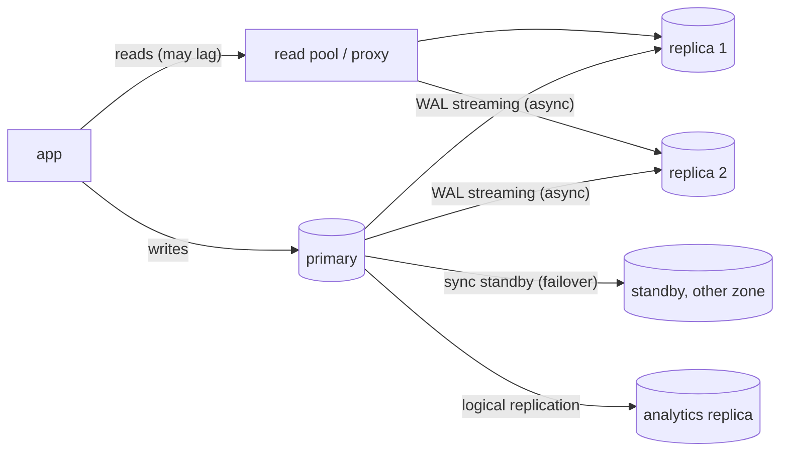
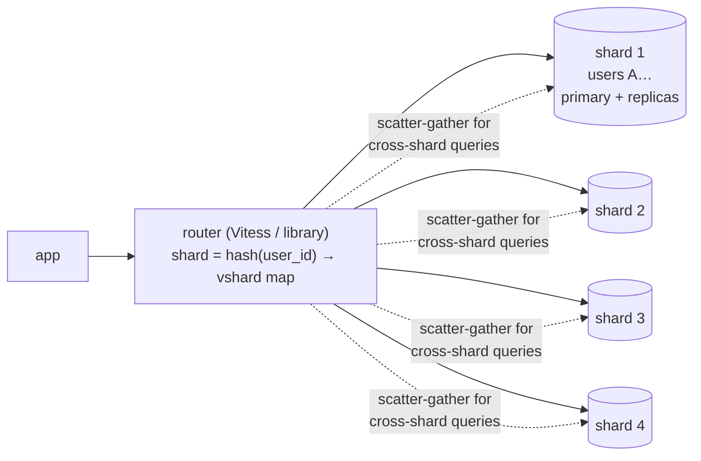
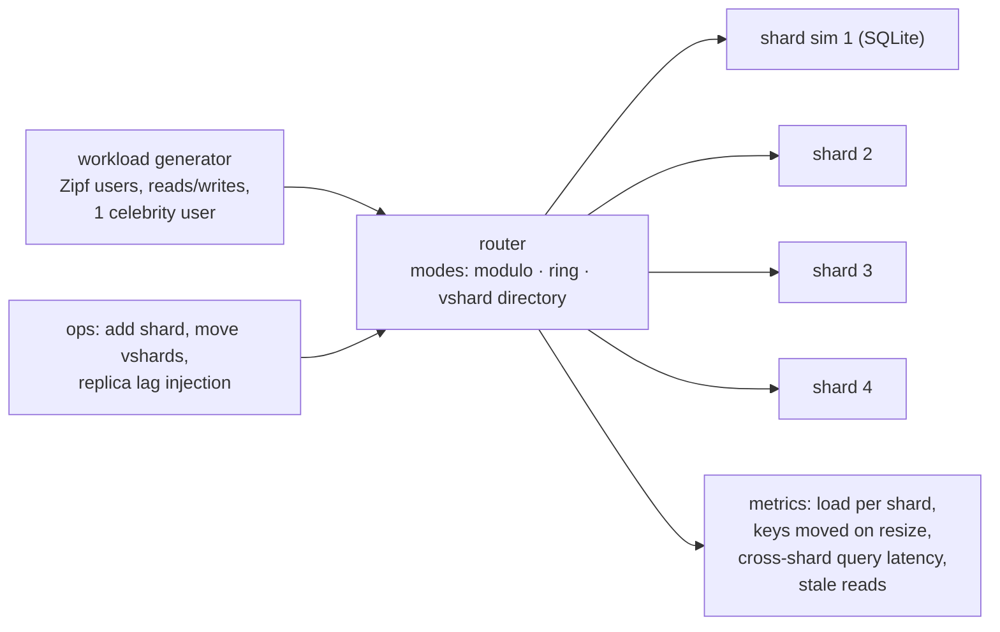
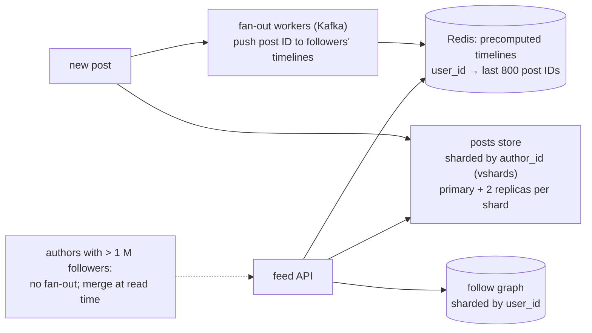

# Chapter 9 — Database Scaling

> **Volume 4 — High-Level Design** · [Contents](index.md) · ← [Chapter 8 — Service Mesh & Service Discovery](ch08-service-mesh-and-service-discovery.md) · Next → [Chapter 10 — Event-Driven Systems](ch10-event-driven-systems.md)

---

## Concept

Read replicas, caching, sharding (key selection), partitioning, and the read/write split.

**In one sentence:** you scale a database in steps — tune queries and indexes, scale the machine up, add a cache and read replicas for reads, partition large tables, and only then shard writes across many databases by a carefully chosen key — because each step adds complexity the previous one didn't.

**Mental model — a busy library.** First you organize the shelves better (indexes). Then you hire a bigger building (vertical scaling). Then you put photocopies of popular books at a front desk (cache) and open branch libraries with copies of the whole collection for reading only (read replicas). When even writing new books into the catalog overwhelms one building, you split the collection by author's last name across several buildings (sharding) — and now finding "all books about cats" means visiting every building.

**The scaling ladder (climb in order)**

| Step | Helps | Cost |
|------|-------|------|
| 1. Query + index tuning ([Vol 1 Ch 46](../volume-1-cs-foundations/ch46-schema-design-normalization-and-indexing.md)), connection pooling (PgBouncer) | everything | engineering time |
| 2. Vertical scaling | everything, instantly | money; a ceiling |
| 3. Caching ([Ch 5](ch05-caching-strategies.md)) | read-heavy hot data | invalidation, staleness |
| 4. **Read replicas** | read throughput, reporting isolation | replication lag → stale reads |
| 5. Table **partitioning** (one DB) | huge tables: time-based retention, index size | partition-key-aware queries |
| 6. Functional split | different domains on different DBs | cross-domain joins disappear |
| 7. **Sharding** | write throughput and data size beyond one node | cross-shard queries and transactions, resharding, operations |

**Read/write split and its consistency cost** — writes go to the primary; reads go to replicas. Asynchronous replicas lag (milliseconds, sometimes seconds under load), so a user who just saved a profile may read the old one. Fixes: read-your-writes routing (read from the primary for a few seconds after a write, or wait until the replica has reached the write's LSN), sticky routing for critical reads, and monitoring replica lag.

**Choosing a shard key**

| Good key | Why | Watch out |
|----------|-----|-----------|
| `tenant_id` / `user_id` | most queries are "for this user"; spreads evenly | whale tenants → dedicated shards |
| hash of an entity ID | even distribution | range queries across the whole set need scatter-gather |
| composite `(user_id, time bucket)` | bounds per-key growth | more complex routing |
| **Bad:** `created_at`, `country`, `status` | all new writes hit one shard; low cardinality | **hot shards** |

**Hot spots** — a celebrity account, a viral post, or a monotonically increasing key concentrates load. Mitigations: hash the key, add salt/suffix buckets for hot keys, give whales dedicated shards, cache hot reads.

**Cross-shard queries** — scatter-gather to all shards and merge (slower, tail latency adds up); maintain global secondary indexes or denormalized lookup tables; route analytics to a warehouse instead; avoid cross-shard transactions (use sagas instead, [Vol 3 Ch 12](../volume-3-low-level-design/ch12-event-bus-cqrs-and-event-sourcing.md)).

**Routing** — the application computes the shard (a library), or a proxy does (Vitess, Citus, ProxySQL), using consistent hashing or a directory (key → shard map) that makes moving data easier.

---

## Prereqs

* [Vol 1 Ch 45 — SQL & the Relational Model](../volume-1-cs-foundations/ch45-sql-and-the-relational-model.md)
* [Vol 1 Ch 46 — Schema Design, Normalization & Indexing](../volume-1-cs-foundations/ch46-schema-design-normalization-and-indexing.md)
* [Vol 1 Ch 47 — ACID, Transactions & Isolation](../volume-1-cs-foundations/ch47-acid-transactions-and-isolation.md)

---

## Diagram

**A primary + replicas diagram**



**Replication lag and read-your-writes**

```
 t=0 ms   user saves name "Ada"  → primary (LSN 1000)
 t=5 ms   user reloads            → replica at LSN 990 → shows the OLD name ✗
 fix: after a write, remember LSN 1000 in the session; route reads to a replica only
      once it has replayed ≥ 1000 (or read from the primary for ~2 s)
```

**A sharded database with a routing layer**



**A hot shard**

```
 shard key = created_date      today's shard  ████████████████████  (100% of writes)
                               other shards   ░                      (idle)
 shard key = hash(user_id)     shard 1..4     █████ █████ █████ █████  (even)
```

---

## Example

```sql
-- Declarative partitioning in Postgres (one database, many partitions)
CREATE TABLE events (
  id          bigint GENERATED ALWAYS AS IDENTITY,
  user_id     bigint NOT NULL,
  occurred_at timestamptz NOT NULL,
  payload     jsonb,
  PRIMARY KEY (id, occurred_at)
) PARTITION BY RANGE (occurred_at);

CREATE TABLE events_2024_05 PARTITION OF events FOR VALUES FROM ('2024-05-01') TO ('2024-06-01');
CREATE TABLE events_2024_06 PARTITION OF events FOR VALUES FROM ('2024-06-01') TO ('2024-07-01');
-- retention: DROP TABLE events_2023_05;   (instant, instead of a huge DELETE)
-- queries with WHERE occurred_at … touch only the relevant partitions (partition pruning)
```

```python
# Application-level shard routing with a directory of virtual shards
import hashlib

N_VSHARDS = 1024                                 # fixed; many more than physical shards
VSHARD_TO_DB = {v: f"db{v % 4}" for v in range(N_VSHARDS)}   # directory: move vshards to rebalance

def vshard(user_id: int) -> int:
    return int.from_bytes(hashlib.md5(str(user_id).encode()).digest()[:4], "big") % N_VSHARDS

def db_for(user_id: int) -> str:
    return VSHARD_TO_DB[vshard(user_id)]

print(db_for(42), db_for(43))
# Adding db4: move some vshards' data, then update the directory entries — no global rehash.
```

```python
# Read-your-writes with replicas
def read_profile(session, user_id):
    recent_write = session.get("last_write_ts", 0) > time.time() - 2
    conn = primary if recent_write else replicas.pick()
    return conn.execute("SELECT * FROM profiles WHERE user_id = %s", (user_id,)).fetchone()
```

---

## Exercises

1. Choose a shard key and explain hot spots.

   <details><summary>Solution</summary>For a multi-tenant SaaS: <code>tenant_id</code> — nearly every query filters by tenant, so queries stay on one shard and a tenant's data is co-located for joins. Hot spot: one huge tenant can overwhelm its shard; mitigate by giving whales dedicated shards (directory-based placement) or by sub-sharding them by <code>(tenant_id, hash(entity_id))</code>. Avoid time-based keys (all writes go to the newest shard) and low-cardinality keys.</details>

2. Add a read replica and route reads to it.

   <details><summary>Solution</summary>Create a streaming replica; send writes and "must be fresh" reads (right after a write, checkout, balances) to the primary, and everything else (feeds, search, reports) to the replica pool via a proxy or two connection pools. Monitor replica lag and remove a replica from the pool when lag exceeds a threshold. Put heavy analytics on a separate replica so it can't slow user reads.</details>

3. Why is `SELECT … ORDER BY created_at LIMIT 20` across 16 shards expensive?

   <details><summary>Solution</summary>The router must ask all 16 shards for their top 20 (320 rows), merge-sort, and return 20. Latency is set by the slowest shard, and deep pagination (<code>OFFSET 10000</code>) multiplies the work on every shard. Use keyset pagination, a denormalized global timeline or index, or a search or analytics system for global queries.</details>

---

## Mini project

**A sharded-store simulator with a consistent-hashing router.**



**Steps**

1. Four SQLite files as shards; a router that implements modulo, a consistent-hash ring, and a virtual-shard directory.
2. A workload with Zipf-distributed users plus one celebrity.
3. Add a fifth shard under each mode and count the rows that must move.
4. Implement scatter-gather for a global "latest 20" query and measure its latency vs a single-shard query.
5. Simulate replica lag and show stale reads with and without read-your-writes routing.

**Done when:** the metrics show modulo moving ~80% of keys on resize vs ~20% for the ring or directory, the celebrity creates a visible hot shard, and read-your-writes eliminates stale reads.

---

## Design

**Design the data tier for a social feed (sharding + replicas).**

Requirements: 200 M users, 50 M DAU, 100 M posts/day, 10 B feed reads/day, p99 feed read < 100 ms.



**Capacity**

| Item | Estimate |
|------|----------|
| Post writes | 100 M/day ≈ 1,160/s avg, ~6,000/s peak |
| Feed reads | 10 B/day ≈ 116k/s avg, ~580k/s peak → served from the timeline cache |
| Post storage | 100 M × 1 KB = 100 GB/day ≈ 36 TB/year (× 3 replicas ≈ 110 TB) |
| Shards | ~2 TB per shard → ~18 shards for one year; plan 32 physical, 4,096 virtual shards |
| Timeline cache | 50 M active users × 800 IDs × 8 B ≈ 320 GB → a Redis cluster of ~10 × 64 GB nodes with replicas |

**Decisions to justify**

* **Shard posts by `author_id`** — writes and "a user's own posts" stay on one shard; virtual shards allow rebalancing.
* **Feeds come from precomputed timelines in Redis** (fan-out on write), so reads never scatter across post shards; posts are then fetched by ID in batches.
* **Hybrid fan-out:** celebrities are excluded from fan-out and merged at read time to avoid millions of writes per post.
* **Read replicas** per shard for post lookups; read-your-writes for a user's own new post.
* **Analytics and search** go to separate systems fed by CDC, not the OLTP shards.

---

## Open source

* [`vitessio/vitess`](https://github.com/vitessio/vitess) — sharding middleware for MySQL (used by YouTube, Slack): vindexes, resharding workflows, and query routing.
* [`postgres/postgres`](https://github.com/postgres/postgres) (replication) — streaming and logical replication, declarative partitioning; see also Citus for distributed Postgres.

---

## Interview

1. **"How do you choose a shard key?"**
   <details><summary>Answer</summary>Pick the key most queries filter on, so each query touches one shard; with high cardinality and even distribution of load (not just data); that keeps related data together for joins and transactions; and that doesn't concentrate new writes (avoid time or monotonic keys). Plan for hot keys (dedicated shards or salting) and use virtual shards or a directory so you can rebalance later.</details>

2. **"Read replicas — consistency cost?"**
   <details><summary>Answer</summary>Replicas usually replicate asynchronously, so reads can be stale by milliseconds to seconds (more under load or during long transactions). That breaks read-your-writes, monotonic reads across replicas, and uniqueness checks done on a replica. Mitigate with primary reads after writes, LSN-aware routing, sticky replica selection, lag monitoring and ejection, and sending only lag-tolerant reads to replicas.</details>

---

## Checklist

- [ ] avoid hot shards
- [ ] handle cross-shard queries
- [ ] balance read scale vs staleness

---

> [Contents](index.md) · ← [Chapter 8 — Service Mesh & Service Discovery](ch08-service-mesh-and-service-discovery.md) · Next → [Chapter 10 — Event-Driven Systems](ch10-event-driven-systems.md)
