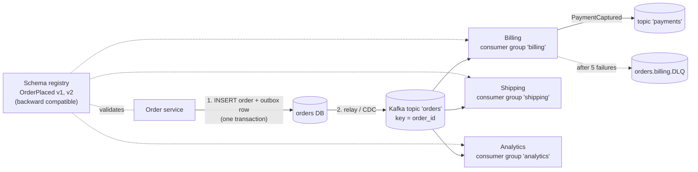
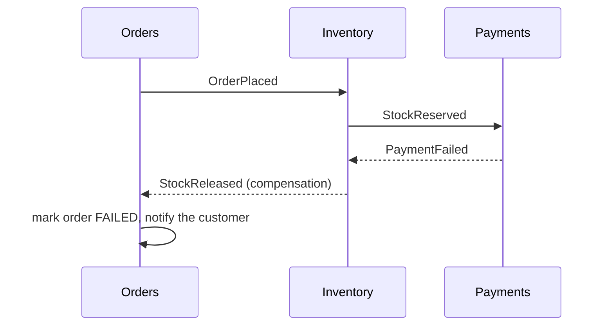
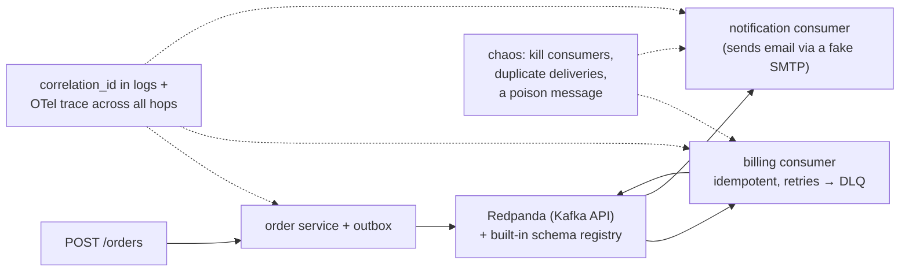
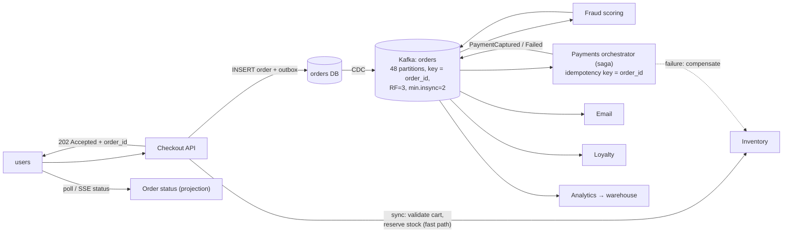

# Chapter 10 — Event-Driven Systems

> **Volume 4 — High-Level Design** · [Contents](index.md) · ← [Chapter 9 — Database Scaling](ch09-database-scaling.md) · Next → [Chapter 11 — CDN, Edge & Geo-Distribution](ch11-cdn-edge-and-geo-distribution.md)

---

## Concept

Event producers/consumers, event schemas, ordering, idempotency, and eventual consistency.

**In one sentence:** in an event-driven system, services announce facts ("an order was placed") instead of calling each other directly, and any number of other services react on their own schedule — which decouples teams and absorbs load spikes, at the price of eventual consistency and careful handling of order and duplicates.

**Mental model — a town crier vs phone calls.** In request/response, the order clerk must phone billing, shipping, and analytics one by one, and if shipping doesn't answer, the order is stuck. With events, the clerk shouts "Order 123 placed!" in the square once; whoever cares writes it down and acts. New listeners can join without the clerk changing anything. But nobody knows exactly *when* each listener acted.

**Event-driven vs request/response**

| | Request/response (sync) | Event-driven (async) |
|-|-------------------------|----------------------|
| Coupling | caller knows every callee, their API, and their availability | the producer knows only the event schema |
| Failure | a callee failure fails the caller (cascades) | consumers fail independently; the log buffers |
| Latency to the user | the sum of the chain | fast acknowledgment; work finishes later |
| Consistency | immediate (if every step succeeded) | **eventual** |
| Adding a new reaction | change the caller | add a consumer |
| Debugging | a stack trace / one trace | distributed: needs correlation IDs and tracing |
| Best for | queries; things the user needs *now* | side effects, integration, fan-out, analytics, workflows |

**Kinds of events**

| Kind | Payload | Example | Trade-off |
|------|---------|---------|-----------|
| Notification | just the ID | `OrderPlaced {order_id}` | small; consumers call back for details (coupling + load) |
| **Event-carried state transfer** | the data consumers need | `OrderPlaced {order_id, customer, items, total}` | consumers are autonomous; bigger events; schema is a contract |
| Domain event (event sourcing) | the state change itself | [Vol 1 Ch 52](../volume-1-cs-foundations/ch52-event-sourcing-and-cqrs-distributed-view.md) | full history |

**Choreography vs orchestration**

| | Choreography | Orchestration |
|-|--------------|---------------|
| How | each service reacts to events and emits its own | a central orchestrator (a saga coordinator, Temporal, Step Functions) tells each step what to do |
| Pros | fully decoupled; no central point | the flow is visible in one place; easy timeouts and compensation |
| Cons | the overall flow is implicit and hard to follow | the orchestrator knows every participant |
| Use | simple fan-out reactions | multi-step business processes with compensation (sagas) |

**The hard parts and their fixes**

| Problem | Fix |
|---------|-----|
| Duplicates (at-least-once delivery) | **idempotent consumers**: dedup by `event_id` in the same transaction as the side effect |
| Ordering | partition by the entity key (`order_id`); rely on per-key order only; use sequence numbers to detect gaps |
| Writing to the DB *and* publishing the event atomically | the **transactional outbox**: write the event to an `outbox` table in the same DB transaction; a relay publishes it (or CDC with Debezium) |
| Poison messages | bounded retries → a **dead-letter queue**, with alerting and replay tooling |
| Schema evolution | versioned schemas in a **schema registry** with compatibility rules (backward/forward) |
| Eventual consistency in the UI | show "processing"; return a version; read your own writes from the source |
| Tracing a flow | carry `correlation_id` and `causation_id` in every event; propagate trace context |

---

## Prereqs

* [Chapter 7 — Message Queues & Streaming (Kafka, SQS, Pub/Sub)](ch07-message-queues-and-streaming-kafka-sqs-pub.md)
* [Vol 3 Ch 12 — Event Bus, CQRS & Event Sourcing](../volume-3-low-level-design/ch12-event-bus-cqrs-and-event-sourcing.md)

---

## Diagram

**An event flow across services with a schema registry**



**Why the outbox exists: the dual-write problem**

```
 WITHOUT outbox                                  WITH outbox
 BEGIN; INSERT order; COMMIT;  ✓                 BEGIN;
 publish("OrderPlaced")        ✗ crash here        INSERT order;
 → the order exists, but nobody ever hears        INSERT outbox(event);
   about it (or: publish first, DB fails →      COMMIT;             ← atomic
   a ghost event for an order that doesn't exist) relay: read outbox → publish → mark sent
                                                 (at-least-once → consumers dedup)
```

**Ordering: per key, not global**

```
 partition 0: [o-7 Placed] [o-7 Paid] [o-7 Shipped]      order within o-7 ✓
 partition 1: [o-9 Placed] [o-9 Cancelled]               order within o-9 ✓
 no ordering between o-7 and o-9 — and none is needed
```

**A choreographed checkout saga with compensation**



---

## Example

**An `OrderPlaced` event consumed by billing, shipping, and analytics**

```json
{
  "event_id": "4f1c2a9e-8b1d-4c1e-9a55-2b6f0d3c7e11",
  "type": "OrderPlaced",
  "version": 2,
  "occurred_at": "2024-05-01T10:02:11.330Z",
  "producer": "order-service",
  "correlation_id": "r-8f2a",
  "key": "order-123",
  "data": {
    "order_id": "order-123",
    "customer_id": "c-7",
    "items": [{"sku": "SKU-1", "qty": 2, "unit_price_cents": 1500}],
    "total_cents": 3000,
    "currency": "EUR",
    "shipping_country": "DE"
  }
}
```

```python
# Transactional outbox: write the state change and the event together
import json, uuid
def place_order(conn, order):
    with conn.transaction():
        conn.execute("INSERT INTO orders (id, customer_id, total_cents) VALUES (%s, %s, %s)",
                     (order["id"], order["customer_id"], order["total_cents"]))
        event = {"event_id": str(uuid.uuid4()), "type": "OrderPlaced", "version": 2,
                 "key": order["id"], "data": order}
        conn.execute("INSERT INTO outbox (id, topic, key, payload) VALUES (%s, %s, %s, %s)",
                     (event["event_id"], "orders", order["id"], json.dumps(event)))

# Relay: publish unsent outbox rows (at-least-once)
def relay(conn, producer):
    rows = conn.execute("SELECT id, topic, key, payload FROM outbox WHERE sent_at IS NULL "
                        "ORDER BY created_at LIMIT 500 FOR UPDATE SKIP LOCKED").fetchall()
    for id_, topic, key, payload in rows:
        producer.produce(topic, key=key, value=payload)
    producer.flush()
    conn.execute("UPDATE outbox SET sent_at = now() WHERE id = ANY(%s)", ([r[0] for r in rows],))
```

```python
# Idempotent consumer: dedup and side effect in ONE transaction
def handle_order_placed(conn, event):
    with conn.transaction():
        inserted = conn.execute(
            "INSERT INTO processed_events (consumer, event_id) VALUES ('billing', %s) "
            "ON CONFLICT DO NOTHING", (event["event_id"],)).rowcount
        if inserted == 0:
            return                          # already handled: a redelivery
        d = event["data"]
        conn.execute("INSERT INTO invoices (order_id, amount_cents, currency) VALUES (%s, %s, %s)",
                     (d["order_id"], d["total_cents"], d["currency"]))
```

---

## Exercises

1. Design an event schema with versioning.

   <details><summary>Solution</summary>An envelope (<code>event_id, type, version, occurred_at, producer, key, correlation_id, causation_id</code>) plus <code>data</code>. Define it in Avro or Protobuf and register it with <b>backward</b> compatibility, so new consumers can read old events. Allowed changes: add optional fields with defaults. For breaking changes (renames, type changes), publish <code>OrderPlaced v3</code> — often to a new topic — dual-publish during migration, and retire v2 after consumers move. Document the ownership and meaning of each field.</details>

2. Make a consumer idempotent across redeliveries.

   <details><summary>Solution</summary>See <code>handle_order_placed</code>: a <code>processed_events</code> table with a unique <code>(consumer, event_id)</code> constraint, written in the same transaction as the side effect. Or make the side effect naturally idempotent: an upsert keyed by <code>order_id</code>, or a conditional update with a version. For external side effects (sending email, charging a card), pass an idempotency key to the provider.</details>

3. A consumer receives `OrderShipped` before `OrderPlaced` for the same order. How can that happen, and what do you do?

   <details><summary>Solution</summary>The events were published to different partitions or topics, a producer retried out of order, or they came from different services. Partition every event about an order by <code>order_id</code> in one topic when order matters. Otherwise, make the consumer tolerant: store out-of-order events and apply them when the prerequisite arrives, or model state so that any order converges (e.g. status with sequence numbers, ignoring older sequences).</details>

---

## Mini project

**An event-driven workflow with two consumers and a schema registry.**



**Steps**

1. Order service with an outbox table and a relay (or Debezium CDC).
2. Register an Avro/JSON schema; the producer validates before publishing; try a breaking change and watch the registry reject it.
3. Two consumers (billing, notification), each idempotent, with bounded retries and a DLQ.
4. A replay tool that re-publishes a DLQ message after a fix.
5. Chaos tests: kill a consumer mid-batch, force duplicate deliveries, inject a poison message. Check invariants: one invoice per order, one email per order.
6. Trace one order end to end with its correlation ID.

**Done when:** duplicates and crashes never produce double invoices or emails, the poison message lands in the DLQ with an alert, and a breaking schema change is rejected.

---

## Design

**Design an event-driven checkout pipeline.**

Requirements: 2,000 orders/s at peak (sales events); checkout must respond in < 300 ms; payment, inventory, fraud, email, loyalty points, and analytics all react; no order may be lost or double-charged.



**Decisions to justify**

* **Sync where the user needs an answer, async for everything else.** Cart validation and stock reservation are synchronous; payment, email, loyalty, and analytics are events. The API returns `202 Accepted` with the order ID in < 300 ms.
* **Outbox + CDC** so that no order exists without its event, and no event exists without its order.
* **Partitioning by `order_id`** keeps all events for one order in order. 48 partitions allow up to 48 parallel consumers per group; at 2,000 events/s, that's ~40/s per partition — lots of headroom.
* **An orchestrated saga for payment** (visible flow, timeouts, compensation that releases stock), **choreography** for simple reactions (email, loyalty).
* **Exactly-once effects** = at-least-once delivery + idempotent consumers + provider idempotency keys.
* **Durability:** replication factor 3, `acks=all`, `min.insync.replicas=2`.
* **Observability:** consumer lag per group as the key alert; DLQ depth; end-to-end order latency (placed → paid).

---

## Open source

* [`apache/kafka`](https://github.com/apache/kafka) — partitions, consumer groups, idempotent producers, and transactions (`enable.idempotence`, `transactional.id`).
* [`confluentinc/schema-registry`](https://github.com/confluentinc/schema-registry) — schema storage with compatibility checks for Avro, Protobuf, and JSON Schema. See also `debezium/debezium` for CDC-based outboxes.

---

## Interview

1. **"Event-driven vs request/response?"**
   <details><summary>Answer</summary>Request/response is simple and immediately consistent, and suits queries and anything the user needs right now, but it couples services in time and availability, so failures and latency cascade. Event-driven decouples producers from consumers, absorbs load spikes, and makes adding reactions easy, but it brings eventual consistency, duplicate and ordering handling, and harder debugging. Most systems use both: sync for the user-facing critical path, events for side effects and integration.</details>

2. **"How do you handle event ordering?"**
   <details><summary>Answer</summary>Don't require global order — it doesn't scale. Require order only per entity: publish all of an entity's events with the same key so they land in one partition, and process each partition sequentially. Add sequence numbers or versions so consumers can detect gaps and ignore stale events. Where cross-entity order matters, design for commutativity or have one producer serialize the decisions.</details>

---

## Checklist

- [ ] version event schemas
- [ ] idempotent consumers
- [ ] accept eventual consistency

---

> [Contents](index.md) · ← [Chapter 9 — Database Scaling](ch09-database-scaling.md) · Next → [Chapter 11 — CDN, Edge & Geo-Distribution](ch11-cdn-edge-and-geo-distribution.md)
