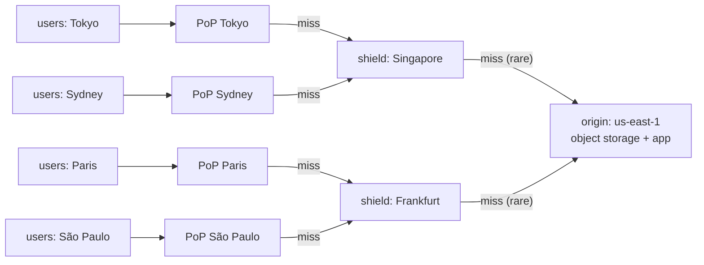
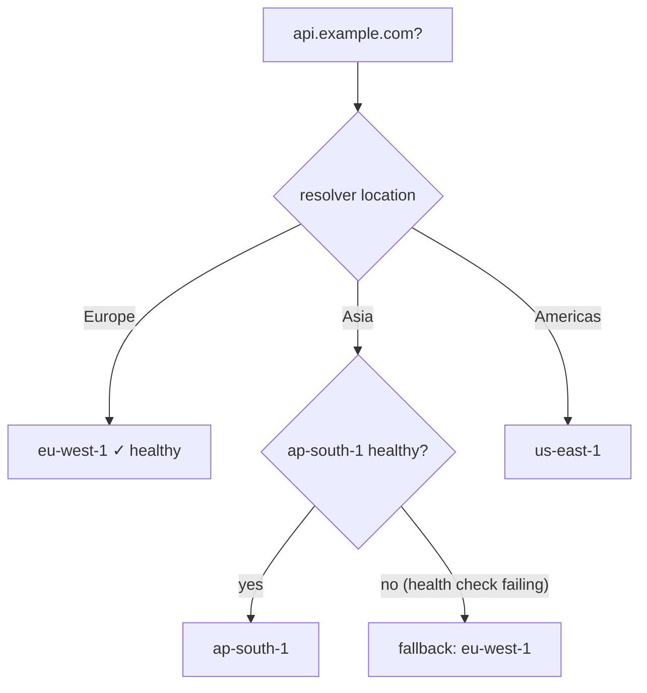
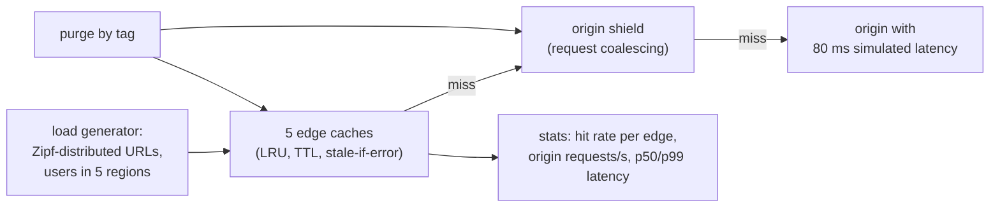
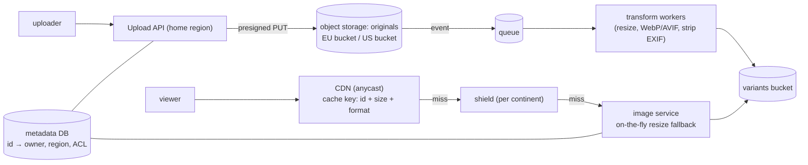

# Chapter 11 — CDN, Edge & Geo-Distribution

> **Volume 4 — High-Level Design** · [Contents](index.md) · ← [Chapter 10 — Event-Driven Systems](ch10-event-driven-systems.md) · Next → [Chapter 12 — Multi-Tenancy](ch12-multi-tenancy.md)

---

## Concept

Caching at the edge, geo-routing, data residency, and multi-region consistency.

**In one sentence:** the speed of light is a hard limit, so global systems put copies of content and compute close to users (CDN edges, regional deployments), route each user to the nearest healthy place, keep data where the law says it must live, and choose carefully which data is shared across regions and how consistent it must be.

**Mental model — a coffee chain.** One roastery (the origin) supplies hundreds of cafés (edge PoPs). Each café keeps the popular beans on its shelf (cache) and orders from the regional warehouse (origin shield) when it runs out. Customers go to the nearest café (geo-routing). Some local laws say a city's customer loyalty records must stay in that country (data residency).

**Why distance matters**

| Route | Distance | Light in fiber (~200,000 km/s), round trip |
|-------|---------:|--------------------------------:|
| Same city | 50 km | 0.5 ms |
| Frankfurt ↔ London | 640 km | ~6 ms |
| New York ↔ London | 5,600 km | ~56 ms (~70 ms in practice) |
| New York ↔ Sydney | 16,000 km | ~160 ms (~200+ ms in practice) |

A page needing 5 sequential round trips (DNS, TCP, TLS, HTML, API) from Sydney to a US-only origin: ~1 s just in physics. From a local edge: ~50 ms.

**CDN caching**

| Concept | Meaning |
|---------|---------|
| PoP | point of presence: an edge data center near users |
| Cache key | usually host + path + query (+ `Vary` headers); normalize it to raise hit rates |
| TTL | from `Cache-Control: max-age / s-maxage` or edge rules |
| **Origin shield** | a mid-tier cache in one region that all edges miss to, so the origin sees ~1 request per object instead of one per PoP |
| Purge / invalidation | remove objects by URL, tag, or prefix (seconds to minutes) |
| **Cache busting** | put a content hash in the file name (`app.3f9a1c.js`) → `max-age=31536000, immutable`; a new deploy means a new URL, no purge needed |
| `stale-while-revalidate` / `stale-if-error` | serve slightly stale content while refreshing, or when the origin is down |
| Edge compute | small functions at the PoP (Cloudflare Workers, Lambda@Edge): auth checks, redirects, A/B, personalization |

**Geo-routing options**

| Method | How | Notes |
|--------|-----|-------|
| GeoDNS / latency-based DNS | DNS answers with the nearest region's IP | depends on the resolver's location; TTL limits failover speed |
| **Anycast** | the same IP announced from many PoPs; BGP delivers to the nearest | used by CDNs and DNS providers; fast failover |
| Global load balancer | one anycast IP → proxies to the best healthy region | e.g. Google Cloud LB, AWS Global Accelerator |
| Health-checked failover | remove unhealthy regions from answers | always pair routing with health checks |

**Multi-region data patterns**

| Pattern | Writes | Reads | Consistency | Fits |
|---------|--------|-------|-------------|------|
| Single primary region + read replicas | one region | local replicas | strong for writes, stale reads elsewhere | most apps; simple |
| Active-passive (DR) | primary only; secondary on standby | primary | strong; failover loses the async lag | disaster recovery ([Ch 13](ch13-disaster-recovery-backups-rto-rpo.md)) |
| **Geo-partitioned (home region)** | each user's data lives in their home region | local for local users | strong within a region | data residency, low latency for most traffic |
| Active-active multi-leader | any region | local | eventual; conflicts (LWW, CRDTs) | carts, presence, likes, collaborative data |
| Global consensus (Spanner, CockroachDB) | any region, via quorum | local (maybe stale) or quorum | strong | when correctness is non-negotiable; each write pays cross-region latency |

**Data residency** — laws (GDPR, India's DPDP, China's PIPL, sector rules) may require that personal data is stored or processed in a region. Design: a user → home-region mapping at sign-up; region-local databases for PII; only non-personal or aggregated data in global services; encryption with region-held keys; logs and backups count too.

---

## Prereqs

* [Vol 1 Ch 44 — Delivery: Load Balancing, Reverse Proxies & CDN](../volume-1-cs-foundations/ch44-delivery-load-balancing-reverse-proxies-and-cdn.md)

---

## Diagram

**A global CDN with edge PoPs and origin shielding**



**Cache hit ratio math**

```
 1,000 PoPs, a hot object with TTL 60 s:
   without a shield: up to 1,000 origin fetches per minute
   with 2 shields:   ~2 origin fetches per minute
 at a 95% edge hit rate and 1M req/s → 50k req/s reach the shields → a few hundred reach the origin
```

**Geo-DNS routing to the nearest region, with fallback**



**Geo-partitioned users (home region)**

```
 global directory (small, replicated everywhere):   user_id → home_region
   u-1 → eu    u-2 → us    u-3 → in
 eu-west (EU PII stays here)   us-east              ap-south (India PII)
 [users, orders for eu users]  [… us users]         [… in users]
 a request for u-1 arriving in us-east → proxied to eu-west (or the client is redirected)
```

---

## Example

**A CDN cache rule and cache-busting headers**

```nginx
# Origin (nginx) — send the right headers; the CDN honors them
location ~* \.(js|css|woff2|png|jpg|svg)$ {
    # file names contain a content hash, e.g. app.3f9a1c.js
    add_header Cache-Control "public, max-age=31536000, immutable";
}
location = /index.html {
    add_header Cache-Control "public, max-age=0, s-maxage=60, stale-while-revalidate=300";
}
location /api/ {
    add_header Cache-Control "private, no-store";            # never cache personalized API responses at the edge
}
location /api/products/ {
    add_header Cache-Control "public, s-maxage=30, stale-if-error=600";
    add_header Surrogate-Key "products";                     # purge all products with one tag
}
```

```js
// Edge function (Cloudflare Workers style): normalize the cache key + geo redirect
export default {
  async fetch(req) {
    const url = new URL(req.url);
    ["utm_source", "utm_medium", "utm_campaign", "fbclid"].forEach(p => url.searchParams.delete(p));
    if (url.pathname === "/" && req.cf?.country === "DE") url.pathname = "/de/";
    return fetch(new Request(url.toString(), req), { cf: { cacheEverything: true } });
  },
};
```

```text
Geo-DNS (Route 53 style)
  api.example.com  latency record → eu-west-1 ALB    health check /healthz
  api.example.com  latency record → us-east-1 ALB    health check /healthz
  api.example.com  latency record → ap-south-1 ALB   health check /healthz
  TTL 60 s  → a failed region stops receiving new resolutions within ~1–2 minutes
```

---

## Exercises

1. Explain cache-busting for static assets.

   <details><summary>Solution</summary>Build tools put a content hash in each asset's file name (<code>app.3f9a1c.js</code>). The HTML references the hashed names. Assets are served with <code>max-age=1 year, immutable</code>, so browsers and CDNs never revalidate them. A new deploy produces new names, so users get new code immediately without purging. Only the small HTML entry point gets a short TTL.</details>

2. Design multi-region with a primary/secondary.

   <details><summary>Solution</summary>Primary region: app + read-write DB. Secondary: app (scaled down or read-only) + an async DB replica + replicated object storage. Global routing sends all traffic to the primary; reads can be served locally in the secondary with stale-read tolerance. Failover: health checks fail → promote the replica → switch routing (DNS or global LB) → scale up the secondary. RPO = replication lag (seconds); RTO = detection + promotion + DNS (minutes). Rehearse it regularly.</details>

3. Why must personalized API responses never be cached with `public`?

   <details><summary>Solution</summary>A shared cache would serve one user's data to the next user who requests the same URL — a data leak. Use <code>private, no-store</code> (or a cache key that includes the auth identity, only for data designed for it) and keep the CDN out of personalized paths.</details>

---

## Mini project

**A simulated CDN with edge caches and origin fetch.**



**Steps**

1. Five edge caches (an LRU dict with TTL), each with a latency to users of 10 ms and to the shield of 60 ms.
2. A shield with request coalescing: concurrent misses for one key share one origin fetch.
3. Generate traffic with a Zipf distribution (a few hot objects, a long tail).
4. Measure the hit rate, origin load, and latency percentiles with and without the shield, and with different TTLs.
5. Add `stale-if-error`: take the origin down and show edges still serving.
6. Add tag-based purge and measure how long until stale content disappears.

**Done when:** your numbers show the shield cutting origin load by an order of magnitude, and edges keep serving through an origin outage.

---

## Design

**Design a globally distributed image-serving system.**

Requirements: 500M images, 20k uploads/s peak, 2M image views/s globally, several sizes and formats per image (thumbnail, medium, WebP/AVIF); p95 view latency < 100 ms worldwide; EU users' private images stay in the EU.



**Decisions to justify**

* **Upload directly to object storage** with presigned URLs; the API never proxies bytes.
* **Pre-generate common variants** asynchronously; an on-the-fly resize service is the fallback for rare sizes, and results are cached.
* **The CDN does nearly all the work.** Images are immutable (a new upload = a new ID), so TTL = 1 year. 2M views/s at a 98% edge hit rate leaves ~40k/s for shields and ~few thousand/s for origin.
* **Format negotiation:** the `Accept` header → the cache key includes the format bucket (AVIF / WebP / JPEG), not the raw header, to keep the hit rate high.
* **Private images:** signed URLs with short expiry (validated at the edge); EU-resident originals and variants live only in EU buckets, and the EU shield only fetches from them.
* **Storage math:** 500M images × (2 MB original + ~500 KB of variants) ≈ 1.25 PB; use tiered storage for originals that are rarely accessed.

---

## Open source

* [`traefik/traefik`](https://github.com/traefik/traefik) — an edge router with automatic TLS, middlewares, and routing rules.
* [`envoyproxy/envoy`](https://github.com/envoyproxy/envoy) (edge) — used as the edge proxy in many CDNs and meshes; see its HTTP cache filter and locality-aware load balancing. See also `varnishcache/varnish-cache` for a classic HTTP cache.

---

## Interview

1. **"How does a CDN reduce origin load?"**
   <details><summary>Answer</summary>Edges serve cached responses for repeated requests, so only misses reach the origin. Shields collapse misses from hundreds of edges into one fetch per object, and request coalescing merges concurrent misses for the same key. Long TTLs on immutable, hash-named assets, normalized cache keys, and <code>stale-while-revalidate</code> / <code>stale-if-error</code> raise the hit rate further. Typically 90–99% of traffic never reaches the origin.</details>

2. **"Multi-region consistency — how?"**
   <details><summary>Answer</summary>Pick per data type. Most data: a single write region (or a per-user home region) with async replicas — strong within the home region, stale reads elsewhere. Data that tolerates conflicts (carts, counters, presence): active-active with LWW or CRDTs. Data needing global strong consistency (money, inventory, uniqueness): a consensus-based database (Spanner, CockroachDB) paying cross-region write latency, or route those writes to one region. Always define the RPO for failover.</details>

---

## Checklist

- [ ] cache immutable assets forever
- [ ] route by geo with fallback
- [ ] design for data residency

---

> [Contents](index.md) · ← [Chapter 10 — Event-Driven Systems](ch10-event-driven-systems.md) · Next → [Chapter 12 — Multi-Tenancy](ch12-multi-tenancy.md)
