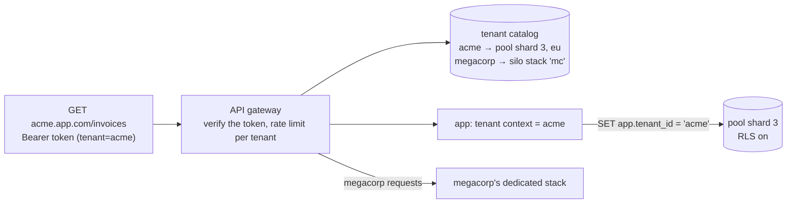
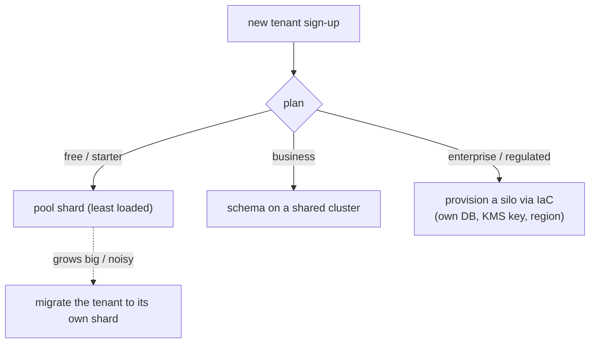
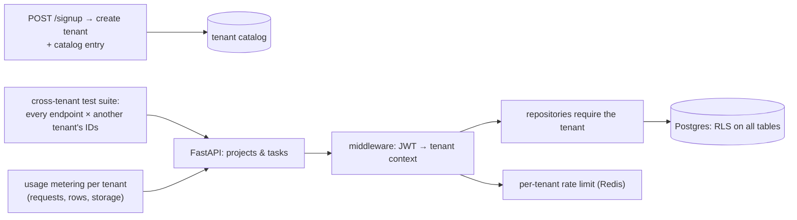
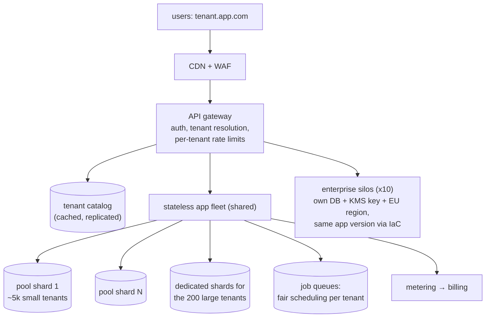

# Chapter 12 — Multi-Tenancy

> **Volume 4 — High-Level Design** · [Contents](index.md) · ← [Chapter 11 — CDN, Edge & Geo-Distribution](ch11-cdn-edge-and-geo-distribution.md) · Next → [Chapter 13 — Disaster Recovery (Backups, RTO/RPO)](ch13-disaster-recovery-backups-rto-rpo.md)

---

## Concept

Tenant isolation models (pool, bridge, silo), data isolation, and tenant-aware routing/security.

**In one sentence:** a multi-tenant SaaS serves many customer organizations (tenants) from one system, and the core design choice is how much they share — everything (pool), a shared app with separate databases or schemas (bridge), or fully separate stacks (silo) — traded off against cost, isolation, and operational effort.

**Mental model — housing.** Pool is a hostel: one big room, cheapest, and everyone relies on the staff to keep belongings apart. Bridge is an apartment building: shared walls and elevators, but each unit has its own lock. Silo is a street of detached houses: expensive, but nobody's plumbing problem floods the neighbors.

**The three models**

| | Pool (shared everything) | Bridge (shared app, separate schema or DB) | Silo (dedicated stack) |
|-|-------------------------|-------------------------------------------|------------------------|
| Data | one DB, a `tenant_id` column on every row | schema-per-tenant or DB-per-tenant | separate DB, app, and often account/VPC |
| Isolation | logical (code + RLS) | stronger (separate objects) | strongest (physical) |
| Cost per tenant | lowest | medium | highest |
| Number of tenants | 100,000s | 100s–1,000s (schema) / 100s (DB) | tens to hundreds |
| Noisy neighbors | a real risk | reduced (DB-level) | none |
| Per-tenant backup / restore / delete | hard (row-level) | easy | easy |
| Migrations | one run | N runs (automate!) | N stacks to upgrade |
| Customization | little | some | a lot (versions, regions, keys) |
| Typical tier | free / self-serve | business | enterprise, regulated, "bring your own key" |

Real SaaS usually mixes them: pool for the long tail, silo for the biggest or most regulated tenants (a *tiered* model).

**Preventing tenant data leaks — defense in depth**

| Layer | Control |
|-------|---------|
| Identity | every request carries an authenticated tenant ID (from the token, never from a URL parameter alone) |
| Application | a tenant context set once per request; repository methods *require* the tenant; no "unscoped" queries |
| Database | **Row-Level Security (RLS)** policies filter by `current_setting('app.tenant_id')`; unique constraints include `tenant_id` |
| Caches, queues, search | the tenant ID is part of every cache key, message, index filter, and object-storage prefix |
| Keys | per-tenant encryption keys (envelope encryption) for silo/bridge tiers |
| Testing | automated **cross-tenant tests**: tenant A's token must never read tenant B's IDs, across every endpoint |
| Observability | the tenant ID in logs, metrics, and traces (and per-tenant usage metering) |

**Noisy neighbors** — per-tenant rate limits and quotas ([Ch 6](ch06-rate-limiting-throttling-and-backpressure.md)), fair queuing for background jobs, statement timeouts, moving heavy tenants to their own shard or silo, and metering usage so it can also be billed.

**Tenant-aware routing** — resolve the tenant from the subdomain (`acme.app.com`), a header, or the token, then look up its placement (`tenant → shard / region / stack`) in a small, cached **tenant catalog**, and route there.

---

## Prereqs

* [Vol 1 Ch 45 — SQL & the Relational Model](../volume-1-cs-foundations/ch45-sql-and-the-relational-model.md)
* [Vol 2 Ch 10 — Security & Threat Modeling](../volume-2-software-engineering/ch10-security-and-threat-modeling.md)

---

## Diagram

**Shared table vs schema-per-tenant vs DB-per-tenant**

```
 POOL: shared tables                BRIDGE: schema per tenant         SILO: DB (or stack) per tenant
 ┌────────────────────────────┐     ┌──────────── db ───────────┐     ┌─ db_acme ─┐ ┌─ db_globex ─┐
 │ invoices                   │     │ acme.invoices             │     │ invoices  │ │ invoices    │
 │ tenant_id │ id │ amount    │     │ globex.invoices           │     └───────────┘ └─────────────┘
 │ acme      │ 1  │ 500       │     │ initech.invoices          │      (own compute, backups, keys,
 │ globex    │ 2  │ 900       │     └───────────────────────────┘       maybe own region)
 │ acme      │ 3  │ 120       │      search_path = acme
 └────────────────────────────┘
  RLS: tenant_id = current tenant
```

**Tenant-aware request path**



**Tiered placement**



---

## Example

```sql
-- Pool model with Row-Level Security (PostgreSQL)
CREATE TABLE invoices (
  tenant_id   text   NOT NULL,
  id          bigint GENERATED ALWAYS AS IDENTITY,
  customer    text   NOT NULL,
  total_cents int    NOT NULL,
  PRIMARY KEY (tenant_id, id)                       -- the tenant is part of every key
);
CREATE INDEX ON invoices (tenant_id, customer);

ALTER TABLE invoices ENABLE ROW LEVEL SECURITY;
ALTER TABLE invoices FORCE ROW LEVEL SECURITY;      -- applies even to the table owner
CREATE POLICY tenant_isolation ON invoices
  USING (tenant_id = current_setting('app.tenant_id'))
  WITH CHECK (tenant_id = current_setting('app.tenant_id'));

-- The app role is NOT a superuser and does NOT have BYPASSRLS
-- Per request / transaction:
BEGIN;
SET LOCAL app.tenant_id = 'acme';
SELECT * FROM invoices;                              -- returns only acme's rows
INSERT INTO invoices (tenant_id, customer, total_cents) VALUES ('globex', 'x', 1);
-- ERROR: new row violates row-level security policy
COMMIT;
```

```python
# Tenant context set once per request; every repository call uses it
import contextvars
current_tenant = contextvars.ContextVar("tenant")

@app.middleware("http")
async def tenant_middleware(request, call_next):
    claims = verify_jwt(request.headers["authorization"])
    token = current_tenant.set(claims["tenant_id"])          # from the token, not the URL
    try:
        return await call_next(request)
    finally:
        current_tenant.reset(token)

def db_session():
    conn = pool.getconn()
    conn.execute("SET app.tenant_id = %s", (current_tenant.get(),))   # RLS backstop
    return conn

def cache_key(*parts):                                         # tenants never share cache entries
    return ":".join(["t", current_tenant.get(), *map(str, parts)])
```

```python
# A cross-tenant test: run it against EVERY endpoint that takes an ID
def test_no_cross_tenant_reads(client, acme_token, globex_invoice_id):
    r = client.get(f"/invoices/{globex_invoice_id}", headers={"Authorization": acme_token})
    assert r.status_code == 404
```

---

## Exercises

1. Implement tenant isolation with RLS.

   <details><summary>Solution</summary>See the SQL above: <code>tenant_id</code> on every table and in every primary and unique key; <code>ENABLE</code> + <code>FORCE ROW LEVEL SECURITY</code>; a policy with both <code>USING</code> and <code>WITH CHECK</code>; an app role without <code>BYPASSRLS</code>; <code>SET LOCAL app.tenant_id</code> per transaction (important with connection pools — <code>LOCAL</code> resets at commit). Test that a missing setting returns nothing or an error rather than every row.</details>

2. Compare the three models' cost/scale.

   <details><summary>Solution</summary>Pool: near-zero marginal cost per tenant and one migration, scaling to 100k+ tenants, but it has the weakest isolation and noisy-neighbor risk, and per-tenant restore is hard. Bridge (schema/DB per tenant): moderate cost, easy per-tenant backup and delete, but migrations and connection counts grow with N (practical up to a few thousand). Silo: high fixed cost per tenant (a DB plus compute, often $100s–1,000s/month), strongest isolation and custom options, heavy operations unless fully automated with IaC. Tier them by plan.</details>

3. A developer adds a Redis cache for `GET /settings` keyed by `settings:{user_id}`. What's the multi-tenant bug risk?

   <details><summary>Solution</summary>If user IDs aren't globally unique (e.g. per-tenant sequences), two tenants' users collide and one tenant sees another's settings. Always include the tenant in cache keys, search filters, queue messages, and object-storage paths.</details>

---

## Mini project

**A multi-tenant SaaS schema with RLS and tenant-scoped queries.**



**Steps**

1. Tables `tenants`, `users`, `projects`, `tasks`, all with `tenant_id` in the keys; RLS on every tenant table.
2. JWT middleware sets the tenant context; the DB session sets `app.tenant_id` per transaction.
3. Per-tenant rate limits and a statement timeout; per-tenant usage counters.
4. An automated cross-tenant test that enumerates routes and tries other tenants' IDs.
5. A "move tenant to a dedicated database" script (export by `tenant_id`, import, flip the catalog).
6. Tenant deletion that proves every row, cache entry, and file for the tenant is gone.

**Done when:** the cross-tenant suite passes for every route, removing the app-level filter still returns no foreign rows (RLS catches it), and a tenant can be moved to its own DB with a catalog flip.

---

## Design

**Design multi-tenant architecture for a SaaS app.**

Requirements: a project-management SaaS; 50,000 tenants (most small, 200 large, 10 enterprise customers requiring a dedicated database, EU data residency, and their own encryption keys); 99.9% availability; one tenant's load must not degrade others.



**Decisions to justify**

* **Tiered model:** pool shards for the long tail (cheap), dedicated shards for large tenants (noisy-neighbor protection), and silos for enterprise (compliance, BYOK, residency).
* **One codebase, one version** everywhere; silos are stamped out with the same Terraform module and upgraded by the same pipeline (fleet-wide rollouts with canary tenants first).
* **The tenant catalog** is the routing source of truth: `tenant → tier, shard, region, key ID`. Moving a tenant = copy data + flip the catalog entry.
* **Isolation in depth:** tenant from the token, a tenant-required repository API, RLS as a backstop, tenant-prefixed cache keys and storage paths, and cross-tenant tests in CI.
* **Fairness:** per-tenant rate limits and quotas, fair-share job queues (round-robin across tenants, not FIFO), statement timeouts, and alerts on tenants exceeding their tier.
* **Metering** per tenant feeds both capacity planning and billing.

---

## Open source

* [`postgres/postgres`](https://github.com/postgres/postgres) (RLS) — the docs chapter "Row Security Policies" (`CREATE POLICY`, `FORCE ROW LEVEL SECURITY`, `BYPASSRLS`). See also `citusdata/citus`, which shards Postgres by `tenant_id` for pool-model SaaS, and AWS's "SaaS Tenant Isolation Strategies" whitepaper.

---

## Interview

1. **"Pool vs silo multi-tenancy?"**
   <details><summary>Answer</summary>Pool shares all infrastructure and separates tenants logically with a tenant ID: lowest cost, easiest to operate at huge tenant counts, one migration — but isolation relies on code and RLS, noisy neighbors are a risk, and per-tenant restore or residency is hard. Silo gives each tenant dedicated infrastructure: the strongest isolation, per-tenant keys, regions, and scaling, and easy backup and delete — but high per-tenant cost and fleet-management overhead. Most SaaS use both, by tier.</details>

2. **"How do you prevent tenant data leaks?"**
   <details><summary>Answer</summary>Defense in depth: derive the tenant from the authenticated token; set a tenant context once per request; make data access impossible without a tenant (a scoped repository API); enforce it again in the database with RLS; include the tenant in every cache key, index filter, queue message, and storage path; use per-tenant encryption keys for sensitive tiers; and continuously run automated cross-tenant access tests. Log and alert on authorization denials.</details>

---

## Checklist

- [ ] isolate data per tenant
- [ ] test cross-tenant access
- [ ] plan per-tenant scaling

---

> [Contents](index.md) · ← [Chapter 11 — CDN, Edge & Geo-Distribution](ch11-cdn-edge-and-geo-distribution.md) · Next → [Chapter 13 — Disaster Recovery (Backups, RTO/RPO)](ch13-disaster-recovery-backups-rto-rpo.md)
