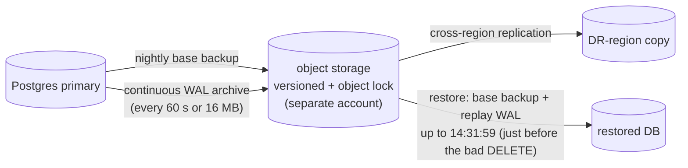
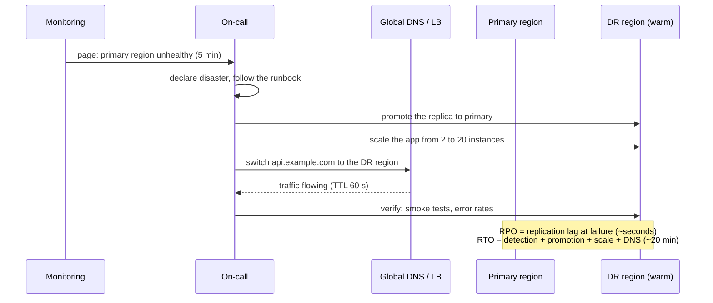
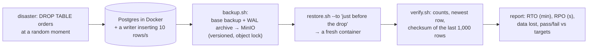
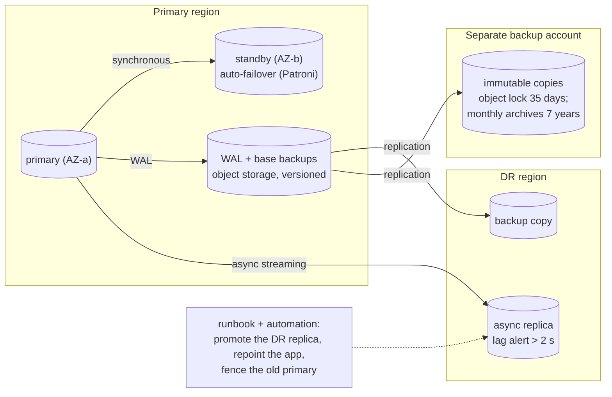

# Chapter 13 — Disaster Recovery (Backups, RTO/RPO)

> **Volume 4 — High-Level Design** · [Contents](index.md) · ← [Chapter 12 — Multi-Tenancy](ch12-multi-tenancy.md) · Next → [Chapter 14 — Security at the System Level](ch14-security-at-the-system-level.md)

---

## Concept

Backup strategies, restore testing, RTO/RPO, and multi-region failover.

**In one sentence:** disaster recovery answers two questions agreed with the business — how much data may we lose (RPO) and how long may we be down (RTO) — and then proves, by actually restoring and failing over on a schedule, that the system can meet them.

**Mental model — a fire drill and a photo album.** Backups are copies of your photo album kept in another building; how often you copy them decides how many recent photos a fire can take (RPO). The fire drill is how you prove everyone can get out and set up again elsewhere, and how long it takes (RTO). An album copy you've never tried to open is a hope, not a backup.

**RPO vs RTO**

| | RPO — Recovery Point Objective | RTO — Recovery Time Objective |
|-|-------------------------------|-------------------------------|
| Question | how much *data* can we lose? | how long can we be *down*? |
| Measured | time between the last recoverable point and the disaster | time from the disaster to service restored |
| Driven by | backup frequency, replication lag, sync vs async | detection, automation, restore speed, DNS, people |
| Example | "≤ 5 minutes of orders" | "back within 1 hour" |

**What you're protecting against**

| Disaster | Replication helps? | Backups help? |
|----------|:-:|:-:|
| Disk / node failure | ✓ | ✓ |
| Zone outage | ✓ multi-AZ | ✓ |
| Region outage | ✓ cross-region | ✓ (if stored cross-region) |
| **Accidental `DELETE` / bad migration / bug corrupting data** | ✗ replicas copy the mistake instantly | ✓ **point-in-time recovery** |
| **Ransomware / malicious admin** | ✗ | ✓ only if backups are **immutable** and in a separate account |
| Provider / account compromise | ✗ | ✓ with an off-provider or separate-account copy |

Replication is for availability; backups are for recovery. You need both.

**Backup strategies**

| Type | What | Pros / cons |
|------|------|-------------|
| Full snapshot | the whole volume or DB at time T | simple restore; large and slow |
| Incremental / differential | changes since the last backup | small and fast; restore needs a chain |
| **Continuous WAL / binlog archiving** | every change streamed to object storage | **point-in-time recovery (PITR)** to any second; RPO ≈ seconds |
| Logical dump (`pg_dump`) | SQL or data export | portable across versions; slow for large DBs |
| Object storage versioning + replication | S3 versioning, cross-region replication | protects files against deletes and overwrites |

**The 3-2-1 rule (plus immutability):** 3 copies, on 2 different media or services, with 1 off-site — and at least 1 immutable (object lock / WORM) in a separate account.

**DR strategies (cost ↔ RTO)**

| Strategy | Secondary region has | RTO | RPO | Cost |
|----------|---------------------|-----|-----|------|
| Backup & restore | only backups | hours–a day | hours (or minutes with PITR) | $ |
| Pilot light | the data replicated; minimal core infrastructure off or tiny | tens of minutes | minutes | $$ |
| Warm standby | a scaled-down, fully working copy | minutes | seconds–minutes | $$$ |
| Multi-site active-active | full capacity serving traffic | ~0 (reroute) | ~0 (sync) or seconds | $$$$ |

**Why test restores, not just backups?** Backups fail silently: expired credentials, missing tables, corrupt files, incompatible versions, a restore that takes 14 hours instead of the 1 you promised, or a runbook nobody can follow. The only real measure of RTO and RPO is a timed restore.

---

## Prereqs

* [Chapter 9 — Database Scaling](ch09-database-scaling.md)

---

## Diagram

**A backup/recovery timeline showing RPO (data loss) and RTO (downtime)**

```
 time ──────────────────────────────────────────────────────────────────────────────►
      last good                                                  service
      backup / WAL point      💥 disaster                        restored
            │                    │                                  │
            ├──── RPO ───────────┤                                  │
            │  data written here │                                  │
            │  is LOST           ├──────────── RTO ─────────────────┤
                                 │ detect → decide → restore/        │
                                 │ promote → verify → reroute        │
```

**Nightly snapshots + WAL streaming → point-in-time recovery**



**Warm-standby failover**



---

## Example

```bash
# PostgreSQL with pgBackRest: full + WAL archiving to S3, then PITR
pgbackrest --stanza=main --type=full backup            # nightly (cron / systemd timer)
# postgresql.conf: archive_mode = on
#                  archive_command = 'pgbackrest --stanza=main archive-push %p'

# Disaster: someone ran DELETE FROM orders at 14:32:05
pgbackrest --stanza=main --delta \
  --type=time --target="2024-05-01 14:32:00+00" --target-action=promote restore
# start Postgres → it replays WAL up to 14:32:00 → orders are back

# Verify every restore automatically
psql -c "SELECT count(*), max(created_at) FROM orders"   # compare to expectations
```

```python
# A scheduled restore test that measures the real RTO and RPO
import time, subprocess, datetime as dt

def restore_drill():
    t0 = time.monotonic()
    subprocess.run(["./restore_latest.sh", "--target", "drill-db"], check=True)      # to a scratch instance
    rto_minutes = (time.monotonic() - t0) / 60
    newest = query("drill-db", "SELECT max(created_at) FROM orders")               # newest recovered row
    rpo_seconds = (dt.datetime.now(dt.timezone.utc) - newest).total_seconds()
    rows_ok = query("drill-db", "SELECT count(*) FROM orders") > 0
    report(rto_minutes=rto_minutes, rpo_seconds=rpo_seconds, ok=rows_ok)
    assert rto_minutes <= 60 and rpo_seconds <= 300, "DR objectives missed — page the owner"
```

```hcl
# Immutable backups: S3 Object Lock in a separate backup account
resource "aws_s3_bucket" "backups" {
  bucket              = "acme-db-backups-dr"
  object_lock_enabled = true
}
resource "aws_s3_bucket_object_lock_configuration" "backups" {
  bucket = aws_s3_bucket.backups.id
  rule {
    default_retention {
      mode = "COMPLIANCE"     # cannot be deleted by anyone, including root, until retention ends
      days = 35
    }
  }
}
```

---

## Exercises

1. Define RTO/RPO for a service and pick a strategy.

   <details><summary>Solution</summary>Ask the business what an hour of downtime and a minute of lost data cost. Example: an e-commerce checkout — RPO ≤ 1 min (lost orders mean lost money and trust), RTO ≤ 30 min. That needs continuous WAL archiving (for PITR), a cross-region async replica, and warm standby with an automated failover runbook. An internal reporting tool might accept RPO 24 h and RTO 1 day: nightly backups and restore on demand.</details>

2. Test a restore from backup.

   <details><summary>Solution</summary>Restore the latest backup to a fresh, isolated instance using only the runbook (ideally by someone who didn't write it). Time every step. Verify row counts, the newest timestamps, schema version, and a few business queries; then run the app's smoke tests against it. Record the measured RTO and RPO, fix every surprise, and automate the drill monthly.</details>

3. Your primary DB has synchronous replicas in three zones. Do you still need backups?

   <details><summary>Solution</summary>Yes. Replicas protect against hardware and zone failures, but they faithfully replicate a <code>DROP TABLE</code>, a buggy migration, or ransomware encryption within milliseconds. Only point-in-time backups, ideally immutable and in a separate account, recover from logical corruption.</details>

---

## Mini project

**A backup + restore script with verification and a measured RTO/RPO.**



**Steps**

1. Run Postgres and MinIO in Docker; a script inserts rows continuously with timestamps.
2. Configure base backups and WAL archiving (pgBackRest or WAL-G) to MinIO with versioning.
3. Chaos script: at a random time, drop a table; log the exact time.
4. `restore.sh`: restore to a new container at a target time just before the drop.
5. `verify.sh`: compare counts and checksums; compute RPO (the gap from the last recovered row to the drop time) and RTO (the restore duration).
6. Run it on a schedule and fail loudly when objectives are missed.

**Done when:** one command runs the whole drill and prints measured RTO and RPO, and both meet your stated targets.

---

## Design

**Design DR for a payments database.**

Requirements: a payments ledger in PostgreSQL, 3 TB, 3,000 writes/s; RPO ≈ 0 for a zone failure and ≤ 5 s for a region failure; RTO ≤ 15 min for a region failure; protection against operator mistakes and ransomware; 7-year retention for audit.



**Decisions to justify**

* **Zone failure (RPO 0, RTO < 1 min):** a synchronous standby in another zone, with automatic failover (Patroni or a managed Multi-AZ service). Synchronous means every commit waits for the standby — a few ms of extra latency, acceptable for a ledger.
* **Region failure (RPO ≤ 5 s, RTO ≤ 15 min):** an async cross-region replica (sync across regions would add ~70 ms+ to every write). Alert when lag > 2 s. Failover is a practiced, mostly automated runbook; **fencing** the old primary prevents split-brain.
* **Logical disasters:** PITR from WAL archives (any second in the last 35 days); **immutable** copies in a separate account defeat ransomware and malicious admins.
* **Double-entry ledger + idempotency keys** make reconciliation after a failover possible: replayed or missing transactions are detectable.
* **Audit retention:** monthly logical exports to archive storage for 7 years, with restore tests yearly.
* **Proof:** a monthly restore drill and a quarterly region failover game day, with measured RTO/RPO reported to leadership.

---

## Open source

* [`postgres/postgres`](https://github.com/postgres/postgres) (WAL/PITR) — the docs chapter "Continuous Archiving and Point-in-Time Recovery"; tools: pgBackRest, WAL-G, Barman, and Patroni for HA.
* [`velero/velero`](https://github.com/velero/velero) — backup, restore, and migration of Kubernetes resources and persistent volumes.

---

## Interview

1. **"RTO vs RPO?"**
   <details><summary>Answer</summary>RPO (Recovery Point Objective) is the maximum acceptable data loss, measured in time: how far back the last recoverable state may be. It is set by backup frequency and replication mode. RTO (Recovery Time Objective) is the maximum acceptable downtime until service is restored. It is set by detection, automation, restore speed, and routing. Both are business decisions that drive the DR strategy and its cost.</details>

2. **"Why test restores, not just backups?"**
   <details><summary>Answer</summary>A backup job succeeding only proves that bytes were written. Restores fail for many silent reasons: missing WAL segments, expired keys or credentials, version incompatibilities, corrupted files, missing configuration, runbooks that don't work, or restore times far beyond the RTO. Only regular, timed, verified restore drills turn "we have backups" into a known RTO and RPO.</details>

---

## Checklist

- [ ] state RTO/RPO explicitly
- [ ] automate + verify restores
- [ ] run failover drills

---

> [Contents](index.md) · ← [Chapter 12 — Multi-Tenancy](ch12-multi-tenancy.md) · Next → [Chapter 14 — Security at the System Level](ch14-security-at-the-system-level.md)
