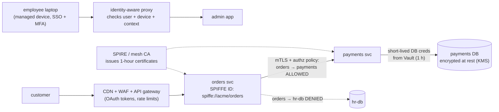
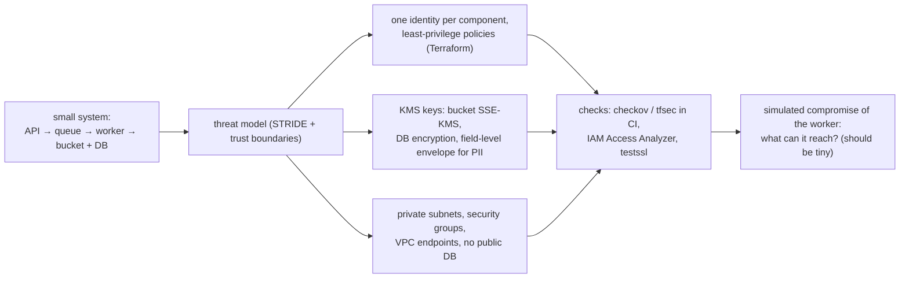
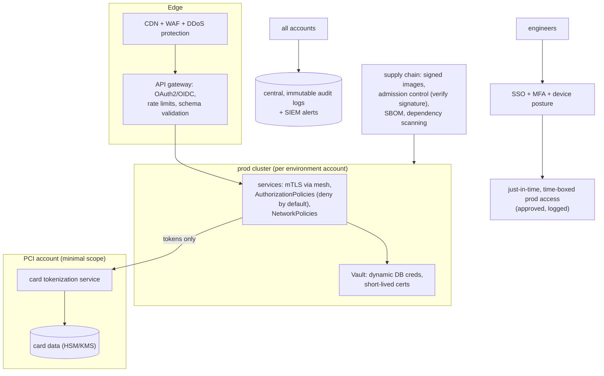

# Chapter 14 — Security at the System Level

> **Volume 4 — High-Level Design** · [Contents](index.md) · ← [Chapter 13 — Disaster Recovery (Backups, RTO/RPO)](ch13-disaster-recovery-backups-rto-rpo.md) · Next → [Chapter 15 — Cloud Architecture](ch15-cloud-architecture.md)

---

## Concept

Zero-trust, IAM, secrets, encryption in transit/at rest, and blast-radius reduction.

**In one sentence:** system-level security assumes any component can be compromised, so every request is authenticated and authorized regardless of network location (zero trust), every identity gets only the permissions it needs, credentials are short-lived and rotated, data is encrypted everywhere, and the architecture is split so a breach in one part can't spread to the rest.

**Mental model — a modern office building.** The old model is a castle: a strong wall, and anyone inside is trusted. Zero trust is an office where your badge is checked at *every* door, each badge opens only the rooms your job needs, badges expire each evening, the safes are locked even inside locked rooms (encryption at rest), and fire doors divide the building so one fire can't burn it all down (blast radius).

**Zero trust vs perimeter**

| | Perimeter ("castle and moat") | Zero trust |
|-|-------------------------------|------------|
| Trust based on | network location (inside the VPN = trusted) | verified identity + device + context, per request |
| East-west traffic | often unauthenticated plaintext | mTLS with workload identities |
| After a breach | the attacker moves laterally freely | each hop requires new authorization |
| Access | broad network access (VPN) | per-application, least-privilege access (identity-aware proxies) |

**IAM principles**

| Principle | Practice |
|-----------|----------|
| **Least privilege** | grant specific actions on specific resources (`s3:GetObject` on `bucket/reports/*`), not `*` |
| Identities for workloads, not shared keys | IAM roles for services, Kubernetes service accounts → cloud roles (workload identity), SPIFFE IDs |
| **Short-lived credentials** | STS tokens (15 min–1 h), OIDC federation for CI, Vault dynamic DB credentials |
| Separation of duties | whoever deploys can't also approve their own access; break-glass accounts audited |
| Policy as code | IAM in Terraform, reviewed; automated checks for wildcards and public access |
| Continuous review | access analyzers; remove unused permissions (e.g. unused for 90 days) |

**Secrets at scale**

| Level | Approach |
|-------|----------|
| Bad | secrets in code, images, env files in git, Slack |
| OK | a secrets manager, read at startup, rotated manually |
| **Good** | a secrets manager + automatic rotation + workload identity to fetch them (no bootstrap secret) + audit logs |
| Best | no long-lived secrets at all: dynamic, per-instance credentials that expire (Vault DB engine, IAM auth to RDS) |

**Encryption**

| Where | How |
|-------|-----|
| **In transit** | TLS 1.2+/1.3 at the edge; **mTLS** between services (a mesh or SPIFFE/SPIRE); TLS to databases |
| **At rest** | disk/volume encryption (default on major clouds); database TDE; object storage SSE-KMS |
| **Envelope encryption** | a KMS master key encrypts per-object data keys; data keys encrypt data. Rotating the master key doesn't re-encrypt all data; per-tenant keys enable crypto-shredding |
| Application level | encrypt specific fields (national IDs, tokens) so even DB admins see ciphertext |
| Key management | KMS/HSM; keys never leave; access logged; separate duties for key admins and data admins |

**Blast-radius reduction**

* Separate cloud **accounts/projects** per environment and per sensitive system (prod ≠ staging ≠ security tooling).
* Network segmentation: private subnets, security groups allowing only needed ports from needed sources, deny egress by default.
* Cell-based architecture: shards of users served by independent stacks.
* One service = one identity = its own permissions and secrets.
* Rate limits, quotas, and budgets so a compromised key can't do unlimited damage.

---

## Prereqs

* [Vol 2 Ch 10 — Security & Threat Modeling](../volume-2-software-engineering/ch10-security-and-threat-modeling.md)

---

## Diagram

**A zero-trust architecture with identity-aware access and mTLS**



**Blast radius: separate accounts and cells**

```
 organization
 ├── account: security (logs, audit, backups — write-only from others)
 ├── account: prod-payments      ← PCI scope, the smallest possible
 ├── account: prod-core
 │     ├── cell-1 (users 0–24%)
 │     ├── cell-2 (users 25–49%)  a bad deploy or a compromise hits one cell, not everyone
 │     └── …
 ├── account: staging            no network path to prod; no prod data
 └── account: sandbox
```

**Envelope encryption**

```
 KMS master key (never leaves the KMS/HSM)
      │ encrypts
      ▼
 data key (random per object / per tenant) ──encrypts──► data
 stored together:  [encrypted data key][ciphertext]
 read: ask KMS to decrypt the data key (logged, IAM-checked) → decrypt the data in memory
 delete a tenant's key → all their data becomes unreadable (crypto-shredding)
```

---

## Example

```json
{
  "Version": "2012-10-17",
  "Statement": [
    {
      "Sid": "ReadOwnReports",
      "Effect": "Allow",
      "Action": ["s3:GetObject"],
      "Resource": "arn:aws:s3:::acme-reports/tenant-*/reports/*"
    },
    {
      "Sid": "DecryptWithReportsKeyOnly",
      "Effect": "Allow",
      "Action": ["kms:Decrypt"],
      "Resource": "arn:aws:kms:eu-west-1:111122223333:key/5f1e…",
      "Condition": { "StringEquals": { "kms:ViaService": "s3.eu-west-1.amazonaws.com" } }
    }
  ]
}
```

```yaml
# Istio: require mTLS everywhere, and allow only orders → payments
apiVersion: security.istio.io/v1beta1
kind: PeerAuthentication
metadata: { name: default, namespace: prod }
spec: { mtls: { mode: STRICT } }
---
apiVersion: security.istio.io/v1beta1
kind: AuthorizationPolicy
metadata: { name: payments-allow-orders, namespace: prod }
spec:
  selector: { matchLabels: { app: payments } }
  action: ALLOW
  rules:
    - from: [{ source: { principals: ["cluster.local/ns/prod/sa/orders"] } }]
      to:   [{ operation: { methods: ["POST"], paths: ["/charge"] } }]
```

```bash
# Vault: dynamic, short-lived database credentials
vault write database/roles/payments-app \
    db_name=payments \
    creation_statements="CREATE ROLE \"{{name}}\" LOGIN PASSWORD '{{password}}' VALID UNTIL '{{expiration}}'; \
                         GRANT SELECT, INSERT ON ledger TO \"{{name}}\";" \
    default_ttl=1h max_ttl=4h
vault read database/creds/payments-app      # username v-payments-8f3k…, a password, lease 1h
```

```python
# Envelope encryption with AWS KMS
import boto3, os
from cryptography.hazmat.primitives.ciphers.aead import AESGCM
kms = boto3.client("kms")

def encrypt(plaintext: bytes, key_id: str) -> dict:
    dk = kms.generate_data_key(KeyId=key_id, KeySpec="AES_256")
    nonce = os.urandom(12)
    ct = AESGCM(dk["Plaintext"]).encrypt(nonce, plaintext, None)
    return {"edk": dk["CiphertextBlob"], "nonce": nonce, "ct": ct}    # the plaintext key is discarded

def decrypt(blob: dict) -> bytes:
    key = kms.decrypt(CiphertextBlob=blob["edk"])["Plaintext"]        # IAM-checked, logged
    return AESGCM(key).decrypt(blob["nonce"], blob["ct"], None)
```

---

## Exercises

1. Design least-privilege IAM for a service.

   <details><summary>Solution</summary>List exactly what the service does: reads objects under one prefix, writes to one queue, and decrypts with one KMS key. Grant only those actions on those ARNs, with conditions (region, VPC endpoint, tags). Give it its own role through workload identity (no access keys). Deny wildcards via policy checks in CI. Start from access logs (IAM Access Analyzer can generate a policy from CloudTrail) and review unused permissions quarterly.</details>

2. Encrypt data at rest and in transit.

   <details><summary>Solution</summary>At rest: enable KMS encryption on volumes, the database, snapshots, and buckets (default-deny unencrypted uploads with a bucket policy); use envelope encryption at the application level for sensitive fields. In transit: TLS 1.3 at the edge with HSTS; mTLS between services (mesh or SPIRE); <code>sslmode=verify-full</code> to the database. Verify with scanners (e.g. <code>testssl.sh</code>) and config rules that alert on unencrypted resources.</details>

3. A CI job has an AWS access key with `AdministratorAccess` stored as a repo secret. List the risks and a fix.

   <details><summary>Solution</summary>Risks: a long-lived key that anyone who can edit workflows (or a compromised action) can exfiltrate; unlimited blast radius across the account; no expiry. Fix: GitHub OIDC federation to a role that is assumable only from this repo and branch (via conditions), with least-privilege permissions for the deploy, and credentials that expire in minutes. Delete the key and review CloudTrail for its past use.</details>

---

## Mini project

**A threat model + least-privilege IAM + encryption for a small system.**



**Steps**

1. Draw the system and its trust boundaries; list STRIDE threats per boundary.
2. Terraform (on LocalStack or a sandbox account): a separate role for each component, with only the actions it needs.
3. Encryption: KMS keys, bucket policy denying unencrypted uploads, DB encryption, and envelope encryption for one PII field.
4. Networking: private subnets, security groups with specific sources, VPC endpoints instead of public egress.
5. Policy checks in CI (`checkov`, `tfsec`) that fail on wildcards, public buckets, or missing encryption.
6. "Assume breach" exercise: with the worker's credentials, list everything it can access; document the blast radius.

**Done when:** each component's reachable resources are exactly what it needs, CI blocks insecure changes, and the blast-radius write-up fits in a paragraph.

---

## Design

**Design the security posture for a multi-service platform.**

Requirements: ~40 microservices on Kubernetes across 3 environments; handles payments (PCI) and personal data (GDPR); 200 engineers; must pass SOC 2; must contain the impact of any single compromised service or credential.



**Decisions to justify**

* **Zero trust inside the cluster:** mesh mTLS with workload identities, and authorization policies that deny by default (service A may call only B's specific endpoints).
* **Shrink PCI scope:** only a small tokenization service in a separate account ever sees card numbers; everything else handles tokens.
* **No long-lived secrets:** workload identity → Vault or cloud roles; dynamic DB credentials; CI via OIDC.
* **Human access:** SSO + MFA + managed devices; no standing prod access — just-in-time elevation with approval, time limits, and session recording.
* **Blast radius:** an account per environment and per sensitive domain; per-service identities; cell-based deployment for the core; egress allow-lists.
* **Supply chain:** only signed images from the internal registry are admitted (policy controller); SBOMs; dependency and image scanning in CI.
* **Detect and respond:** central immutable audit logs, alerts on anomalous IAM or KMS use, and incident runbooks ([Vol 2 Ch 15](../volume-2-software-engineering/ch15-incident-response-and-postmortems.md)).

---

## Open source

* [`hashicorp/vault`](https://github.com/hashicorp/vault) — secrets engines (dynamic DB credentials, PKI, transit encryption-as-a-service), leases, and audit devices.
* [`spiffe/spire`](https://github.com/spiffe/spire) — issues short-lived workload identities (X.509 SVIDs) based on attestation, the foundation for mTLS without shared secrets. See also Google's BeyondCorp papers on zero trust.

---

## Interview

1. **"Zero trust — what changes?"**
   <details><summary>Answer</summary>Network location stops granting trust. Every request — user-to-app and service-to-service — is authenticated with a strong identity (user + device posture, or a workload certificate), authorized against an explicit least-privilege policy, and encrypted, even inside the private network. VPN-style broad access is replaced by per-application, identity-aware access, with continuous verification and logging. The goal is that a single breached host or credential can't move laterally.</details>

2. **"How do you manage secrets at scale?"**
   <details><summary>Answer</summary>Centralize them in a secrets manager with fine-grained access and audit logs; give workloads identities (IAM roles, Kubernetes service accounts, SPIFFE) so they authenticate without a bootstrap secret; prefer dynamic, short-lived credentials generated on demand; rotate everything else automatically; never put secrets in code, images, or logs (scan for leaks); and scope each secret to one service so a leak has a small blast radius.</details>

---

## Checklist

- [ ] least privilege everywhere
- [ ] encrypt transit + rest
- [ ] rotate credentials automatically

---

> [Contents](index.md) · ← [Chapter 13 — Disaster Recovery (Backups, RTO/RPO)](ch13-disaster-recovery-backups-rto-rpo.md) · Next → [Chapter 15 — Cloud Architecture](ch15-cloud-architecture.md)
