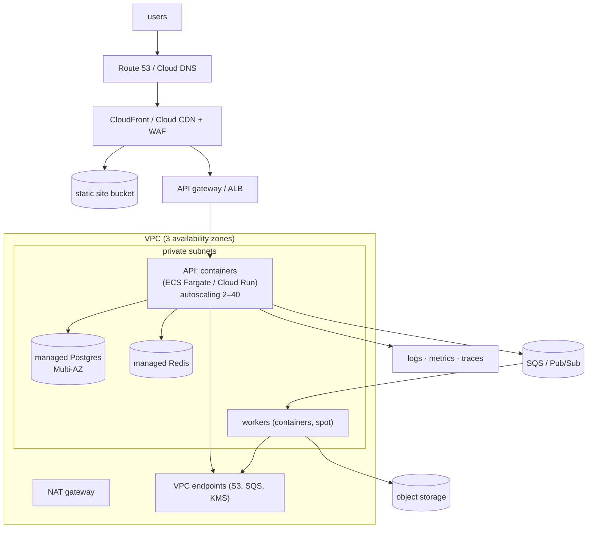
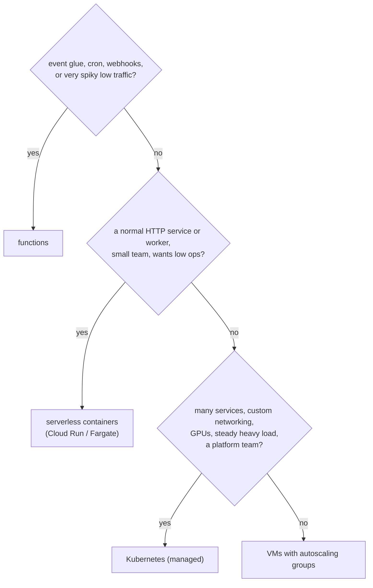
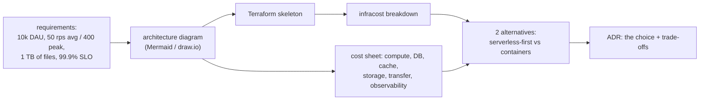
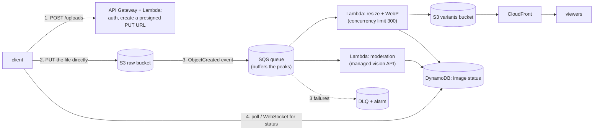

# Chapter 15 — Cloud Architecture

> **Volume 4 — High-Level Design** · [Contents](index.md) · ← [Chapter 14 — Security at the System Level](ch14-security-at-the-system-level.md) · Next → [Chapter 16 — Cost & Capacity Economics](ch16-cost-and-capacity-economics.md)

---

## Concept

Cloud building blocks (compute, storage, networking, managed services), serverless vs containers, and cost-aware design.

**In one sentence:** cloud architecture is choosing and connecting rented building blocks — compute, storage, networking, and managed services — so the system meets its reliability, performance, security, and cost goals with the least undifferentiated work for your team.

**Mental model — building with LEGO Technic vs carving wood.** On-premises you carve every part yourself: servers, racks, databases, backups. In the cloud you snap together ready-made parts (a managed database, a queue, a load balancer) that someone else maintains. The skill moves from making parts to choosing the right parts, connecting them safely, and not buying far more bricks than you need.

**The building blocks (AWS / GCP / Azure names)**

| Category | Options | Use |
|----------|---------|-----|
| **Compute** | VMs (EC2 / Compute Engine / VMs); containers (EKS/ECS, GKE, Cloud Run, AKS, Container Apps); functions (Lambda, Cloud Functions, Azure Functions) | run code |
| **Storage** | object (S3 / GCS / Blob); block (EBS / PD / Managed Disks); file (EFS / Filestore / Files) | files, volumes, shared file systems |
| **Databases** | relational (RDS/Aurora, Cloud SQL/AlloyDB, Azure SQL); NoSQL (DynamoDB, Firestore/Bigtable, Cosmos DB); caches (ElastiCache, Memorystore); warehouses (Redshift, BigQuery, Synapse) | data |
| **Networking** | VPC/VNet, subnets, NAT, load balancers, DNS, CDN, private endpoints, transit gateways | connectivity and isolation |
| **Integration** | queues (SQS, Pub/Sub, Service Bus), streams (Kinesis, managed Kafka), workflows (Step Functions, Workflows), API gateways, event buses (EventBridge) | decoupling |
| **Identity & security** | IAM, KMS, secrets managers, WAF | [Ch 14](ch14-security-at-the-system-level.md) |
| **Observability** | CloudWatch, Cloud Monitoring/Logging, Azure Monitor, managed Prometheus/Grafana | operations |

**Serverless vs containers vs VMs**

| | Functions (Lambda) | Serverless containers (Cloud Run, Fargate) | Kubernetes / VMs |
|-|--------------------|-------------------------------------------|------------------|
| Unit | a function per event | a container, scaled per request | pods/processes you manage |
| Scaling | per request, to zero, very fast | per request/concurrency, to zero (Cloud Run) | autoscalers you configure; rarely to zero |
| Max run time | ~15 min (Lambda) | long (up to 60 min per request on Cloud Run; unlimited on Fargate tasks) | unlimited |
| Cold starts | yes (100 ms–seconds) | yes, smaller with min instances | none |
| Ops burden | lowest | low | highest |
| Cost at low/bursty traffic | **lowest** (pay per ms) | low | idle capacity costs money |
| Cost at high steady traffic | can be **highest** | moderate | **lowest** per unit (with commitments) |
| Portability / control | lowest | high (it's a container) | highest |
| Fits | event glue, webhooks, cron, spiky APIs | most web APIs and workers | large platforms, special hardware/networking, steady heavy load |

**Break-even sketch:** Lambda at 512 MB, 100 ms per request ≈ $0.00000083 compute + $0.0000002 request ≈ **$1.03 per million requests**. A 2-vCPU container at ~$50/month handling 200 req/s sustained ≈ 518M requests/month ≈ **$0.10 per million**. Serverless wins at low or spiky volume; containers win at high steady volume. Always model your own numbers.

**Managed services — when sensible:** use managed databases, queues, caches, and object storage unless you have a strong reason not to (special performance, cost at huge scale, portability requirements). Running your own Postgres HA with backups, patching, and failover is a full-time job.

**Lock-in, sensibly** — lock-in isn't binary; it's a cost you weigh. Low-regret choices: standard interfaces (Postgres, Kafka API, S3 API, OCI containers, Kubernetes, OpenTelemetry, Terraform). Accept deep lock-in where the service gives a big advantage (DynamoDB, BigQuery), and keep your domain logic behind your own interfaces ([Vol 3 Ch 9](../volume-3-low-level-design/ch09-hexagonal-architecture-ports-and-adapters.md)) so a later migration touches adapters, not everything.

**Well-architected pillars** (shared by the major clouds): operational excellence, security, reliability, performance efficiency, cost optimization, sustainability.

---

## Prereqs

* [Chapter 1 — Capacity Planning](ch01-capacity-planning.md)
* [Chapter 2 — Scalability & Reliability Fundamentals](ch02-scalability-and-reliability-fundamentals.md)
* [Vol 1 Ch 44 — Delivery: Load Balancing, Reverse Proxies & CDN](../volume-1-cs-foundations/ch44-delivery-load-balancing-reverse-proxies-and-cdn.md)

---

## Diagram

**A reference architecture on a cloud provider with managed services**



**Choosing compute**



**Mapping a monolith to cloud services (lift → reshape)**

```
 on-prem monolith box                     cloud
 ┌────────────────────────┐
 │ nginx                  │  ──►  ALB / API gateway + CDN
 │ app (Django)           │  ──►  containers (Fargate / Cloud Run), 3 AZs
 │ cron jobs              │  ──►  EventBridge Scheduler / Cloud Scheduler → a job
 │ Celery + RabbitMQ      │  ──►  SQS / Pub/Sub + workers
 │ Postgres on the box    │  ──►  RDS / Cloud SQL (Multi-AZ, PITR)
 │ Redis                  │  ──►  ElastiCache / Memorystore
 │ /var/uploads           │  ──►  S3 / GCS (+ presigned URLs)
 │ logs in files          │  ──►  CloudWatch / Cloud Logging + OTel
 └────────────────────────┘
```

---

## Example

**API gateway → serverless/containers → managed DB/cache (Terraform excerpt, AWS)**

```hcl
resource "aws_ecs_service" "api" {
  name            = "api"
  cluster         = aws_ecs_cluster.main.id
  task_definition = aws_ecs_task_definition.api.arn
  launch_type     = "FARGATE"
  desired_count   = 3
  network_configuration {
    subnets         = module.vpc.private_subnets
    security_groups = [aws_security_group.api.id]
  }
  load_balancer {
    target_group_arn = aws_lb_target_group.api.arn
    container_name   = "api"
    container_port   = 8080
  }
}

resource "aws_db_instance" "main" {
  engine                  = "postgres"
  engine_version          = "16"
  instance_class          = "db.r7g.large"
  multi_az                = true
  storage_encrypted       = true
  backup_retention_period = 14
  db_subnet_group_name    = aws_db_subnet_group.private.name
  publicly_accessible     = false
}

resource "aws_elasticache_replication_group" "cache" {
  replication_group_id       = "api-cache"
  description                = "api cache"
  node_type                  = "cache.r7g.large"
  num_cache_clusters         = 2
  automatic_failover_enabled = true
  at_rest_encryption_enabled = true
  transit_encryption_enabled = true
}
```

```python
# Serverless vs container cost model — plug in your own numbers
def lambda_cost(req_per_month, ms=100, mb=512):
    gb_s = req_per_month * (ms / 1000) * (mb / 1024)
    return gb_s * 0.0000166667 + req_per_month / 1e6 * 0.20

def container_cost(req_per_month, rps_per_task=200, task_month=50.0, min_tasks=2):
    avg_rps = req_per_month / (30 * 24 * 3600)
    tasks = max(min_tasks, -(-avg_rps // rps_per_task))    # ceiling division
    return tasks * task_month

for m in (1e6, 50e6, 500e6, 5e9):
    print(f"{m/1e6:>6.0f}M req/mo  lambda ${lambda_cost(m):>9,.0f}   containers ${container_cost(m):>6,.0f}")
#      1M req/mo  lambda $        1   containers $   100
#     50M req/mo  lambda $       52   containers $   100
#    500M req/mo  lambda $      517   containers $   100
#   5000M req/mo  lambda $    5,167   containers $   500
```

---

## Exercises

1. Map a monolith to cloud services.

   <details><summary>Solution</summary>See the mapping above. Order: (1) lift the app into containers behind a managed LB, move the DB to a managed service with Multi-AZ and PITR, and move files to object storage; (2) move cron and queues to managed schedulers and queues; (3) add a CDN and WAF; (4) put everything in IaC with observability; (5) only then consider splitting services where scaling or team boundaries demand it.</details>

2. Compare serverless vs container costs for a workload.

   <details><summary>Solution</summary>Model monthly requests, duration, memory, and the traffic shape. Run the cost model above with real prices: at 1–50M requests per month, functions are cheaper (and scale to zero); somewhere in the hundreds of millions of steady requests, containers win. Add hidden costs: API gateway fees per request, NAT and data transfer, cold-start impact on SLOs, and the engineering time for each option.</details>

3. Why put the database in private subnets with `publicly_accessible = false`?

   <details><summary>Solution</summary>It removes an entire attack surface: the database can't be reached from the internet at all, only from app security groups inside the VPC. Credential leaks or database zero-days then require a foothold inside the network first. Admins connect through SSM Session Manager, a bastion, or an identity-aware proxy.</details>

---

## Mini project

**A cost-estimate + architecture diagram for a service on a cloud provider.**



**Steps**

1. Write requirements (traffic, data size, SLO, compliance).
2. Draw the architecture with managed services across 2–3 AZs.
3. A Terraform skeleton for the main resources; run `infracost breakdown`.
4. Build a cost sheet including easily forgotten items (NAT processing, egress, logs, backups).
5. Design an alternative (serverless-first) and cost it too.
6. Write an ADR choosing one, with the break-even point where you'd switch.

**Done when:** you have a diagram, a monthly estimate within ±30% for each option, and an ADR explaining the choice.

---

## Design

**Design a serverless image-processing pipeline.**

Requirements: users upload images (up to 25 MB); generate 4 sizes plus WebP; detect NSFW content; 1M uploads/day with peaks of 200/s; results available within 10 s p95; pay close to zero when idle.



**Decisions to justify**

* **Presigned uploads**: the file goes straight to S3; Lambda never handles 25 MB bodies (API Gateway payload limits make that impossible anyway).
* **SQS between S3 and the workers** absorbs peaks, gives retries and a DLQ, and lets you cap Lambda concurrency so downstream APIs aren't overwhelmed.
* **Idempotent processing** keyed by the object key and version: S3 events are at-least-once.
* **Capacity:** 200 uploads/s × ~2 s of processing ≈ 400 concurrent executions at peak (set reserved concurrency; request a limit increase if needed). Memory ~2 GB for image libraries (a faster CPU comes with more memory in Lambda).
* **Cost:** 1M/day × 2 s × 2 GB ≈ 4M GB-s/day ≈ $67/day of compute at list price, and near zero when idle. Compare with a container fleet sized for the peak.
* **Status in DynamoDB** (on-demand capacity) keyed by image ID; the client polls or subscribes.
* **Limits to watch:** Lambda's 15-minute timeout and `/tmp` size; very large images or video → Fargate tasks instead.

---

## Open source

* [`serverless/serverless`](https://github.com/serverless/serverless) — a framework for defining functions, events, and resources; compare with AWS SAM, SST, and Terraform modules.
* [`aws/aws-sdk`](https://github.com/aws/aws-sdk) — the SDK specs; the AWS, Google Cloud, and Azure "Well-Architected" / "Architecture Framework" docs are the reference checklists.

---

## Interview

1. **"Serverless vs containers — when each?"**
   <details><summary>Answer</summary>Serverless functions for event-driven glue, scheduled jobs, webhooks, and spiky or low-traffic APIs — you pay per use, scale to zero, and have almost no ops, but you accept cold starts, time limits, and per-request pricing that gets expensive at high steady volume. Containers for long-running or steady high-traffic services, custom runtimes, and portability — more control and a lower unit cost at scale, with more to operate (less with serverless containers like Cloud Run or Fargate). Decide with a cost model and the latency SLO.</details>

2. **"How do you control cloud cost?"**
   <details><summary>Answer</summary>Design for it (right service per workload, autoscaling, scale to zero where possible, keep traffic in-zone, a CDN for egress); make it visible (tags, per-team and per-service dashboards, unit cost per request or customer, budgets and anomaly alerts); optimize continuously (right-size, commitments for the steady baseline, spot for interruptible work, storage lifecycle, delete idle resources); and review cost in design reviews and PRs (Infracost). See <a href="ch16-cost-and-capacity-economics.md">Ch 16</a>.</details>

---

## Checklist

- [ ] use managed services where sensible
- [ ] design for cost
- [ ] avoid vendor lock-in where it matters

---

> [Contents](index.md) · ← [Chapter 14 — Security at the System Level](ch14-security-at-the-system-level.md) · Next → [Chapter 16 — Cost & Capacity Economics](ch16-cost-and-capacity-economics.md)
