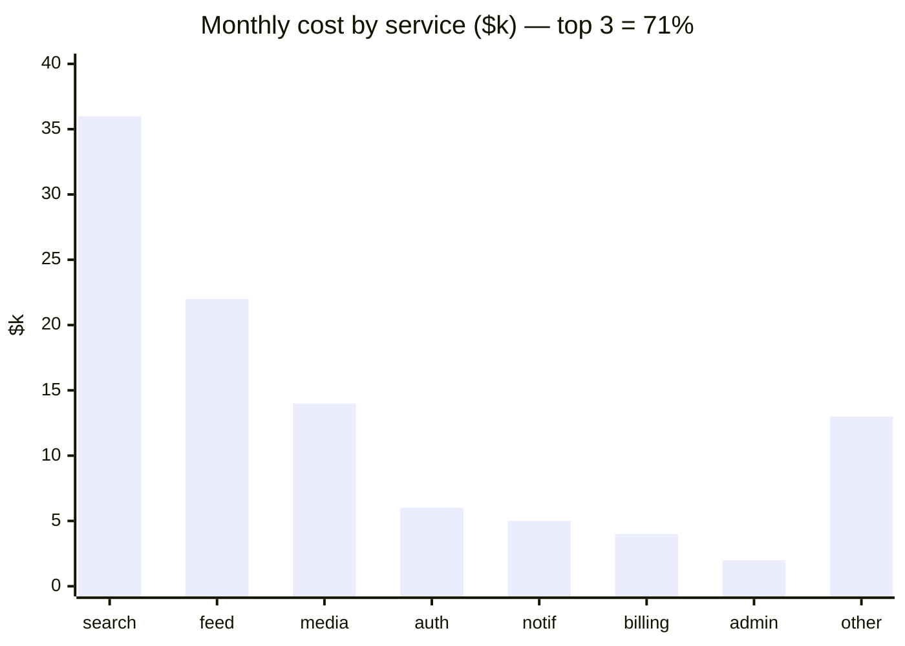
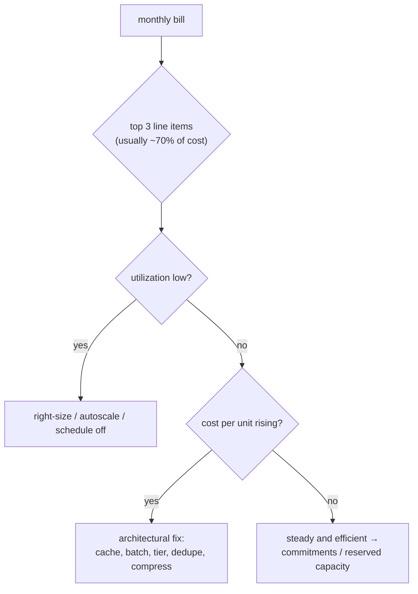
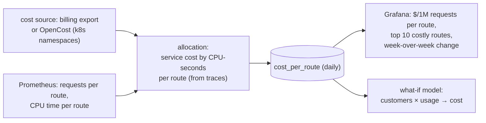
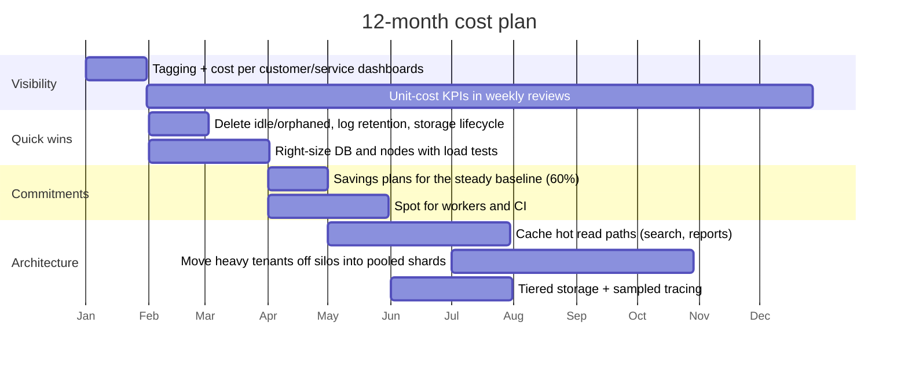

# Chapter 16 — Cost & Capacity Economics

> **Volume 4 — High-Level Design** · [Contents](index.md) · ← [Chapter 15 — Cloud Architecture](ch15-cloud-architecture.md) · Next → [Chapter 17 — The 30-System Design Portfolio](ch17-the-30-system-design-portfolio.md)

---

## Concept

Unit economics, cloud cost drivers, right-sizing, and cost as a design constraint.

**In one sentence:** at the design level, cost is a requirement like latency — you estimate the cost of an architecture before building it, express it per unit of business value, find which components dominate as scale grows, and choose designs whose cost grows slower than revenue.

**Mental model — running a restaurant.** You don't just look at the monthly total. You know the *cost per plate*: ingredients, staff minutes, a share of rent. If a dish costs €9 to make and sells for €8, selling more of it makes things worse. Architecture decisions set your cost per plate.

This chapter is the **design-time** view. For operational cost hygiene (tagging, right-sizing a running cluster, purchase models), see [Vol 1 Ch 59](../volume-1-cs-foundations/ch59-cost-awareness-in-the-cloud.md).

**Unit economics**

| Metric | Formula | Use |
|--------|---------|-----|
| Cost per request | infra cost ÷ requests | API efficiency; compare services |
| **Cost per active customer / tenant** | infra cost ÷ monthly active customers (or tenants) | pricing, margins, plan design |
| Cost per transaction / order | infra cost ÷ orders | e-commerce, payments |
| Cost per GB stored / processed | storage or pipeline cost ÷ GB | data platforms |
| Infra cost as % of revenue (COGS) | infra ÷ revenue | SaaS gross margin (healthy SaaS: infra ≈ 5–15% of revenue) |
| Marginal cost | Δcost ÷ Δunits | does the next customer cost less than the average? |

**How costs scale with design choices**

| Design choice | Cost behavior |
|---------------|---------------|
| Per-tenant silos | fixed cost per tenant → bad for many small tenants ([Ch 12](ch12-multi-tenancy.md)) |
| Fan-out on write for feeds | writes × followers: celebrities explode cost |
| Synchronous calls to paid APIs per request | linear in traffic × price; cache or batch |
| Keeping all logs / traces | linear in traffic × retention; sample and tier |
| Multi-region active-active | ~2–3× infra + cross-region transfer |
| Chatty microservices across AZs | transfer charges per GB on every hop |
| LLM calls per request | often the *largest* cost line; see [Vol 5 Ch 18](../volume-5-ai-systems/ch18-cost-and-latency-optimization.md) |

**Right-sizing, continuously** — compare provisioned capacity with p95 usage (CPU, memory, IOPS, connections); keep headroom for SLOs (e.g. target 60–70% CPU at peak); autoscale; review monthly because usage drifts; pick newer, cheaper instance families (ARM).

**Reducing spend without hurting reliability**

1. Measure unit cost and the SLOs *together* on one dashboard.
2. Remove pure waste first (idle, orphaned, over-retained) — no reliability impact.
3. Right-size with load tests, one change at a time; watch p99 and errors.
4. Buy commitments only for the proven steady baseline.
5. Architectural changes (caching, batching, tiered storage, fewer cross-zone hops) — with ADRs.
6. Never cut redundancy that the SLO depends on (multi-AZ, backups) without an explicit decision.

---

## Prereqs

* [Chapter 15 — Cloud Architecture](ch15-cloud-architecture.md)

---

## Diagram

**A cost breakdown by service with the top spenders highlighted**



```
 service   $k/mo   requests/mo   $ per 1M req   note
 search      36        1,200M          30        ← heavy index nodes; the top spender
 feed        22          900M          24        fan-out on write
 media       14        3,000M           5        mostly CDN; efficient per request
 auth         6        2,500M           2
```

**Unit cost vs scale: good and bad designs**

```
 $ per customer
   ▲
   │ ╲                                       bad: per-customer silos → the curve flattens
   │  ╲___________________________________   at a high floor
   │   ╲
   │    ╲___
   │        ‾‾‾‾────______                   good: shared pool + caching → keeps falling
   │                      ‾‾‾‾‾‾────────     (economies of scale)
   └────────────────────────────────────────► customers
```

**Where to look first**



---

## Example

**Right-sizing an over-provisioned cluster, and reserving capacity for steady load**

```
 cluster: 30 × 8-vCPU nodes, on-demand ($0.34/h each)      = 30 × 0.34 × 730 ≈ $7,450/mo
 observed: p95 CPU 22%, p95 memory 35%, peak day = 1.4 × average

 step 1 right-size: needed at peak ≈ 30 × 8 × 0.22 / 0.65 target ≈ 81 vCPU ≈ 11 nodes
 step 2 split: 8 nodes steady (a 1-year commitment, ~40% off) + 0–6 autoscaled on-demand
 cost ≈ 8 × 0.34 × 0.6 × 730 + (avg 2 extra) × 0.34 × 730 ≈ $1,191 + $496 ≈ $1,690/mo
 saving ≈ 77% — verified with a load test at 1.5× peak: p99 unchanged, 0 errors
```

```python
# Unit economics model for a design review
def monthly_infra(customers, req_per_customer=30_000, cost_per_m_req=6.0,
                  gb_per_customer=2.0, cost_per_gb=0.023, fixed=4_000):
    requests = customers * req_per_customer
    return fixed + requests / 1e6 * cost_per_m_req + customers * gb_per_customer * cost_per_gb

for c in (1_000, 10_000, 100_000):
    total = monthly_infra(c)
    print(f"{c:>7,} customers  ${total:>9,.0f}/mo  ${total / c:6.2f} per customer")
#   1,000 customers  $    4,226/mo  $  4.23 per customer
#  10,000 customers  $    6,260/mo  $  0.63 per customer
# 100,000 customers  $   26,600/mo  $  0.27 per customer
# with a $10/month price: infra is 42% of revenue at 1k customers, 2.7% at 100k
```

---

## Exercises

1. Find and fix the top cost driver in a sample bill.

   <details><summary>Solution</summary>In the chart above, search is the top driver at $30 per 1M requests, 6× media's cost. Check node utilization and index size; typical fixes: a result cache for popular queries (often 30–60% hit rate), fewer replicas off-peak, cheaper instance types for warm data, shrinking the index (dropping unused fields). Measure $/1M requests before and after, with p99 latency alongside.</details>

2. Compute unit cost per request.

   <details><summary>Solution</summary>Unit cost = the service's allocated cost ÷ its requests in the same period. For search: $36,000 ÷ 1,200M = $0.00003 per request = $30 per million. Allocate shared costs (cluster overhead, observability) by a fair key such as CPU-seconds, and track the number weekly per service.</details>

3. A feature adds one call to a third-party API ($0.002 per call) on every page view (50M/month). What do you tell the team?

   <details><summary>Solution</summary>$100,000/month — probably more than the whole infra bill. Cache results (per user or per item with a TTL), batch calls, call only when the result is visible, or negotiate volume pricing. Put the unit cost in the design doc before building.</details>

---

## Mini project

**A cost model + dashboard tracking cost per endpoint.**



**Steps**

1. Get daily cost per service (billing export, or OpenCost on a local cluster).
2. Allocate each service's cost to routes by their share of CPU-seconds (from traces or profiling metrics).
3. Store daily `(route, requests, cost)`; compute $/1M requests.
4. Dashboard: the top 10 routes by total cost and by unit cost, plus trends.
5. A what-if model (like the Python above) for pricing and capacity planning.
6. Alert when a route's unit cost rises 30% week over week (e.g. an accidental N+1 query).

**Done when:** you can say which endpoint is most expensive per request, and a deliberately introduced inefficiency shows up on the dashboard within a day.

---

## Design

**Design a cost-optimization plan for a growing service.**

Situation: a B2B SaaS with 3,000 customers, infra at $140k/month (28% of revenue) and growing faster than revenue; target < 15% within 12 months without reducing the 99.9% SLO.



**Decisions to justify**

* **Visibility first:** without cost per customer and per service, you'll optimize the wrong things. Tag enforcement; untagged spend reported.
* **Quick wins** (typically 10–25%) with near-zero risk: waste removal, retention, lifecycle policies.
* **Right-sizing with evidence:** load tests at 1.5× peak before and after; SLO dashboards next to cost.
* **Commit only to the proven floor** (~60% of the baseline), leaving room for architecture changes that reduce usage.
* **Architecture changes** attack the unit cost: caching, pooling small tenants (their silo fixed costs dominate), cheaper storage tiers, sampling observability data.
* **Guardrails:** no changes to redundancy the SLO depends on without an ADR; each change reversible; track the error budget.
* **Expected result:** waste −15%, right-sizing −15%, commitments −12%, architecture −20% ≈ infra at ~12–14% of revenue as revenue grows.

---

## Open source

* [`opencost/opencost`](https://github.com/opencost/opencost) — Kubernetes cost allocation by namespace, workload, and label, with real cloud pricing. See also `infracost/infracost` (cost of Terraform changes in PRs) and the FinOps Foundation framework.

---

## Interview

1. **"How do you reduce cloud spend without hurting reliability?"**
   <details><summary>Answer</summary>Put cost and SLOs on the same dashboard. First remove pure waste (idle resources, over-retention, orphaned volumes). Then right-size using p95 utilization plus headroom, validated by load tests. Buy commitments for the steady floor; use spot for interruptible work. Then attack unit cost architecturally (caching, batching, storage tiers, fewer cross-zone hops). Make one reversible change at a time, and never remove redundancy the SLO relies on without an explicit decision.</details>

2. **"What's unit economics for infra?"**
   <details><summary>Answer</summary>Measuring infrastructure cost per unit of business value — per request, customer, tenant, order, or GB — instead of as a total. It shows whether cost grows proportionally with the business, which features or customers are expensive to serve, and whether a design scales economically. It links engineering to margins: infra as a share of revenue (COGS), and marginal cost per new customer.</details>

---

## Checklist

- [ ] track cost per unit of value
- [ ] right-size continuously
- [ ] treat cost as a first-class requirement

---

> [Contents](index.md) · ← [Chapter 15 — Cloud Architecture](ch15-cloud-architecture.md) · Next → [Chapter 17 — The 30-System Design Portfolio](ch17-the-30-system-design-portfolio.md)
