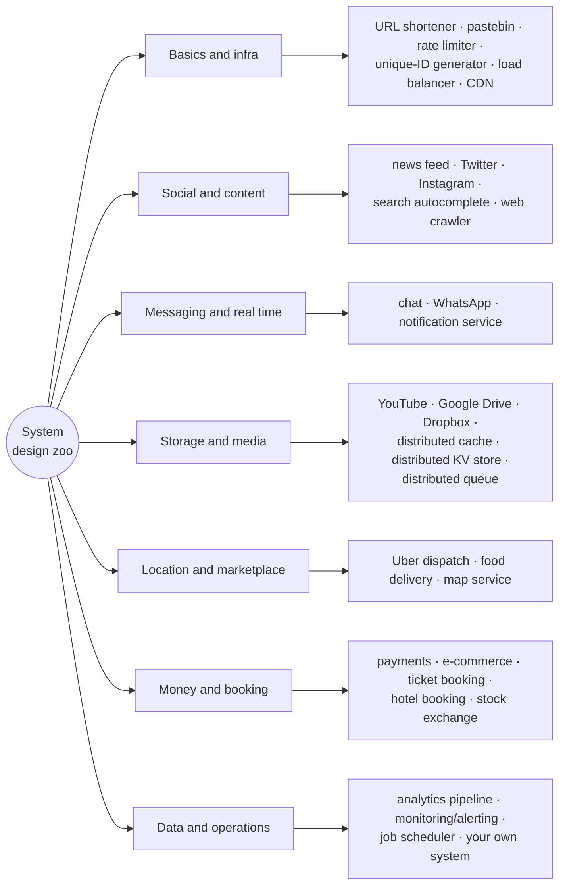
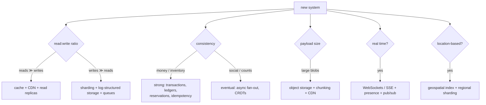
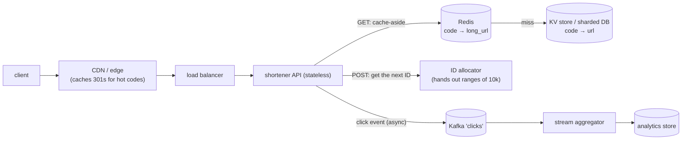
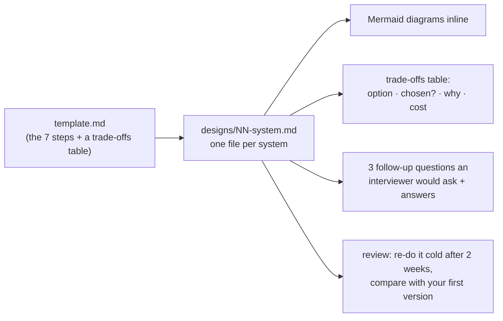

# Chapter 17 — The 30-System Design Portfolio

> **Volume 4 — High-Level Design** · [Contents](index.md) · ← [Chapter 16 — Cost & Capacity Economics](ch16-cost-and-capacity-economics.md)

---

## Concept

Applying every prior chapter to a portfolio of canonical designs; pattern recognition across systems.

**In one sentence:** after enough designs you notice there are only a dozen recurring building blocks — ID generation, caching, fan-out, queues, sharding, search indexes, blob storage, geo-routing, rate limiting, consensus — and each "new" system is a different arrangement of them, driven by its read/write ratio, consistency needs, and scale.

**Mental model — a chess player's openings.** Grandmasters don't calculate every move from scratch; they recognize patterns ("this is a Sicilian") and know the standard plans and traps. A system-design portfolio is your book of openings: "this is a fan-out problem", "this is a hot-key problem", "this is an inventory-consistency problem".

**A repeatable process (use it for every system)**

| Step | Output | Time in a 45-min interview |
|:-:|--------|:-:|
| 1. **Requirements** | functional (the 3–5 core features); non-functional (scale, latency, availability, consistency, durability); out of scope | 5 min |
| 2. **Estimates** | QPS (avg and peak), read:write ratio, storage over N years, bandwidth ([Ch 1](ch01-capacity-planning.md)) | 5 min |
| 3. **API** | 3–6 endpoints or events with key parameters | 3 min |
| 4. **Data model** | entities, keys, access patterns → storage choice | 5 min |
| 5. **High-level design** | boxes and arrows for the main flows | 10 min |
| 6. **Deep dives** | the 2–3 hardest parts: the bottleneck, consistency, a hot key | 12 min |
| 7. **Wrap-up** | failure modes, monitoring, trade-offs made, what you'd do next | 5 min |

**The recurring patterns**

| Pattern | Problem it solves | Seen in |
|---------|-------------------|---------|
| Unique IDs (Snowflake, ranges) | collision-free keys at scale | shortener, chat, feeds, orders |
| Cache-aside + CDN | read-heavy traffic | nearly everything |
| **Fan-out on write vs read** | feeds, notifications | Twitter, Instagram, news feed |
| Queue + workers | async, spiky work | crawlers, video, notifications, payments |
| Sharding / partitioning | write scale | KV stores, chat, analytics |
| Inverted index | text search | autocomplete, search, e-commerce |
| Blob storage + metadata DB | large files | Drive, Dropbox, YouTube, Instagram |
| Geospatial index (geohash, S2, quadtree) | "near me" | Uber, food delivery, maps |
| Reservations with expiry + strong consistency | double-booking | tickets, hotels, inventory |
| Idempotency + ledger | money correctness | payments, e-commerce |
| Presence + persistent connections | real time | chat, collaboration, dispatch |
| Consensus / leader election | coordination | distributed queue, KV store, scheduler |
| Streaming aggregation | real-time analytics | clickstream, monitoring |

---

## Prereqs

* [Chapters 1–16 of this volume](index.md), especially [Ch 1 — Capacity Planning](ch01-capacity-planning.md), [Ch 5 — Caching](ch05-caching-strategies.md), [Ch 7 — Queues](ch07-message-queues-and-streaming-kafka-sqs-pub.md), and [Ch 9 — Database Scaling](ch09-database-scaling.md).

---

## Diagram

**The "system design zoo" — 31 systems grouped by family**



**Which pattern does a system need?**



---

## Example

**The canonical URL-shortener design, worked fully as a template**

**1. Requirements**

* Functional: `POST /urls {long_url, custom_alias?, expires_at?}` → a short URL; `GET /{code}` → redirect; basic click analytics.
* Non-functional: 100M new URLs/month; reads ≈ 10× writes; redirects p99 < 50 ms; 99.99% availability for redirects; codes never collide; keep links 5 years.
* Out of scope: user accounts, link editing, detailed analytics UI.

**2. Estimates**

```
 writes:  100M / month ÷ 2.6M s/month ≈ 38/s average,  ~200/s peak (×5)
 reads:   10× → ≈ 386/s average,  ~2,000/s peak;  viral links → hot keys
 storage: 100M × 12 months × 5 years = 6B URLs × ~500 B ≈ 3 TB (+ replicas)
 code length: base62 (a–z, A–Z, 0–9): 62^7 ≈ 3.5 trillion codes ≫ 6B → 7 characters is plenty
```

**3. API**

```
 POST /v1/urls        {"long_url": "...", "alias": "spring-sale", "expires_at": "..."}  → 201 {"code": "aZ3k9Qx"}
 GET  /{code}         → 301/302 Location: long_url      (404 if unknown, 410 if expired)
 GET  /v1/urls/{code}/stats → {"clicks": 1234, "by_day": [...]}
```

**4. Data model** — `urls(code PK, long_url, created_at, expires_at, owner)`; access is always by `code`, so a key-value store (DynamoDB, Cassandra) or Postgres sharded by `code` both work. Clicks go to an append-only analytics stream, not to the URL row.

**5. High-level design**



**6. Deep dives**

| Topic | Choice and reasoning |
|-------|----------------------|
| **Generating codes** | Option A: hash(long_url) → base62, take 7 chars — collisions need checks and retries. **Option B (chosen): a counter** → base62. Each API server leases a range of 10,000 IDs from a small coordinator (etcd or a DB row with `UPDATE … RETURNING`), so no per-request coordination and no collisions. To make codes non-guessable, shuffle the ID with a reversible permutation (e.g. a Feistel cipher) before encoding. |
| Custom aliases | insert with a uniqueness condition (`PutItem` with `attribute_not_exists(code)` / `INSERT … ON CONFLICT`); a 409 if taken |
| **301 vs 302** | 301 (permanent) lets browsers and CDNs cache the redirect: less load, but you lose click counts and can't change the target. 302 (temporary) keeps every click visible. Choose per product need; many use 302 plus edge caching with a short TTL. |
| Hot keys (a viral link) | the CDN caches the redirect; Redis in front of the DB; request coalescing on a miss |
| Expiry | store `expires_at`; check on read (410 Gone); a background job deletes expired rows |
| Abuse | rate limit creation per IP/key; scan long URLs against malware/phishing lists |
| Availability | stateless API across 3 AZs; the DB replicated; the redirect path depends only on the cache + DB (analytics is async and may lag) |

**7. Wrap-up** — monitor redirect p99, cache hit rate, 404 rate, ID-range exhaustion, and Kafka lag. Trade-offs made: counter-based IDs (simple and collision-free) over hashes; eventual consistency for analytics; 302 to keep click counts.

```python
import string

ALPHABET = string.digits + string.ascii_lowercase + string.ascii_uppercase   # 62 characters

def encode(n: int) -> str:
    if n == 0:
        return ALPHABET[0]
    out = []
    while n:
        n, r = divmod(n, 62)
        out.append(ALPHABET[r])
    return "".join(reversed(out))

def decode(s: str) -> int:
    n = 0
    for ch in s:
        n = n * 62 + ALPHABET.index(ch)
    return n

class RangeAllocator:
    """Each server leases a block of IDs, so creating a URL needs no coordination."""
    def __init__(self, lease_block):       # lease_block() → (start, end), e.g. from etcd or a DB row
        self.lease_block, self.next, self.end = lease_block, 0, 0
    def next_id(self):
        if self.next >= self.end:
            self.next, self.end = self.lease_block()
        self.next += 1
        return self.next - 1

counter = iter(range(0, 10**12, 10_000))
alloc = RangeAllocator(lambda: (s := next(counter), s + 10_000))
ids = [alloc.next_id() for _ in range(3)]
print([encode(i + 56_800_235_584) for i in ids])   # 62**6 offset → always 7 characters: ['1000000', '1000001', '1000002']
assert decode(encode(123_456_789)) == 123_456_789
print(62**7)                                        # 3521614606208
```

---

## Exercises

1. Pick any system and draw its full design.

   <details><summary>Solution</summary>Follow the 7-step process above on paper or in Mermaid: requirements, estimates with real numbers, API, data model with its access patterns, a high-level diagram, 2–3 deep dives on the true bottlenecks, and a wrap-up on failure modes and monitoring. Time-box it to 45 minutes, then compare with the compact entry below and one public write-up.</details>

2. For each, list the top 3 scaling bottlenecks.

   <details><summary>Solution</summary>The compact entries below list bottlenecks for all 31 systems. The usual suspects: hot keys and partitions (celebrities, viral content, flash sales), fan-out amplification (feeds, notifications), write contention on shared counters or inventory, large-object bandwidth (video, files), cross-region consistency (payments, bookings), and stateful connection counts (chat, dispatch).</details>

3. What single change would you make to the URL shortener if analytics had to be exact per click?

   <details><summary>Solution</summary>Use 302 redirects (so browsers don't cache them) and don't cache redirects at the edge — or cache them at the edge but log clicks from edge logs or an edge worker that emits an event per request. Then make the click pipeline at-least-once with dedup by request ID.</details>

---

## Mini project

**A personal design journal with diagrams + trade-off notes for each system.**



**Steps**

1. Create a template with the 7 steps and a trade-offs table.
2. One file per system in `designs/`, with Mermaid diagrams (they render on GitHub and in this site).
3. For each design, write the numbers (QPS, storage) — not just boxes.
4. Add "what breaks at 10× scale?" for each.
5. Re-do each design from memory two weeks later and diff it with the original.

**Done when:** you have 30+ designs, each with estimates, a diagram, and a trade-offs table, and you can whiteboard any of them in 45 minutes without notes.

---

## Design

**Design these 30+ systems (a running portfolio).** Each compact entry gives the requirements, key components, the main bottlenecks, and the central trade-off. The URL shortener is fully worked in [Example](#example).

### Family A — Basics & infrastructure

**1. URL shortener** — see the full worked example above.

**2. Pastebin**
* *Requirements:* create text pastes (≤ 10 MB), read by URL, optional expiry and private links; reads ≫ writes.
* *Components:* API → object storage for the content, metadata DB (id, owner, expiry, size) → CDN for public pastes; IDs as in the URL shortener.
* *Bottlenecks:* storage growth, hot pastes, abuse (malware, spam).
* *Trade-off:* content in blob storage (cheap, CDN-friendly) vs in the DB (simpler, but bloats the DB).

**3. Rate limiter** ([Ch 6](ch06-rate-limiting-throttling-and-backpressure.md))
* *Requirements:* limit per user/key/IP across a fleet; < 1 ms overhead; clear 429s.
* *Components:* a middleware in the gateway → Redis with a token bucket or sliding-window counter via an atomic Lua script; local token caches for very hot keys.
* *Bottlenecks:* Redis round trips per request, hot keys, cross-region consistency.
* *Trade-off:* exact global limits (central Redis, more latency) vs approximate limits (local buckets synced periodically).

**4. Distributed unique-ID generator**
* *Requirements:* 64-bit, roughly time-ordered, no coordination per ID, 100k+ IDs/s per node.
* *Components:* **Snowflake** layout: 41 bits of milliseconds + 10 bits of machine ID + 12 bits of sequence (4,096 IDs/ms per machine); machine IDs assigned via ZooKeeper/etcd; alternatives are ULID/UUIDv7.
* *Bottlenecks:* clock skew and clocks going backwards; machine-ID assignment.
* *Trade-off:* sortable (Snowflake, UUIDv7; leaks creation time and volume) vs random (UUIDv4; worse index locality).

**5. Load balancer** ([Vol 1 Ch 44](../volume-1-cs-foundations/ch44-delivery-load-balancing-reverse-proxies-and-cdn.md), [Ch 4](ch04-load-balancing.md))
* *Requirements:* millions of connections, health checks, L4 + L7, no single point of failure.
* *Components:* anycast/ECMP in front of L4 nodes using consistent hashing (Maglev) → L7 proxies (Envoy) → backends; a control plane distributes config.
* *Bottlenecks:* connection-table memory, TLS CPU, config propagation.
* *Trade-off:* L4 (fast, blind to requests) vs L7 (smart routing, more CPU).

**6. CDN** ([Ch 11](ch11-cdn-edge-and-geo-distribution.md))
* *Requirements:* serve cacheable content near users globally, purge within seconds, survive origin outages.
* *Components:* anycast DNS → edge PoPs (a memory + SSD cache) → regional shields → origin; a purge bus; TLS at the edge.
* *Bottlenecks:* cache capacity for the long tail, purge fan-out, the cold-start thundering herd on the origin.
* *Trade-off:* long TTLs (hit rate) vs freshness (purges, short TTLs).

### Family B — Social & content

**7. News feed**
* *Requirements:* a user sees posts from people they follow, ranked, in < 200 ms; 500M users.
* *Components:* post service → fan-out workers → per-user feed caches (Redis lists of post IDs) → feed API merges + ranks → hydrate posts from a cache.
* *Bottlenecks:* fan-out on write for users with millions of followers; ranking cost; cache memory.
* *Trade-off:* **fan-out on write** (fast reads, expensive for celebrities) vs **on read** (cheap writes, slow reads) → a hybrid: push for normal users, pull for celebrities.

**8. Twitter-like feed**
* *Requirements:* 300M DAU, 500M tweets/day (~6k/s, peaks 30k/s), timelines, search, trends.
* *Components:* tweet store (sharded by tweet ID, Snowflake), social graph service, hybrid fan-out timelines in Redis, search index (inverted, time-partitioned), trends via stream aggregation.
* *Bottlenecks:* celebrity fan-out, hot tweets (likes and retweet counters), real-time search indexing.
* *Trade-off:* exact counters (contention) vs sharded or approximate counters.

**9. Instagram-like media**
* *Requirements:* upload photos and short videos, a feed, likes and comments; 100M uploads/day.
* *Components:* presigned upload → object storage → transcode/resize workers → CDN; metadata in a sharded DB; feed as in #7.
* *Bottlenecks:* storage and egress bandwidth, transcode capacity, feed fan-out.
* *Trade-off:* pre-generating all variants (storage cost) vs on-the-fly resizing (compute and latency).

**10. Search autocomplete**
* *Requirements:* suggestions within ~50 ms per keystroke, ranked by popularity, updated daily; 10k+ QPS.
* *Components:* an offline pipeline aggregates query logs → builds a **trie with top-k per prefix** → sharded by prefix → served from memory; a CDN/browser cache for short prefixes.
* *Bottlenecks:* memory for the trie, query volume per keystroke, freshness for trending terms.
* *Trade-off:* precomputed top-k per node (fast reads, big memory, stale) vs computing at query time (fresh, slower); debounce on the client.

**11. Web crawler**
* *Requirements:* crawl 1B pages per month politely, deduplicate, re-crawl by change rate.
* *Components:* URL frontier (priority queues + per-host politeness queues) → fetchers (async) → DNS cache → parser → content dedup (simhash) → URL dedup (a Bloom filter) → store in object storage → links back to the frontier.
* *Bottlenecks:* politeness per host, DNS, dedup at the scale of billions, spider traps.
* *Trade-off:* breadth vs freshness; Bloom filter false positives (skipping some URLs) vs memory.

### Family C — Messaging & real time

**12. Chat system**
* *Requirements:* 1:1 and group chat, online presence, delivery/read receipts, history; 50M concurrent connections.
* *Components:* WebSocket gateways (stateful, sharded by user) → a connection registry (user → gateway) → message service → storage (wide-column, partitioned by conversation, clustered by time) → pub/sub between gateways; push notifications when offline.
* *Bottlenecks:* connection counts per gateway, large group fan-out, ordering within a conversation.
* *Trade-off:* per-conversation ordering (sequence numbers from one partition) vs global ordering (don't).

**13. WhatsApp-like messenger**
* *Requirements:* end-to-end encryption, offline delivery, multi-device, media; 100B messages/day.
* *Components:* as in #12, plus the Signal protocol (the server only stores ciphertext), a per-device message queue until acknowledged, media via encrypted blobs in object storage.
* *Bottlenecks:* ~1.2M messages/s average, multi-device key management, huge groups.
* *Trade-off:* E2E encryption (privacy) vs server-side features (search, spam filtering).

**14. Notification service**
* *Requirements:* send push, email, and SMS from many producers; user preferences; retries; no duplicates; rate limits per channel.
* *Components:* API/events → validation + preference lookup → per-channel queues → channel workers (APNs, FCM, SES, Twilio) → status tracking; templates; dedup by idempotency key.
* *Bottlenecks:* provider rate limits, spikes (a campaign to 10M users), retry storms.
* *Trade-off:* at-least-once delivery (possible duplicates, deduped by key) vs at-most-once (missed notifications).

### Family D — Storage & media

**15. YouTube-like video platform**
* *Requirements:* upload, transcode into multiple resolutions, stream adaptively worldwide; 500 hours uploaded per minute.
* *Components:* resumable upload → raw storage → a transcoding DAG (split into chunks, parallel encode to HLS/DASH ladders) → CDN; metadata DB; view counts via stream aggregation; recommendations offline.
* *Bottlenecks:* transcode compute, egress bandwidth (the dominant cost), popular-video hot spots.
* *Trade-off:* transcoding every resolution up front vs on demand for the long tail.

**16. Google Drive-like storage**
* *Requirements:* store files, folders, sharing, and permissions, with preview; strong consistency for metadata.
* *Components:* metadata service (a relational DB, sharded by user/tenant) → a permissions service → blob storage for content (chunked, deduplicated by hash) → preview workers → search index.
* *Bottlenecks:* permission checks on shared folders (inheritance), metadata hot spots, large uploads.
* *Trade-off:* storing content by hash (dedup, but deletes and privacy get tricky) vs per-file blobs.

**17. Dropbox-like sync**
* *Requirements:* keep folders in sync across devices; offline edits; conflict handling; efficient transfers.
* *Components:* a client watcher → chunking (4 MB, content-defined) → upload only new chunks → metadata journal per user (a cursor for "changes since X") → a notification channel (long-poll/WebSocket) → other devices pull changes.
* *Bottlenecks:* metadata write rate, fan-out of change notifications, huge folders.
* *Trade-off:* conflict resolution by "conflicted copy" files (simple, safe) vs automatic merge (complex).

**18. Distributed cache**
* *Requirements:* sub-millisecond gets and sets, TB-scale memory, node failures tolerated.
* *Components:* client-side consistent hashing over nodes (or a proxy like twemproxy/mcrouter), replicas per shard, LRU/LFU eviction, TTLs.
* *Bottlenecks:* hot keys, rebalancing on node changes, cold-cache stampedes after a failure.
* *Trade-off:* replication (availability, 2× memory) vs no replication (cheaper; a miss hits the DB).

**19. Distributed key-value store**
* *Requirements:* put/get by key, PB scale, tunable consistency, multi-DC.
* *Components:* a Dynamo-style ring with virtual nodes, replication N=3, quorum reads/writes (R+W>N), vector clocks or LWW, hinted handoff, Merkle-tree anti-entropy, an LSM-tree storage engine.
* *Bottlenecks:* compaction, hot partitions, repair traffic.
* *Trade-off:* availability (AP, sloppy quorums) vs consistency (CP, a consensus per shard as in TiKV).

**20. Distributed queue**
* *Requirements:* durable, ordered per partition, consumer groups, replay; 1M messages/s.
* *Components:* partitioned append-only logs on brokers, replication with an in-sync replica set, a controller (Raft/KRaft) for metadata, consumer offsets, retention/compaction.
* *Bottlenecks:* disk throughput, partition count, rebalances of consumer groups.
* *Trade-off:* `acks=all` (durable, slower) vs `acks=1` (faster, may lose data on failover).

### Family E — Location & marketplace

**21. Uber-like dispatch**
* *Requirements:* match riders to nearby drivers in < 1 s; driver locations update every 4 s; 5M drivers online.
* *Components:* location ingestion (~1.25M updates/s) → an in-memory geospatial index (S2 cells / geohash / H3) sharded by region → a matching service (nearest available drivers, ETA-based) → a trip state machine; WebSockets to apps.
* *Bottlenecks:* location write rate, hot city centers, matching fairness and consistency (one driver, two riders).
* *Trade-off:* the ideal match (global optimization, slower) vs greedy nearest (fast, near-optimal); strong consistency on driver assignment only.

**22. Food-delivery app**
* *Requirements:* browse restaurants near me, order, track the courier live, estimate ETAs.
* *Components:* restaurant search (geo + text index), order service (a state machine: placed → accepted → preparing → picked up → delivered), courier dispatch (as #21), live tracking via WebSockets, payments (#26).
* *Bottlenecks:* dinner-time peaks, ETA accuracy, restaurant menu consistency.
* *Trade-off:* batching several orders per courier (efficiency) vs speed per order.

**23. Map service**
* *Requirements:* render maps, search places, and route between points with live traffic.
* *Components:* pre-rendered vector tiles by zoom level on a CDN; a place-search index; a routing engine over a road graph (contraction hierarchies for speed) with live traffic weights from probe data.
* *Bottlenecks:* routing computation, map data updates, tile storage.
* *Trade-off:* precomputation (fast queries, slow to update) vs live computation (fresh, expensive).

### Family F — Money & booking

**24. Ticket booking** (concerts)
* *Requirements:* no double-selling of seats; 1M users arriving at on-sale time; fair access.
* *Components:* a virtual **waiting room** (a queue with tokens) → seat map service → **seat holds with a TTL** (e.g. 10 min) using conditional writes → payment → confirm or release.
* *Bottlenecks:* the thundering herd at on-sale; contention on popular sections; bots.
* *Trade-off:* strong consistency per seat (conditional updates / row locks) vs throughput; a waiting room smooths demand.

**25. Hotel booking**
* *Requirements:* search availability by dates and location, book without overbooking (or with a controlled overbooking rate).
* *Components:* a search index (geo + filters, eventually consistent) → an availability service (inventory per room type per night) → reservations in a transaction that decrements counts for each night → payment.
* *Bottlenecks:* date-range inventory updates, search freshness, third-party channel sync.
* *Trade-off:* a stale search cache (fast) with an authoritative check at booking time.

**26. Payments system**
* *Requirements:* charge cards and wallets, never double-charge, reconcile with providers, full audit.
* *Components:* payment API with **idempotency keys** → a payment state machine → provider adapters (PSPs) → a **double-entry ledger** (append-only) → webhooks/async confirmations → daily reconciliation against provider reports.
* *Bottlenecks:* provider latency and outages, exactly-once effects across systems, reconciliation at scale.
* *Trade-off:* synchronous confirmation (simple UX, slower) vs asynchronous with a pending state (resilient).

**27. E-commerce**
* *Requirements:* catalog, search, cart, checkout, orders, inventory; flash sales.
* *Components:* catalog (a document DB + a search index + CDN), cart (a KV store, per user), checkout (orchestrated saga: reserve inventory → pay → confirm, [Ch 10](ch10-event-driven-systems.md)), order history, recommendations.
* *Bottlenecks:* inventory contention on hot items, checkout latency, search relevance.
* *Trade-off:* reserve inventory at add-to-cart (fewer checkout failures, stranded stock) vs at checkout (the reverse).

**28. Stock exchange**
* *Requirements:* a matching engine with microsecond latency, strict price-time priority, deterministic, auditable.
* *Components:* gateways → a sequencer (a single ordered event log) → an **in-memory, single-threaded matching engine** per symbol (an order book of price levels) → market-data publishers (multicast) → post-trade clearing; the event log is replicated for hot standby.
* *Bottlenecks:* latency jitter (GC, network), fairness, deterministic recovery.
* *Trade-off:* single-threaded determinism (simple and fast per symbol) vs parallelism (shard by symbol).

### Family G — Data & operations

**29. Analytics / clickstream pipeline**
* *Requirements:* ingest 1M events/s, real-time dashboards (1-min delay), and daily exact reports.
* *Components:* SDKs → collectors → Kafka → a stream processor (Flink: windows, dedup) → an OLAP store (ClickHouse/Druid/Pinot) for dashboards; raw events → the lake → batch jobs → warehouse ([Vol 1 Ch 53](../volume-1-cs-foundations/ch53-etl-elt-batch-and-stream-processing.md)).
* *Bottlenecks:* ingestion bursts, late and duplicate events, high-cardinality queries.
* *Trade-off:* streaming for freshness vs batch for exactness → both, reconciled.

**30. Monitoring / alerting**
* *Requirements:* collect metrics from 100k hosts, query recent data fast, alert reliably, store data long-term.
* *Components:* agents → collectors → a time-series DB (sharded, compressed; downsampling for old data) → query layer → an alert evaluator → deduplicated, routed notifications (Alertmanager, PagerDuty).
* *Bottlenecks:* cardinality explosion, query fan-out across shards, the monitoring system failing along with what it monitors.
* *Trade-off:* push vs pull collection; keep monitoring independent of production (separate failure domain).

**31. Job scheduler**
* *Requirements:* run millions of scheduled and delayed jobs (cron + one-off) on time, at-least-once, with retries.
* *Components:* a job store (partitioned by next-run time) → schedulers with leader election per partition → a ready queue → workers with leases and heartbeats → results and a retry policy.
* *Bottlenecks:* many jobs at the same moment (midnight), lease expiry vs long jobs, clock skew.
* *Trade-off:* exactly-once is impossible end to end → at-least-once + idempotent jobs.

**32. Your own system of choice** — pick something you use daily (a code-review tool, Spotify, a ride-sharing surge-pricing engine) and apply the 7 steps.

---

## Open source

* [`donnemartin/system-design-primer`](https://github.com/donnemartin/system-design-primer) — a large collection of concepts, exercises, and solutions with diagrams.
* [`ByteByteGoHq/system-design-101`](https://github.com/ByteByteGoHq/system-design-101) — visual explanations of common systems and protocols. Also read real engineering blogs (Discord, Uber, Netflix, Stripe) for how production designs differ from interview ones.

---

## Interview

1. **"How do you approach an unfamiliar system-design question?"**
   <details><summary>Answer</summary>Clarify the requirements and scope first, then put numbers on them (QPS, storage, read:write ratio, latency and consistency needs). Sketch the API and data model from the access patterns. Draw the simplest design that works, then find the bottleneck the numbers point to and deep-dive there, using known patterns (cache, shard, queue, fan-out, index). Discuss failure modes and trade-offs explicitly. Keep checking in with the interviewer.</details>

2. **"What's your design process?"**
   <details><summary>Answer</summary>The 7 steps: requirements → estimates → API → data model → high-level design → deep dives on the 2–3 hardest parts → wrap-up with failure modes, monitoring, and what changes at 10× scale. Throughout, state the trade-offs ("I choose X over Y because the workload is read-heavy") rather than presenting one "right" answer.</details>

---

## Checklist

- [ ] 30+ designs with diagrams
- [ ] each states trade-offs
- [ ] can whiteboard any of them cold

---

> [Contents](index.md) · ← [Chapter 16 — Cost & Capacity Economics](ch16-cost-and-capacity-economics.md)
