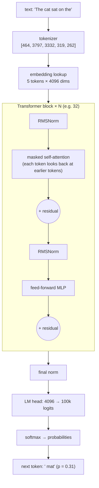
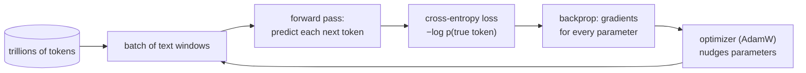
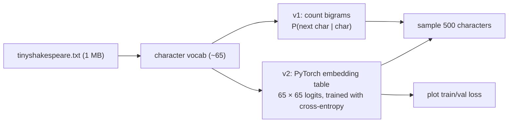

# Chapter 1 — LLM Internals

> **Volume 5 — AI Systems Engineering** · [Contents](index.md) · Next → [Chapter 2 — Tokenization](ch02-tokenization.md)

---

## Concept

How a language model works — parameters, pretraining, the attention mechanism, and scaling laws (intuition, no deep math).

**In one sentence:** a large language model is a giant function with billions of adjustable numbers (parameters) that has been trained, on trillions of words, to answer one question over and over — "given this text so far, what token comes next?" — and everything else it can do falls out of getting very good at that.

**Mental model — the world's most-read autocomplete.** Your phone's keyboard suggests the next word from a few recent words. An LLM does the same thing, but it looks at the *whole* conversation at once (attention), it has read a large slice of the internet, books, and code, and it has billions of knobs to store the patterns it found. To predict the next word of a physics answer well, it has to have picked up some physics; to finish a Python function, it has to model what the code does.

**The pieces**

| Piece | What it is | Intuition |
|-------|-----------|-----------|
| Token | a chunk of text (often part of a word) mapped to an integer ID | the model's alphabet (see [Ch 2](ch02-tokenization.md)) |
| Embedding | a learned vector (e.g. 4,096 numbers) per token ID | a "meaning coordinate" for each token ([Vol 0 Ch 9](../volume-0-math/ch09-linear-algebra-for-ai.md)) |
| Transformer block | attention + a feed-forward network (FFN), repeated N times (e.g. 32–120 layers) | each layer refines every token's vector using context |
| **Attention** | each token looks at earlier tokens and pulls in information from the relevant ones | "which previous words matter for understanding *this* word?" |
| FFN / MLP | a per-token 2-layer network | where much factual "memory" seems to live |
| Logits | one score per vocabulary token (e.g. 100k scores) | how plausible each next token is |
| Softmax | turns logits into probabilities that sum to 1 | `p_i = e^{z_i} / Σ e^{z_j}` |
| **Parameters** | all learned weights: embeddings, attention matrices, FFN matrices | the model's compressed knowledge and skills; a "7B" model has ~7 billion |

**Training stages**

| Stage | Data | Objective | Result |
|-------|------|-----------|--------|
| **Pretraining** | trillions of tokens of web, books, code | minimize cross-entropy of the next token: `loss = −log p(correct next token)` | a *base model*: knows a lot, continues any text, doesn't follow instructions reliably |
| Instruction tuning (SFT) | curated (prompt, good answer) pairs | same loss, on answers only | follows instructions |
| Preference tuning (RLHF / DPO / RLAIF) | human or AI rankings of answers | prefer better answers | helpful, honest, harmless style ([Ch 8](ch08-alignment-rlhf-and-guardrails.md)) |

**Why next-token prediction is so powerful** — to lower the loss on *all* text, the model is pushed to learn grammar, facts, reasoning patterns, coding conventions, and even some world modeling, because each of these helps predict what comes next somewhere in the data. The objective is simple; what it takes to be good at it is not.

**Scaling laws (intuition)** — loss falls smoothly and predictably as a power law when you grow **parameters (N)**, **data (D)**, and **compute (C ≈ 6·N·D FLOPs)** together. The "Chinchilla" result: for a fixed compute budget, the best trade-off is roughly **~20 tokens of training data per parameter**; many modern models are trained on far more tokens than that because smaller models are cheaper to *serve*. Some abilities appear to "emerge" suddenly with scale, though much of that is how we measure them.

**What LLMs are not** — they don't look things up (unless given tools or RAG, [Ch 9](ch09-embeddings-and-rag.md)); they have a knowledge cutoff; they can produce fluent, confident, wrong text (hallucination); and they "think" only through the tokens they generate.

---

## Prereqs

* [Vol 0 Ch 9 — Linear Algebra for AI](../volume-0-math/ch09-linear-algebra-for-ai.md)

---

## Diagram

**A high-level transformer (decoder-only) diagram**



**Tracing one token through the model**

```
 position 5 ("the")                                    shape
 token id 262 ─► embedding row 262          ─►  [4096]           a vector
             ─► + position info (RoPE)       ─►  [4096]
 layer 1:    attention mixes in "cat", "sat", "on"   [4096]  "a location after 'sat on'"
 …           FFN refines                             [4096]
 layer 32:   final vector                            [4096]
 LM head:    vector · W_out (4096 × 100k)       ─►  [100k] logits
 softmax:    ' mat' 0.31  ' floor' 0.18  ' sofa' 0.09  ' bed' 0.07  …
```

**Logits → probabilities (softmax)**

```
 token    logit   e^logit    probability
 ' mat'    2.0     7.39       0.659   ██████████████████████████
 ' floor'  1.0     2.72       0.242   ██████████
 ' moon'   0.1     1.11       0.099   ████
                  Σ = 11.21   Σ = 1.000
```

**Pretraining in one loop**



---

## Example

```python
import numpy as np

def softmax(z):
    z = z - z.max()                     # numerical stability
    e = np.exp(z)
    return e / e.sum()

vocab = ["mat", "floor", "moon"]
logits = np.array([2.0, 1.0, 0.1])
p = softmax(logits)
print(dict(zip(vocab, p.round(3))))     # {'mat': 0.659, 'floor': 0.242, 'moon': 0.099}

# The training signal for this position, if the true next token is "mat":
print(-np.log(p[0]))                    # loss ≈ 0.417 (lower is better; 0 = certain and right)
```

```python
# A real forward pass with Hugging Face (small model, runs on CPU)
from transformers import AutoTokenizer, AutoModelForCausalLM
import torch

name = "gpt2"
tok = AutoTokenizer.from_pretrained(name)
model = AutoModelForCausalLM.from_pretrained(name)

ids = tok("The cat sat on the", return_tensors="pt").input_ids
with torch.no_grad():
    logits = model(ids).logits          # shape [1, seq_len, vocab_size]
probs = logits[0, -1].softmax(-1)       # distribution for the NEXT token
top = probs.topk(5)
for p, i in zip(top.values, top.indices):
    print(f"{tok.decode(i)!r:10} {p:.3f}")

print(sum(p.numel() for p in model.parameters()) / 1e6, "M parameters")   # ~124 M
```

---

## Exercises

1. Explain why next-token prediction yields useful models.

   <details><summary>Solution</summary>To predict the next token of <i>any</i> text well, a model must capture whatever structure makes that text predictable: syntax, facts ("The capital of France is"), arithmetic patterns, code semantics, the goals of the characters in a story, the steps of an argument. Minimizing loss over trillions of diverse tokens therefore forces general-purpose representations. Instruction tuning then points that general ability at following requests.</details>

2. Describe what "parameters" represent and why more scale helps.

   <details><summary>Solution</summary>Parameters are the learned numbers in the embedding tables, attention projections, and MLP matrices; the forward pass is fixed arithmetic over them. Together they store compressed patterns from the training data. More parameters (with enough data and compute) give more capacity to store facts and represent more complex functions, and scaling laws show the loss improving predictably. Diminishing returns and serving cost mean "bigger" is a trade-off, not a free win.</details>

3. If logits are `[2.0, 1.0, 0.1]`, what happens to the probabilities if you add 10 to every logit?

   <details><summary>Solution</summary>Nothing. Softmax is invariant to adding a constant: <code>e^(z+c) / Σ e^(z+c) = e^z / Σ e^z</code>. That's why implementations subtract the max for numerical stability.</details>

---

## Mini project

**A tiny bigram/character-level model trained on a small corpus.**



**Steps**

1. Load a small text (e.g. tinyshakespeare), build a character vocabulary, and encode it as integers.
2. **Counting model:** a 65×65 table of bigram counts → probabilities; sample text from it.
3. **Neural model:** `nn.Embedding(vocab, vocab)` whose row for the current char *is* the logits for the next char; train with cross-entropy and AdamW.
4. Split train/validation; plot both losses; show the neural model converges to the counting model's loss (they model the same thing).
5. Stretch: add context — use the previous 8 chars with a small MLP or one attention layer (a preview of [Ch 3](ch03-transformers.md)) and watch the validation loss drop.

**Done when:** sampled text has the right character statistics (words, spaces, line breaks), and you can explain the loss number (a uniform guess is `ln 65 ≈ 4.17`; a good bigram model gets ≈ 2.5).

---

## Open source

* [`karpathy/nanoGPT`](https://github.com/karpathy/nanoGPT) — `model.py` is a complete GPT in ~300 lines; `train.py` is the pretraining loop. Pair it with the "Let's build GPT" video.
* [`huggingface/transformers`](https://github.com/huggingface/transformers) — `models/llama/modeling_llama.py` shows a modern production block (RMSNorm, RoPE, SwiGLU, grouped-query attention).

---

## Interview

1. **"What does an LLM actually predict?"**
   <details><summary>Answer</summary>A probability distribution over its vocabulary for the next token, given all previous tokens. Generation repeats this: pick a token from the distribution (greedy or sampled), append it, and predict again. Everything — answers, code, "reasoning" — is produced one token at a time from these distributions.</details>

2. **"What is attention intuitively?"**
   <details><summary>Answer</summary>A learned, content-based lookup. Each token creates a query ("what am I looking for?"), and every earlier token offers a key ("what do I contain?") and a value ("what I'll pass on"). The token scores all keys against its query, turns the scores into weights with softmax, and takes a weighted average of the values. So "it" can pull in information from "the cat" several words back. Multiple heads look for different kinds of relationships in parallel.</details>

---

## Checklist

- [ ] trace a forward pass
- [ ] explain logits → probabilities
- [ ] know what pretraining optimizes

---

> [Contents](index.md) · Next → [Chapter 2 — Tokenization](ch02-tokenization.md)
