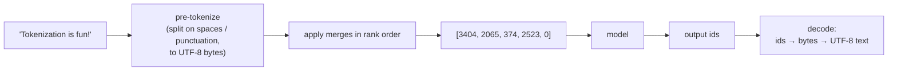
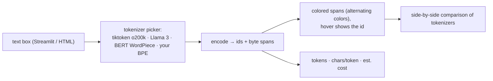

# Chapter 2 — Tokenization

> **Volume 5 — AI Systems Engineering** · [Contents](index.md) · ← [Chapter 1 — LLM Internals](ch01-llm-internals.md) · Next → [Chapter 3 — Transformers](ch03-transformers.md)

---

## Concept

Turning text into tokens — BPE/WordPiece/SentencePiece; token limits and the bugs tokenization causes.

**In one sentence:** before a model sees text, a tokenizer chops it into subword pieces from a fixed vocabulary and turns each into an integer — and that choice quietly decides your cost, your context limit, and a surprising number of model mistakes.

**Mental model — LEGO bricks.** You could build everything from single-stud bricks (characters): flexible, but a castle needs millions of them. You could have one custom piece per object (whole words): fast to build, but there's no piece for a word you've never seen. Subword tokenizers are a LEGO set with common chunks ("ing", "the", "tion") plus small bricks as a fallback — any text can be built, and common text is built from few pieces.

**Why subwords?**

| Unit | Vocab size | Unknown words? | Sequence length | Problem |
|------|-----------:|:-:|---|---------|
| Characters / bytes | 256 | never | very long (slow, costly attention) | the model must learn spelling from scratch |
| Whole words | millions | often (`<unk>`) | short | huge embedding table; no sharing between "run" / "running" |
| **Subwords** | ~32k–200k | never (byte fallback) | medium | the sweet spot |

**Algorithms**

| Algorithm | Used by | Idea |
|-----------|---------|------|
| **BPE** (byte-pair encoding) | GPT family (`tiktoken`), Llama 3, most LLMs | start from bytes; repeatedly **merge the most frequent adjacent pair** into a new token; the merge list *is* the tokenizer |
| WordPiece | BERT | like BPE, but merge the pair that most increases corpus likelihood; `##` marks word continuations |
| Unigram LM | SentencePiece (T5, many multilingual models) | start with a big vocabulary; prune tokens that least hurt the likelihood; can sample segmentations |
| SentencePiece | a *library* (BPE or Unigram) | treats input as a raw stream, spaces become `▁`; no language-specific pre-tokenizer |

**Rules of thumb (English, GPT-style tokenizers)** — ~4 characters or ~¾ of a word per token; 1,000 tokens ≈ 750 words. Other languages, code, numbers, and emoji can be 2–10× more tokens for the same meaning.

**Token limits and cost** — the **context window** (e.g. 200k tokens) counts *input + output* tokens; APIs bill **per token**, usually with output tokens costing more than input. Always count with the model's own tokenizer — character estimates are off by a lot for code and non-English text.

**Failure modes caused by tokenization**

| Symptom | Cause |
|---------|-------|
| can't reliably count letters ("how many r's in strawberry?") or reverse words | the model sees `straw` + `berry`, not letters |
| arithmetic errors on long numbers | `12345678` splits into uneven chunks like `123`, `456`, `78` |
| non-English text costs more and uses more context | fewer merges were learned for those scripts |
| leading space changes everything | `"Hello"` and `" Hello"` are different tokens |
| weird behavior on rare strings ("glitch tokens") | tokens that exist in the vocab but were almost never trained |
| prompt injection via special tokens | user text containing `<|endoftext|>` or a chat-template marker — never allow special tokens from user input |
| trailing whitespace hurts completions | `"… answer: "` ends with a space token the model rarely saw in that position |

---

## Prereqs

* [Vol 1 Ch 9 — Character Encoding & Binary Serialization](../volume-1-cs-foundations/ch09-character-encoding-and-binary-serialization.md) — byte-level BPE starts from UTF-8 bytes.

---

## Diagram

**A BPE merge table turning "low lower lowest" into subword tokens** — corpus word counts: low ×5, lower ×2, lowest ×3, newest ×6 (`</w>` marks the end of a word)

```
 start:  l o w </w>  ·  l o w e r </w>  ·  l o w e s t </w>  ·  n e w e s t </w>

 step  merge            count   corpus after the merge
  1    w + e   → we      11     l o w </w> · l o we r </w> · l o we s t </w> · n e we s t </w>
  2    l + o   → lo      10     lo w </w>  · lo we r </w>  · lo we s t </w>  · n e we s t </w>
  3    we + s  → wes      9     …          · lo wes t </w> · n e wes t </w>
  4    wes + t → west     9     …          · lo west </w>  · n e west </w>
  5    west + </w>        9     lo west</w>   ·   n e west</w>
  6    n + e   → ne       6     ne west</w>

 final tokens:  "low" → [lo, w, </w>]   "lower" → [lo, we, r, </w>]
                "lowest" → [lo, west</w>]   "newest" → [ne, west</w>]
 a new word "slowest" → [s, lo, west</w>] — never seen, still encodable
```

**Encode → model → decode**



**Same meaning, different token counts** (illustrative, GPT-4-style tokenizer)

```
 "Hello, how are you?"            ██████                       6 tokens
 "Hola, ¿cómo estás?"             ███████                      7 tokens
 "नमस्ते, आप कैसे हैं?"             ████████████████             ~16 tokens
 "def add(a, b): return a + b"    ███████████                  11 tokens
 "🤖🤖🤖"                           ██████                       ~6 tokens
```

---

## Example

```python
import tiktoken

enc = tiktoken.get_encoding("o200k_base")          # a modern OpenAI-style BPE vocabulary
text = "Tokenization is surprisingly tricky!"
ids = enc.encode(text)
print(len(ids), ids)
print([enc.decode([i]) for i in ids])              # see each piece
# e.g. ['Token', 'ization', ' is', ' surprisingly', ' tricky', '!']

for w in ["climb", " climb", " climbing", " climbed"]:
    print(repr(w), [enc.decode([i]) for i in enc.encode(w)])
# ' climbing' → [' climbing'] or [' clim', 'bing'] depending on the vocab —
# frequent forms get their own token; rarer forms share a stem piece

print(len(enc.encode("12345678901234567890")))     # numbers split into chunks

# Never let user text become special tokens
enc.encode("<|endoftext|>", disallowed_special="all")   # raises — good default
```

```python
# Counting tokens for cost with Claude's API (token counting endpoint)
import anthropic
client = anthropic.Anthropic()
count = client.messages.count_tokens(
    model="claude-sonnet-5-5",
    messages=[{"role": "user", "content": open("report.md").read()}],
)
print(count.input_tokens)
```

```python
# A minimal BPE trainer (character level, for learning)
from collections import Counter

def train_bpe(corpus: dict[str, int], num_merges: int):
    words = {tuple(w) + ("</w>",): c for w, c in corpus.items()}
    merges = []
    for _ in range(num_merges):
        pairs = Counter()
        for w, c in words.items():
            for a, b in zip(w, w[1:]):
                pairs[(a, b)] += c
        if not pairs:
            break
        best = max(pairs, key=pairs.get)
        merges.append(best)
        new_words = {}
        for w, c in words.items():
            out, i = [], 0
            while i < len(w):
                if i + 1 < len(w) and (w[i], w[i + 1]) == best:
                    out.append(w[i] + w[i + 1]); i += 2
                else:
                    out.append(w[i]); i += 1
            new_words[tuple(out)] = c
        words = new_words
    return merges, words

merges, words = train_bpe({"low": 5, "lower": 2, "lowest": 3, "newest": 6}, 6)
print(merges)   # [('w','e'), ('l','o'), ('we','s'), ('wes','t'), ('west','</w>'), ('n','e')]
```

---

## Exercises

1. Implement a minimal BPE trainer.

   <details><summary>Solution</summary>See <code>train_bpe</code>. To <i>encode</i> a new word, split it into characters and repeatedly apply the learned merges in the order they were learned (lowest rank first). Production tokenizers work on UTF-8 <i>bytes</i> (so any text is encodable), pre-split with a regex (so merges don't cross word or number boundaries), and use efficient priority queues.</details>

2. Explain why tokenization breaks on some languages/whitespace.

   <details><summary>Solution</summary>Merges are learned from training-data frequency. Languages that are rare in that data, or scripts whose characters take 3 UTF-8 bytes, get few merges, so the same meaning needs many more tokens: higher cost, less effective context, and weaker modeling. Whitespace is part of tokens (<code>" the"</code> ≠ <code>"the"</code>), so odd spacing, tabs vs spaces in code, or trailing spaces produce token sequences the model rarely saw.</details>

3. A prompt is 3,000 English words and the reply may be 1,000 words. Roughly how many tokens will you be billed for?

   <details><summary>Solution</summary>At ~0.75 words per token: ~4,000 input tokens + ~1,333 output tokens ≈ 5,300 tokens, with output usually priced higher. Measure with the real tokenizer before trusting the estimate.</details>

---

## Mini project

**A tokenizer visualizer that highlights token boundaries.**



**Steps**

1. Load 2–3 tokenizers (`tiktoken`, a Hugging Face `tokenizers` model, and your own BPE from the exercise).
2. Encode the input and map each token back to its character span (use offsets, or decode tokens one by one and handle partial UTF-8 bytes).
3. Render colored spans; show `▁`/space markers so leading spaces are visible.
4. Show stats: token count, chars per token, and cost at a configurable price per million tokens.
5. Include a gallery of tricky inputs: long numbers, code, emoji, Hindi, Chinese, JSON with whitespace.

**Done when:** you can paste any text and immediately see why it costs what it does, and the gallery demonstrates at least three failure modes from the table.

---

## Open source

* [`openai/tiktoken`](https://github.com/openai/tiktoken) — a fast BPE in Rust with Python bindings; `tiktoken/core.py` and the `_educational.py` module show the algorithm plainly.
* [`huggingface/tokenizers`](https://github.com/huggingface/tokenizers) — BPE, WordPiece, and Unigram with normalizers, pre-tokenizers, and offset mapping.

---

## Interview

1. **"Why do models use subword tokens?"**
   <details><summary>Answer</summary>They balance vocabulary size against sequence length. Characters make sequences very long (attention cost grows with length) and force the model to learn spelling; whole words need huge vocabularies and can't handle new words. Subwords keep common words as single tokens, build rare words from pieces, never produce "unknown" tokens (with byte fallback), and share structure (a stem plus suffixes).</details>

2. **"How do you count tokens for cost?"**
   <details><summary>Answer</summary>Use the exact tokenizer (or the provider's token-counting endpoint) for the model you call, and count the full request — the system prompt, tools/schemas, conversation history, retrieved context — plus the generated output. Price input and output separately, include cached-token discounts where they apply, and track actual usage from API responses rather than estimates.</details>

---

## Checklist

- [ ] train a BPE
- [ ] count tokens accurately
- [ ] know tokenization's failure modes

---

> [Contents](index.md) · ← [Chapter 1 — LLM Internals](ch01-llm-internals.md) · Next → [Chapter 3 — Transformers](ch03-transformers.md)
