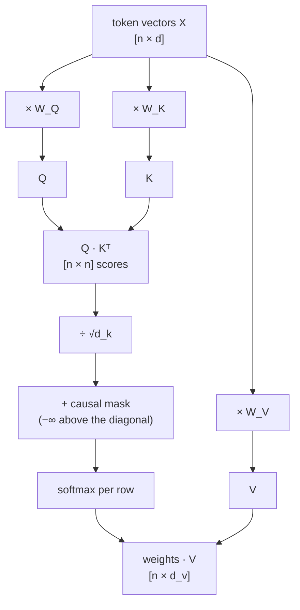
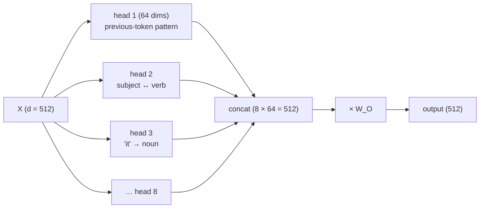
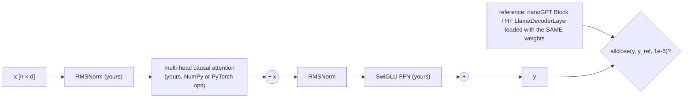

# Chapter 3 — Transformers

> **Volume 5 — AI Systems Engineering** · [Contents](index.md) · ← [Chapter 2 — Tokenization](ch02-tokenization.md) · Next → [Chapter 4 — Inference & Serving](ch04-inference-and-serving.md)

---

## Concept

Self-attention, multi-head attention, positional encoding, and the encoder/decoder split.

**In one sentence:** a transformer processes all tokens in parallel, and in each layer every token asks every other (allowed) token "how relevant are you to me?", then blends their information in proportion to the answer — that blending step is attention.

**Mental model — a meeting where everyone takes notes on everyone.** Each person (token) writes a question on a card (**query**), wears a name badge describing what they know (**key**), and holds a folder of notes (**value**). Everyone compares their question with every badge, decides how much attention each person deserves, and copies a weighted mix of their folders. Several such meetings happen in parallel, each focused on a different topic (**heads**).

**Scaled dot-product attention**

```
 Attention(Q, K, V) = softmax( Q·Kᵀ / √d_k  + mask ) · V

 Q = X·W_Q    what each token is looking for          [n × d_k]
 K = X·W_K    what each token offers as a match        [n × d_k]
 V = X·W_V    what each token passes on if chosen      [n × d_v]
 Q·Kᵀ         relevance of every token to every token  [n × n]
 /√d_k        keeps scores from growing with dimension (so softmax doesn't saturate)
 mask         −∞ for future positions in a decoder (causal), so token i sees only 0..i
 softmax      each row becomes weights that sum to 1
 · V          each token's output = weighted average of values
```

**Multi-head attention** — split the model dimension into *h* heads (e.g. 4096 = 32 heads × 128), run attention separately in each, concatenate, and project with `W_O`. Different heads learn different relations: previous-token, syntax (subject → verb), coreference ("it" → "cat"), copying.

**The rest of a block** — `x = x + Attention(Norm(x))`, then `x = x + FFN(Norm(x))`. Residual connections let information and gradients flow through deep stacks; normalization (LayerNorm / RMSNorm) keeps activations in range; the FFN (typically 4× wider, SwiGLU in modern models) transforms each token independently.

**Positional encoding** — attention by itself ignores order (it's a set operation), so position must be injected:

| Method | How | Used by |
|--------|-----|---------|
| Sinusoidal | add fixed sin/cos waves of different frequencies to the embeddings | the original Transformer (2017) |
| Learned absolute | a learned vector per position | GPT-2, BERT |
| **RoPE** (rotary) | rotate Q and K vectors by a position-dependent angle, so `q·k` depends on *relative* distance | Llama, Mistral, Qwen, most modern LLMs |
| ALiBi | add a distance-proportional penalty to attention scores | BLOOM, MPT |

**Encoder vs decoder**

| | Encoder-only | Decoder-only | Encoder–decoder |
|-|--------------|--------------|-----------------|
| Attention | bidirectional (sees left and right) | **causal** (sees only the left) | encoder bidirectional; decoder causal + **cross-attention** to the encoder |
| Trained to | fill in masked tokens | predict the next token | map input → output sequence |
| Good at | understanding: classification, embeddings, NER | generation, chat, code — **most LLMs today** | translation, summarization |
| Examples | BERT, RoBERTa, embedding models | GPT, Claude, Llama | T5, BART, original Transformer |

**The O(n²) cost** — `Q·Kᵀ` compares every token with every token: n² scores per head per layer. Doubling the context quadruples attention compute and (naively) memory. Mitigations: FlashAttention (the same math, tiled to avoid materializing the n×n matrix in slow memory), sliding-window / sparse attention, grouped-query attention (fewer K/V heads), and the KV cache during generation ([Ch 4](ch04-inference-and-serving.md)).

---

## Prereqs

* [Chapter 1 — LLM Internals](ch01-llm-internals.md)
* [Vol 0 Ch 9 — Linear Algebra for AI](../volume-0-math/ch09-linear-algebra-for-ai.md)

---

## Diagram

**Scaled dot-product attention**



**The causal mask and attention weights for "the cat sat"**

```
               keys →   the    cat    sat
 query "the"          [ 1.00   ░░     ░░  ]     ░░ = masked (future)
 query "cat"          [ 0.35   0.65   ░░  ]
 query "sat"          [ 0.10   0.62   0.28 ]    "sat" attends mostly to "cat" (its subject)
 each row sums to 1
```

**Multi-head attention**



**Why n² hurts**

```
 context length n     attention scores per head per layer (n²)
      1,000            1,000,000
      8,000           64,000,000
    128,000       16,384,000,000        ← FlashAttention computes these in tiles, never storing them all
```

---

## Example

**Attention weights for a 3-token sequence, by hand** — with `d_k = 2` and (to keep it small) `Q = K = X`:

```
 X = Q = K = [[1, 0],      V = [[1, 0],
              [0, 1],           [0, 2],
              [1, 1]]           [1, 1]]

 Q·Kᵀ = [[1, 0, 1],        ÷ √2  →  [[0.707, 0.000, 0.707],
         [0, 1, 1],                  [0.000, 0.707, 0.707],
         [1, 1, 2]]                  [0.707, 0.707, 1.414]]

 softmax each row  →  [[0.401, 0.198, 0.401],
 (no mask here)        [0.198, 0.401, 0.401],
                       [0.248, 0.248, 0.503]]

 weights · V       →  [[0.802, 0.797],
                       [0.599, 1.203],
                       [0.752, 1.000]]
 token 3 ([1,1]) matches itself best, so it keeps ~50% of its own value.
```

```python
import numpy as np

def softmax(z, axis=-1):
    z = z - z.max(axis=axis, keepdims=True)
    e = np.exp(z)
    return e / e.sum(axis=axis, keepdims=True)

def attention(Q, K, V, causal=False):
    d_k = Q.shape[-1]
    scores = Q @ K.swapaxes(-1, -2) / np.sqrt(d_k)          # [..., n, n]
    if causal:
        n = scores.shape[-1]
        scores = np.where(np.tril(np.ones((n, n), bool)), scores, -np.inf)
    w = softmax(scores)
    return w @ V, w

X = np.array([[1, 0], [0, 1], [1, 1]], float)
V = np.array([[1, 0], [0, 2], [1, 1]], float)
out, w = attention(X, X, V)
print(w.round(3)); print(out.round(3))                      # matches the hand calculation

def multi_head(X, Wq, Wk, Wv, Wo, h, causal=True):
    n, d = X.shape
    split = lambda M: M.reshape(n, h, d // h).transpose(1, 0, 2)   # [h, n, d/h]
    heads, _ = attention(split(X @ Wq), split(X @ Wk), split(X @ Wv), causal)
    return heads.transpose(1, 0, 2).reshape(n, d) @ Wo

rng = np.random.default_rng(0)
d, h, n = 8, 2, 5
W = [rng.normal(size=(d, d)) / np.sqrt(d) for _ in range(4)]
print(multi_head(rng.normal(size=(n, d)), *W, h=h).shape)    # (5, 8)
```

```python
# Verify against PyTorch's reference implementation
import torch, torch.nn.functional as F
q = torch.tensor(X)[None, None]; v = torch.tensor(V)[None, None]
ref = F.scaled_dot_product_attention(q, q, v)
print(np.allclose(ref[0, 0].numpy(), out))                  # True
```

---

## Exercises

1. Implement attention in NumPy.

   <details><summary>Solution</summary>See <code>attention</code> above: scores, scale by √d_k, optional causal mask with −∞, a row-wise softmax that subtracts the max, then multiply by V. Test against <code>torch.nn.functional.scaled_dot_product_attention</code> on random inputs, with and without <code>is_causal=True</code>.</details>

2. Explain why attention is O(n²) in sequence length.

   <details><summary>Solution</summary>Every query is compared with every key: <code>Q·Kᵀ</code> is an n×n matrix, so compute is O(n²·d) per head per layer, and a naive implementation stores all n² weights. Doubling the context quadruples that cost. FlashAttention removes the O(n²) <i>memory</i> by computing in tiles, but the O(n²) <i>compute</i> of exact attention remains.</details>

3. Why divide by √d_k?

   <details><summary>Solution</summary>If q and k have independent components with variance 1, their dot product has variance d_k. Large-magnitude scores push softmax toward one-hot outputs with tiny gradients. Dividing by √d_k keeps the score variance near 1.</details>

---

## Mini project

**A from-scratch transformer block on small inputs, verified against a reference.**



**Steps**

1. Implement RMSNorm, multi-head causal attention, a SwiGLU FFN, and residual connections as plain functions.
2. Add RoPE: rotate pairs of dimensions in Q and K by `position × θ_i`.
3. Copy weights from a reference block (a small Llama-style or nanoGPT layer) into your arrays.
4. Run both on the same random input; assert outputs match within tolerance.
5. Measure how time and memory scale for n = 128, 512, 2048, and plot the n² curve.

**Done when:** your block matches the reference to ~1e-5, and your plot shows the quadratic growth.

---

## Open source

* [`karpathy/nanoGPT`](https://github.com/karpathy/nanoGPT) — `model.py`: `CausalSelfAttention`, `MLP`, and `Block` in a few dozen lines each.
* [`huggingface/transformers`](https://github.com/huggingface/transformers) — `models/llama/modeling_llama.py` for RoPE (`apply_rotary_pos_emb`), grouped-query attention, and SDPA/FlashAttention dispatch. Read "Attention Is All You Need" (2017) and "The Illustrated Transformer".

---

## Interview

1. **"What does the attention mechanism compute?"**
   <details><summary>Answer</summary>For each token, a weighted average of value vectors from the tokens it may attend to, with weights from a softmax over scaled dot products between its query and their keys. Q, K, and V are learned linear projections of the token representations, so the model learns what to look for, what to advertise, and what to pass along. Multiple heads do this in parallel subspaces.</details>

2. **"Encoder vs decoder?"**
   <details><summary>Answer</summary>An encoder uses bidirectional self-attention (each token sees the whole input), which makes it good for understanding tasks and embeddings (BERT). A decoder uses causal masking (each token sees only earlier tokens), so it can generate autoregressively (GPT-style LLMs). Encoder–decoder models add cross-attention from the decoder to the encoder's outputs, suited to sequence-to-sequence tasks like translation (T5).</details>

---

## Checklist

- [ ] implement attention
- [ ] explain positional encoding
- [ ] know the O(n²) cost

---

> [Contents](index.md) · ← [Chapter 2 — Tokenization](ch02-tokenization.md) · Next → [Chapter 4 — Inference & Serving](ch04-inference-and-serving.md)
