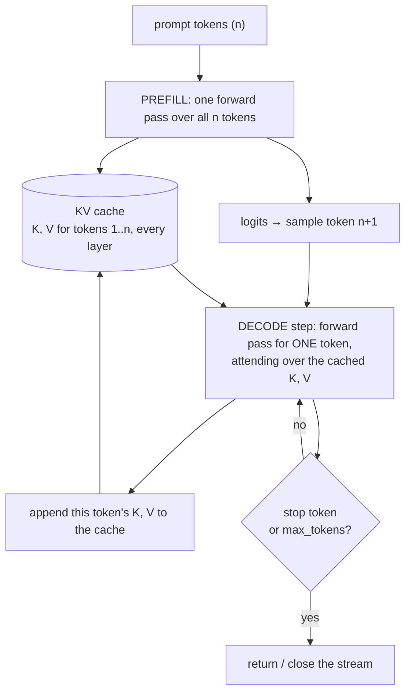
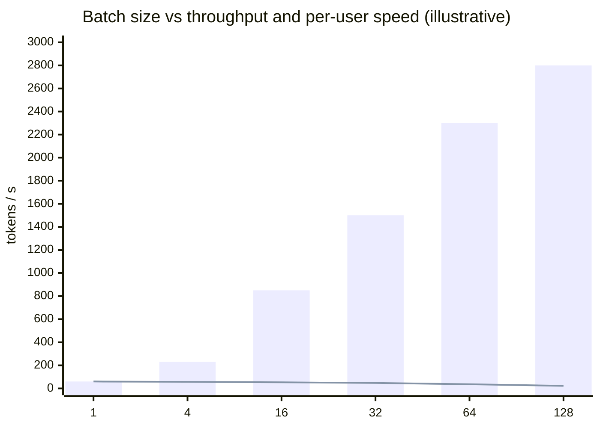
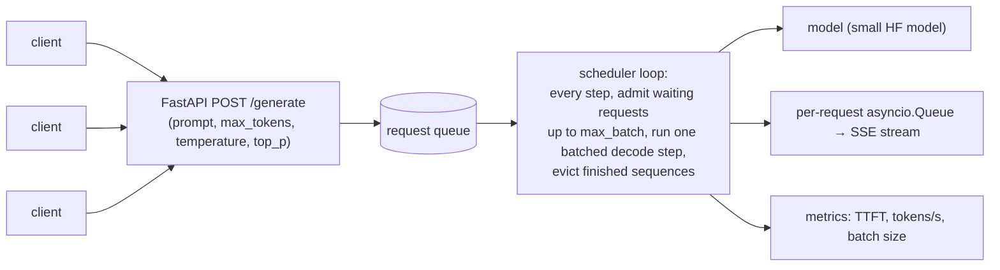
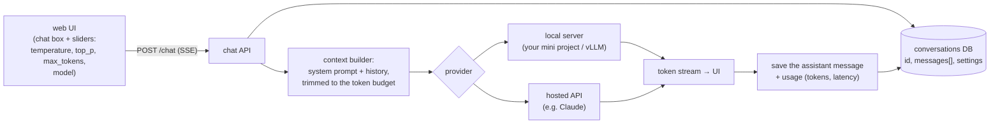

# Chapter 4 — Inference & Serving

> **Volume 5 — AI Systems Engineering** · [Contents](index.md) · ← [Chapter 3 — Transformers](ch03-transformers.md) · Next → [Chapter 5 — Quantization & Efficiency](ch05-quantization-and-efficiency.md)

---

## Concept

Autoregressive decoding, KV cache, batching, sampling (temperature/top-p/top-k), and throughput vs latency.

**In one sentence:** an LLM generates text one token at a time, each step feeding everything so far back in; serving it well means caching past work (the KV cache), choosing each token with the right sampling rule, and batching many users' requests together so the expensive GPU stays busy — while still answering each user fast.

**Mental model — a storyteller who can't skip ahead.** They say one word, then re-read the story so far to pick the next. The KV cache is their notes on everything already said, so they don't re-read the whole story from scratch each time. Batching is telling 64 stories at once, one word per story per breath. Sampling is how adventurous the storyteller is: always the most obvious next word (greedy), or sometimes a surprising one (temperature).

**Two phases of generation**

| Phase | What happens | Bound by | Metric |
|-------|--------------|----------|--------|
| **Prefill** | process the whole prompt in one parallel forward pass; fill the KV cache | compute (big matrix multiplies) | **TTFT** — time to first token |
| **Decode** | one forward pass per new token, reusing the cache | **memory bandwidth** (reading all weights + the KV cache for each token) | **TPOT / ITL** — time per output token; tokens/s |

**The KV cache** — in attention, each new token needs the keys and values of *all previous* tokens. Without a cache, generating token t recomputes K and V for tokens 1…t−1 every step (total O(n²) extra work). With a cache, each step computes K, V only for the new token and appends them. The price is memory:

```
 KV bytes per token = 2 (K and V) × layers × kv_heads × head_dim × bytes_per_value
 Llama-2-7B-like (32 layers, 32 heads × 128, FP16):  2 × 32 × 4096 × 2 B ≈ 0.52 MB per token
 → a 4,096-token context ≈ 2.1 GB per sequence. Grouped-query attention (8 KV heads) cuts it 4×.
```

**Sampling**

| Strategy | Rule | Effect |
|----------|------|--------|
| Greedy | always the argmax | deterministic; can loop or be bland |
| **Temperature** T | softmax(logits / T) | T < 1 sharper (safer), T > 1 flatter (more creative); T → 0 ≈ greedy |
| **Top-k** | keep the k most likely tokens, renormalize | cuts off the long tail of nonsense |
| **Top-p** (nucleus) | keep the smallest set whose probability sums to ≥ p | adapts: few candidates when confident, many when not |
| Min-p | keep tokens with p ≥ min_p × p_max | a newer, robust alternative to top-p |
| Repetition / frequency penalties | lower the logits of already-used tokens | reduce loops |
| Stop sequences, max tokens | end generation | control length and cost |

With logits `[2.0, 1.0, 0.1]`: T = 0.5 → `[0.864, 0.117, 0.019]`; T = 1 → `[0.659, 0.242, 0.099]`; T = 2 → `[0.502, 0.304, 0.194]`.

**Batching**

| Kind | How | Problem |
|------|-----|---------|
| No batching | one request at a time | the GPU is mostly idle during decode |
| Static batching | wait for N requests, run them together until *all* finish | short requests wait for the longest; padding waste |
| **Continuous (in-flight) batching** | at every decode step, finished sequences leave and new ones join | high utilization and low wait — the standard in vLLM, TGI, TensorRT-LLM |
| **PagedAttention** | store the KV cache in fixed-size pages (like virtual memory) | no fragmentation; share prompt prefixes; many more concurrent sequences |

Other speedups: prefix caching (reuse the KV cache of a shared system prompt), speculative decoding (a small draft model proposes several tokens; the big one verifies them in one pass), quantization ([Ch 5](ch05-quantization-and-efficiency.md)), tensor parallelism across GPUs.

**Throughput vs latency** — bigger batches raise total tokens/s (throughput) but make each user's step slower (latency). Serving is a trade-off set by your SLO: interactive chat wants low TTFT (< ~500 ms) and steady streaming (> ~20 tokens/s per user); offline batch jobs want maximum tokens per dollar.

---

## Prereqs

* [Chapter 3 — Transformers](ch03-transformers.md)

---

## Diagram

**An autoregressive decode loop with the KV cache**



**Continuous batching vs static batching**

```
 STATIC (batch waits for its longest request)          CONTINUOUS (join and leave every step)
 slot 1  A A A A A A A A A A                           slot 1  A A A A A A A A A A
 slot 2  B B B · · · · · · ·   ← idle after B ends     slot 2  B B B D D D D E E E
 slot 3  C C C C C · · · · ·                           slot 3  C C C C C F F F F F
 new requests D, E, F wait until A finishes            D, E, F start as soon as a slot frees up
```

**The latency/throughput knob**



Bars: total throughput. Line: tokens/s seen by each user (×1, same scale). Pick the batch size where per-user speed still meets your SLO.

---

## Example

```python
import numpy as np
rng = np.random.default_rng(0)

def sample(logits, temperature=1.0, top_k=None, top_p=None):
    if temperature == 0:
        return int(np.argmax(logits))                        # greedy
    z = logits / temperature
    if top_k is not None:
        cutoff = np.sort(z)[-top_k]
        z = np.where(z >= cutoff, z, -np.inf)
    p = np.exp(z - z.max()); p /= p.sum()
    if top_p is not None:
        order = np.argsort(p)[::-1]
        keep = np.cumsum(p[order]) - p[order] < top_p        # smallest prefix reaching top_p
        mask = np.zeros_like(p, bool); mask[order[keep]] = True
        p = np.where(mask, p, 0); p /= p.sum()
    return int(rng.choice(len(p), p=p))

logits = np.array([2.0, 1.0, 0.1, -1.0])
print(sample(logits, 0), [sample(logits, 0.7, top_p=0.9) for _ in range(10)])
```

```python
# A generate loop with a KV cache (Hugging Face model, token by token)
import torch
from transformers import AutoTokenizer, AutoModelForCausalLM
tok = AutoTokenizer.from_pretrained("gpt2")
model = AutoModelForCausalLM.from_pretrained("gpt2").eval()

@torch.no_grad()
def generate(prompt, max_new=40, temperature=0.8, top_p=0.95):
    ids = tok(prompt, return_tensors="pt").input_ids
    out = model(ids, use_cache=True)                         # prefill
    past, logits = out.past_key_values, out.logits[0, -1]
    for _ in range(max_new):                                 # decode
        nxt = sample(logits.numpy(), temperature, top_p=top_p)
        if nxt == tok.eos_token_id:
            break
        yield tok.decode([nxt])                              # stream each token
        out = model(torch.tensor([[nxt]]), past_key_values=past, use_cache=True)
        past, logits = out.past_key_values, out.logits[0, -1]

print("".join(generate("The best way to learn systems is")))
```

```python
# Streaming from a hosted model (Anthropic SDK)
import anthropic
client = anthropic.Anthropic()
with client.messages.stream(
    model="claude-sonnet-5-5",
    max_tokens=300,
    temperature=0.7,
    messages=[{"role": "user", "content": "Explain the KV cache in two sentences."}],
) as stream:
    for text in stream.text_stream:
        print(text, end="", flush=True)
```

---

## Exercises

1. Implement greedy vs sampled decoding.

   <details><summary>Solution</summary>See <code>sample</code>: greedy is <code>argmax</code>; sampling divides logits by the temperature, optionally applies top-k and top-p filters, renormalizes, and draws. Generate 5 continuations of the same prompt each way: greedy gives the same text every time (and may repeat itself); T = 0.8 with top-p = 0.95 gives varied, mostly coherent text; T = 1.5 drifts into nonsense.</details>

2. Explain how the KV cache speeds up generation.

   <details><summary>Solution</summary>Each attention layer needs K and V for every previous token. Those don't change once computed (the model is causal), so we store them. Each decode step then runs the network only on the one new token and attends over the cached K and V, instead of re-running the whole growing sequence. Per-step compute stays roughly constant instead of growing with length. The cost is memory proportional to layers × KV heads × head_dim × sequence length × batch size.</details>

3. How much KV cache do 64 concurrent 4k-token chats need on a 7B model without GQA, in FP16?

   <details><summary>Solution</summary>~2.1 GB per sequence (from the formula above) × 64 ≈ 137 GB — more than the model weights (~14 GB) and more than one 80 GB GPU. Hence GQA, KV-cache quantization, PagedAttention, and capping concurrency.</details>

---

## Mini project

**A minimal inference server with a REST endpoint and batching.**



**Steps**

1. Load a small model (e.g. `Qwen2.5-0.5B` or `gpt2`) once at startup.
2. Requests go into an `asyncio.Queue`; one background loop does the scheduling.
3. Start with static batching (pad and run until all finish), then implement continuous batching: keep per-sequence KV caches and step all active sequences together.
4. Stream tokens back over SSE ([Vol 1 Ch 43](../volume-1-cs-foundations/ch43-websockets-grpc-mqtt-and-sse.md)).
5. Load test with 1, 8, and 32 concurrent clients; chart TTFT, per-user tokens/s, and total throughput.

**Done when:** continuous batching visibly beats static batching on total throughput and on p95 TTFT under mixed short and long requests.

---

## Build #1

**An AI Chatbot — a chat endpoint with history, streaming, and sampling controls.**



**Steps**

1. Data model: `conversations(id, title, settings)`, `messages(conversation_id, role, content, tokens, created_at)`.
2. `/chat` takes a conversation ID and a new user message; builds `[system, …history, user]`; counts tokens and drops the oldest turns (or summarizes them) to fit the context budget.
3. A provider interface (`stream(messages, params) -> AsyncIterator[str]`) with two implementations: your local server and a hosted API — dependency injection from [Vol 2 Ch 3](../volume-2-software-engineering/ch03-dependency-injection-and-inversion-of-control.md).
4. Stream over SSE; support "stop generating" (cancel the upstream request).
5. Sampling controls in the UI, persisted per conversation; show token usage and cost per reply.
6. Basic safety: per-user rate limits, max input size, and a system prompt that can't be overwritten from the UI.

**Done when:** you can hold a multi-turn conversation that survives a page reload, switch providers in config without code changes, cancel a reply mid-stream, and see tokens/latency per message. This is the base that Builds #2–#7 extend.

---

## Open source

* [`vllm-project/vllm`](https://github.com/vllm-project/vllm) — PagedAttention, continuous batching, prefix caching, speculative decoding; `vllm/core/scheduler.py` (or `vllm/v1/core/sched/`) is the scheduling loop.
* [`huggingface/text-generation-inference`](https://github.com/huggingface/text-generation-inference) — a production server (Rust router + Python model shards) with continuous batching and streaming.

---

## Interview

1. **"KV cache — why does it help?"**
   <details><summary>Answer</summary>During decoding, attention for a new token needs K and V for all previous tokens. Those are fixed once computed, so caching them means each step processes only the new token instead of the entire prefix — turning quadratic recomputation into linear work over the sequence. The trade-off is GPU memory that grows with sequence length and batch size, which is why techniques like GQA, PagedAttention, and KV quantization exist.</details>

2. **"Latency vs throughput in serving?"**
   <details><summary>Answer</summary>Latency is what one user feels: time to first token (driven by prefill and queueing) and time per output token (driven by decode speed). Throughput is total tokens per second across all users, which sets cost. Larger batches raise throughput because decode is memory-bound and batching amortizes weight reads, but each step gets slower and queues grow. You tune batch size, concurrency limits, and hardware to meet a latency SLO at the lowest cost per token.</details>

---

## Checklist

- [ ] implement sampling
- [ ] stream tokens
- [ ] batch requests efficiently

---

> [Contents](index.md) · ← [Chapter 3 — Transformers](ch03-transformers.md) · Next → [Chapter 5 — Quantization & Efficiency](ch05-quantization-and-efficiency.md)
