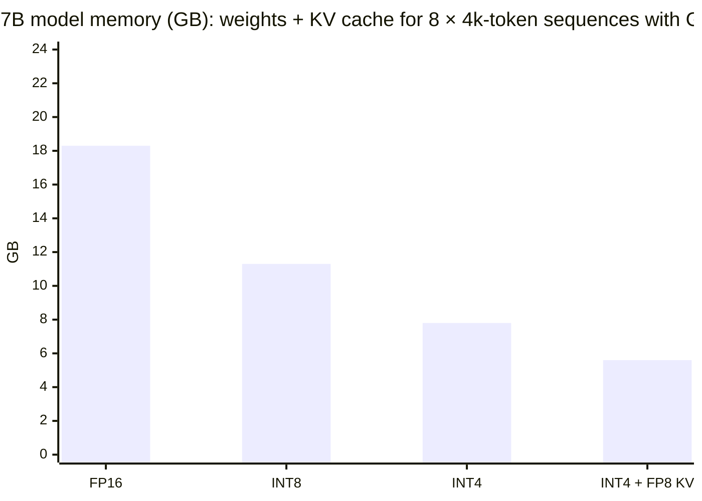
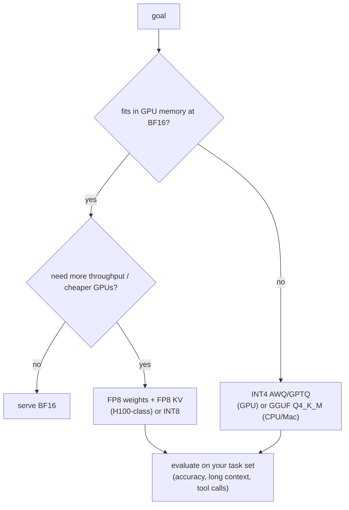
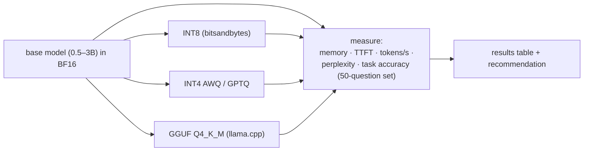

# Chapter 5 — Quantization & Efficiency

> **Volume 5 — AI Systems Engineering** · [Contents](index.md) · ← [Chapter 4 — Inference & Serving](ch04-inference-and-serving.md) · Next → [Chapter 6 — Prompt Engineering & Structured Output](ch06-prompt-engineering-and-structured-output.md)

---

## Concept

FP16/INT8/INT4, GPTQ/AWQ, KV-cache quantization, and the accuracy/speed/memory trade-off.

**In one sentence:** quantization stores a model's numbers with fewer bits — 16, 8, or 4 instead of 32 — so the model takes a fraction of the memory and runs faster (because decoding is limited by how fast weights can be read), usually with only a small loss in quality.

**Mental model — rounding prices.** A store that prices items at $3.14159 could print $3.14 and almost nobody would notice. Rounding every price to the nearest dollar ($3) saves even more ink, but now some totals are noticeably off. Quantization is choosing how coarse the rounding can be — and doing it cleverly (a separate scale per shelf, extra care for the few very expensive items) so the totals stay right.

**Number formats**

| Format | Bits | Bytes/param | 7B weights | 70B weights | Notes |
|--------|:-:|:-:|---:|---:|-------|
| FP32 | 32 | 4 | 28 GB | 280 GB | training master weights |
| FP16 / BF16 | 16 | 2 | 14 GB | 140 GB | the standard for inference; BF16 has FP32's range |
| FP8 (E4M3/E5M2) | 8 | 1 | 7 GB | 70 GB | native on H100/Blackwell-class GPUs |
| INT8 | 8 | 1 | 7 GB | 70 GB | LLM.int8(), SmoothQuant |
| INT4 / NF4 | 4 | 0.5 | **3.5 GB** | 35 GB | GPTQ, AWQ, bitsandbytes NF4, GGUF Q4 |

(Weights only. Add the KV cache ([Ch 4](ch04-inference-and-serving.md)), activations, and runtime overhead — typically +10–30%.)

**How integer quantization works**

```
 affine (asymmetric):   q = round(x / scale) + zero_point        x ≈ (q − zero_point) × scale
                        scale = (max − min) / (2^bits − 1)
 symmetric:             q = round(x / scale),  scale = max|x| / (2^(bits−1) − 1)
```

**Granularity matters** — one scale per whole tensor is crushed by outliers; **per-channel** (per row) or **per-group** (e.g. every 128 weights get their own scale) keeps errors small. Group size 128 at 4 bits costs ~0.125 extra bits per weight for the scales.

**Why quality usually survives** — weights are roughly bell-shaped and redundant; networks are trained with noise and are robust to small perturbations; errors from independent roundings partly cancel; and modern methods protect the few weights and activations that matter most (outliers).

**Methods**

| Method | Type | Idea |
|--------|------|------|
| RTN (round-to-nearest) | post-training, weights | the simple baseline; fine at 8-bit, lossy at 4-bit |
| LLM.int8() | weights + activations | handle outlier feature columns in FP16, the rest in INT8 |
| **GPTQ** | post-training, weights (3–4 bit) | quantize column by column, updating the remaining weights to compensate for error (second-order info from calibration data) |
| **AWQ** | post-training, weights (4 bit) | find the ~1% of weight channels with the largest *activations* and scale them up before quantizing so they keep precision |
| SmoothQuant | weights + activations (W8A8) | move outliers from activations into weights mathematically |
| NF4 / QLoRA | weights (4 bit) | a normal-float 4-bit code matched to bell-shaped weights; train LoRA adapters on top ([Ch 7](ch07-fine-tuning-lora-and-peft.md)) |
| GGUF k-quants (llama.cpp) | weights (2–8 bit) | mixed block formats for CPU/Apple Silicon inference |
| QAT | during training | simulate quantization in training so the model adapts; best quality, costliest |
| **KV-cache quantization** | runtime | store K/V in FP8 or INT8 → ~2× more concurrent context |

**Trade-offs** — memory shrinks nearly in proportion to bits. Speed improves for memory-bound decoding (fewer bytes to read), but only if kernels are efficient; prefill (compute-bound) may gain less or even slow down with dequantization overhead. Quality: 8-bit ≈ lossless; 4-bit with GPTQ/AWQ is typically a small drop; 3-bit and below degrades noticeably, especially for small models, reasoning, and long contexts. **Always measure on your own tasks.**

---

## Prereqs

* [Chapter 4 — Inference & Serving](ch04-inference-and-serving.md)

---

## Diagram

**A weight-matrix quantization diagram (float → int with scale/zero-point)**

```
 FP32 weights (one group)        8-bit affine quantization          dequantized
  0.12  −1.50  0.80  2.30 −0.40   min = −1.50, max = 2.30            0.119 −1.505 0.805 2.295 −0.402
                                  scale = 3.80 / 255 = 0.0149
                                  zero_point = round(1.50 / 0.0149) = 101
                                  q = round(x / scale) + 101
                                  → 109    0   155   255   74        max error ≈ 0.005

 value line:  −1.50 ────────── 0 ─────────────────────── 2.30
 int8 codes:     0 ───────── 101 ─────────────────────── 255
```

**Per-tensor vs per-group scales**

```
 per-tensor: one scale for everything
   [0.01 0.02 −0.03 … 0.02 | 9.7 (outlier!) | 0.01 …]  → scale set by 9.7; small weights all round to 0 ✗
 per-group (128): each group gets its own scale
   group 1: scale from max 0.03 → fine resolution ✓   group 7: scale from 9.7 → the outlier is contained
```

**Where the memory goes: a 7B model on a 24 GB GPU**



(Weights 14 / 7 / 3.5 / 3.5 GB + KV cache ~4.3 GB in FP16, ~2.1 GB in FP8, for 8 × 4k tokens with 8 KV heads.)

**Choosing a format**



---

## Example

```python
import numpy as np

def quantize_affine(x, bits=8):
    qmin, qmax = 0, 2**bits - 1
    scale = (x.max() - x.min()) / (qmax - qmin)
    zero = int(round(-x.min() / scale))
    q = np.clip(np.round(x / scale) + zero, qmin, qmax).astype(np.int32)
    return q, scale, zero

def dequantize(q, scale, zero):
    return (q - zero) * scale

x = np.array([0.12, -1.5, 0.8, 2.3, -0.4])
q, s, z = quantize_affine(x, 8)
print(q, round(s, 4), z)                          # [109   0 155 255  74] 0.0149 101
print(np.abs(dequantize(q, s, z) - x).max())      # ≈ 0.005

# Error grows as bits shrink (random "weights", per-group of 128)
w = np.random.default_rng(0).normal(0, 0.02, size=4096 * 128)
for bits in (8, 4, 3, 2):
    groups = w.reshape(-1, 128)
    err = np.mean([np.abs(dequantize(*quantize_affine(g, bits)) - g).mean() for g in groups[:256]])
    print(bits, f"mean abs error {err:.6f}")
```

```python
# Load a 4-bit model on a GPU with bitsandbytes (NF4)
import torch
from transformers import AutoModelForCausalLM, BitsAndBytesConfig
cfg = BitsAndBytesConfig(load_in_4bit=True, bnb_4bit_quant_type="nf4",
                         bnb_4bit_compute_dtype=torch.bfloat16, bnb_4bit_use_double_quant=True)
model = AutoModelForCausalLM.from_pretrained("Qwen/Qwen2.5-7B-Instruct",
                                             quantization_config=cfg, device_map="auto")
print(model.get_memory_footprint() / 1e9, "GB")   # ~5 GB instead of ~15 GB
```

```bash
# llama.cpp: convert, quantize to GGUF Q4_K_M, run on CPU / Apple Silicon
python convert_hf_to_gguf.py ./Qwen2.5-7B-Instruct --outfile qwen7b-f16.gguf
./llama-quantize qwen7b-f16.gguf qwen7b-Q4_K_M.gguf Q4_K_M
./llama-cli -m qwen7b-Q4_K_M.gguf -p "Explain quantization in one line." -n 64
./llama-perplexity -m qwen7b-Q4_K_M.gguf -f wiki.test.raw      # compare with the f16 model
```

---

## Exercises

1. Quantize a tensor and compute the error.

   <details><summary>Solution</summary>See <code>quantize_affine</code>. For a group with range 3.8, 8-bit gives a step of ~0.015 and a max error of half a step (~0.0075), here ~0.005. At 4 bits the step is 3.8 / 15 ≈ 0.25, so errors are ~17× larger — which is why 4-bit needs small groups and smart methods (GPTQ/AWQ).</details>

2. Compare memory of FP16 vs INT4 for a model size.

   <details><summary>Solution</summary>Weights = parameters × bits / 8. 7B: FP16 = 14 GB, INT4 = 3.5 GB (plus ~0.2–0.5 GB of group scales and zero points). 70B: 140 GB vs 35 GB, so INT4 fits on one 48 GB or 80 GB GPU instead of two to four. Add the KV cache and overhead for the real footprint.</details>

3. Why can 4-bit weights make decoding faster even though the GPU still computes in BF16?

   <details><summary>Solution</summary>Decoding is memory-bandwidth bound: each token requires reading every weight from GPU memory. 4-bit weights are 4× fewer bytes to move; fused kernels dequantize them in fast on-chip memory right before the multiply. Less data moved means more tokens per second — as long as the kernels are efficient.</details>

---

## Mini project

**Quantize a small model and measure speedup + quality change.**



**Steps**

1. Pick a small instruct model and a task set you care about (e.g. 50 JSON-extraction prompts with exact-match scoring).
2. Produce three quantized variants.
3. For each: peak memory, TTFT, decode tokens/s (fixed prompt and output lengths), perplexity on a held-out text, and task accuracy.
4. Plot quality vs memory; find the knee.
5. Write a one-paragraph recommendation for your hardware.

**Done when:** you have a table like "INT4 AWQ: 3.1× less memory, 1.8× faster decode, −1.5 pts accuracy" and a justified choice.

---

## Open source

* [`ggerganov/llama.cpp`](https://github.com/ggerganov/llama.cpp) — GGUF formats and k-quants (`ggml-quants.c`), CPU/Metal/CUDA kernels, and `llama-perplexity` for quality checks.
* [`bitsandbytes-foundation/bitsandbytes`](https://github.com/bitsandbytes-foundation/bitsandbytes) — LLM.int8(), NF4, and 8-bit optimizers. See also AutoAWQ and GPTQModel, and the GPTQ, AWQ, and SmoothQuant papers.

---

## Interview

1. **"Why does quantization usually preserve quality?"**
   <details><summary>Answer</summary>Trained weights are mostly small, bell-shaped, and redundant, and the network tolerates small independent perturbations — rounding errors behave like noise that partly cancels across the many terms of each dot product. Fine-grained scales (per channel or per group) keep the error proportional to local magnitudes, and methods like GPTQ and AWQ explicitly compensate for the error or protect salient weights and outliers. Quality drops appear at very low bit widths, in small models, and on sensitive tasks — so always evaluate.</details>

2. **"What's the memory of a 7B model in INT4?"**
   <details><summary>Answer</summary>About 3.5 GB for the weights (7 × 10⁹ × 0.5 bytes), plus a few hundred MB for scales and zero points and any layers kept in higher precision (often embeddings and the LM head). At runtime add the KV cache (≈ 0.5 MB per token in FP16 for a 7B model without GQA; much less with GQA or a quantized KV cache) and framework overhead. A realistic total is 5–8 GB, depending on context length and batch size.</details>

---

## Checklist

- [ ] explain scale/zero-point
- [ ] run a quantized model
- [ ] measure quality impact

---

> [Contents](index.md) · ← [Chapter 4 — Inference & Serving](ch04-inference-and-serving.md) · Next → [Chapter 6 — Prompt Engineering & Structured Output](ch06-prompt-engineering-and-structured-output.md)
