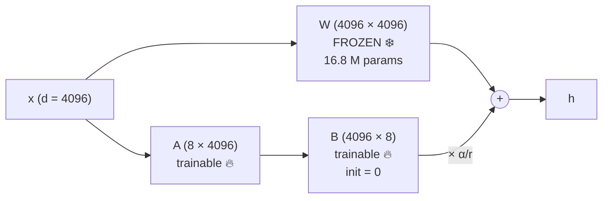
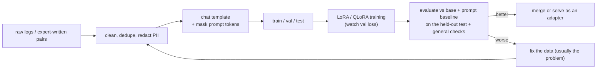
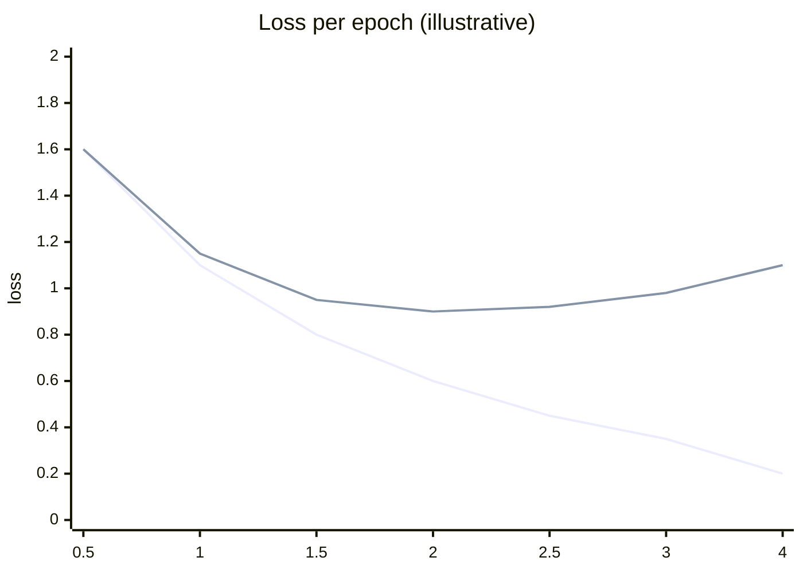
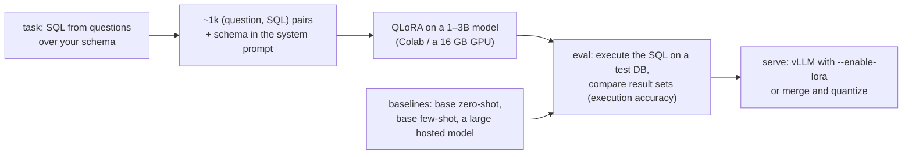

# Chapter 7 — Fine-Tuning, LoRA & PEFT

> **Volume 5 — AI Systems Engineering** · [Contents](index.md) · ← [Chapter 6 — Prompt Engineering & Structured Output](ch06-prompt-engineering-and-structured-output.md) · Next → [Chapter 8 — Alignment, RLHF & Guardrails](ch08-alignment-rlhf-and-guardrails.md)

---

## Concept

Full fine-tuning vs parameter-efficient methods; LoRA adapters, data prep, and when to fine-tune at all.

**In one sentence:** fine-tuning continues training a pretrained model on your own examples so it adopts a behavior, and LoRA does this cheaply by freezing the original weights and learning tiny low-rank "correction" matrices beside them — often less than 1% of the parameters.

**Mental model — sticky notes on a textbook.** Full fine-tuning rewrites the textbook: expensive, and you need a whole new copy per subject. LoRA leaves the textbook untouched and adds a small pad of sticky notes that adjust how certain pages are read. You can swap sticky-note pads per task (support tone, SQL generation, legal style) on the same book.

**When to fine-tune at all**

| Need | Best first tool |
|------|-----------------|
| the model lacks *facts* (your docs, fresh data) | **RAG** ([Ch 9](ch09-embeddings-and-rag.md)) — facts change; weights shouldn't |
| the output *format or style* is inconsistent | better prompts + few-shot + structured output ([Ch 6](ch06-prompt-engineering-and-structured-output.md)) |
| prompts are long and repeated; latency or cost matter | **fine-tune** a smaller model to internalize the instructions |
| a narrow task at scale (classification, extraction, routing) | **fine-tune** a small model (it can beat a large general model at a fraction of the cost) |
| a new language, domain jargon, or tone the base model handles poorly | **fine-tune** (possibly continued pretraining first) |
| safety or policy behavior | preference tuning ([Ch 8](ch08-alignment-rlhf-and-guardrails.md)) |

**Full fine-tuning vs PEFT**

| | Full fine-tuning | LoRA | QLoRA |
|-|------------------|------|-------|
| Trainable params | 100% | ~0.1–1% | ~0.1–1% |
| GPU memory (7B) | ~100+ GB (weights + gradients + Adam states) | ~16–24 GB (BF16 base, frozen) | **~6–10 GB** (4-bit base) |
| Output | a whole new model (14 GB) | an adapter (~10–100 MB) | an adapter |
| Multi-task serving | one model per task | many adapters on one base (hot-swap, multi-LoRA serving) | same |
| Quality | the ceiling | usually close to full FT for adaptation tasks | slightly below LoRA, often negligibly |
| Forgetting | higher risk | lower (base frozen) | lower |

Other PEFT methods: prefix/prompt tuning (learn virtual tokens), IA³ (learned scaling vectors), DoRA (LoRA with magnitude/direction split).

**How LoRA works** — for a frozen weight matrix `W` (d × k), learn two small matrices `A` (r × k) and `B` (d × r) with rank r ≪ d, and use

```
 h = W·x + (α / r) · B·A·x          B starts at zero, so training starts from the unchanged model
 params per matrix: d·k (full) vs r·(d + k) (LoRA)
 d = k = 4096, r = 8:  16.8 M → 65.5 K  (0.39%)
 after training you can merge: W' = W + (α/r)·B·A  → zero extra inference cost
```

**Key hyperparameters**

| Setting | Typical | Effect |
|---------|---------|--------|
| `r` (rank) | 8–64 | capacity of the adapter |
| `lora_alpha` | r to 2r | scale of the update |
| `target_modules` | attention projections (`q_proj`, `k_proj`, `v_proj`, `o_proj`), often plus MLP (`gate_proj`, `up_proj`, `down_proj`) | more modules = more capacity |
| learning rate | 1e-4 – 2e-4 (LoRA) | higher than full fine-tuning |
| epochs | 1–3 | more epochs → overfitting and forgetting |
| dropout | 0–0.1 | regularization |

**Data preparation — this decides the result**

1. **Quality over quantity**: 500–5,000 excellent examples beat 100k noisy ones.
2. Match the *chat template* the model uses (system/user/assistant markers); train on the *assistant* tokens only (mask the prompt tokens).
3. Cover the real distribution, including edge cases and refusals ("I don't know" when the answer isn't in the input).
4. Deduplicate; remove PII and secrets; check licenses.
5. Hold out a test set *before* training; never tune on it.
6. Include some general examples if you need to reduce forgetting.

---

## Prereqs

* [Chapter 3 — Transformers](ch03-transformers.md)

---

## Diagram

**LoRA: frozen weights + low-rank adapters**



```
 params in one 4096 × 4096 projection
 full fine-tune  ████████████████████████████████████████  16,777,216
 LoRA r = 8      ▏                                               65,536   (0.39%)
 LoRA r = 64     ██                                             524,288   (3.1%)
```

**A fine-tuning workflow**



**Overfitting signal**



Top line: validation loss starts rising after ~epoch 2 while training loss keeps falling — stop there.

---

## Example

```python
# QLoRA fine-tuning with Hugging Face PEFT + TRL
import torch
from datasets import load_dataset
from transformers import AutoModelForCausalLM, AutoTokenizer, BitsAndBytesConfig
from peft import LoraConfig
from trl import SFTConfig, SFTTrainer

base = "Qwen/Qwen2.5-1.5B-Instruct"
tok = AutoTokenizer.from_pretrained(base)
model = AutoModelForCausalLM.from_pretrained(
    base, device_map="auto",
    quantization_config=BitsAndBytesConfig(load_in_4bit=True, bnb_4bit_quant_type="nf4",
                                           bnb_4bit_compute_dtype=torch.bfloat16))

lora = LoraConfig(
    r=16, lora_alpha=32, lora_dropout=0.05,
    target_modules=["q_proj", "k_proj", "v_proj", "o_proj", "gate_proj", "up_proj", "down_proj"],
    task_type="CAUSAL_LM",
)

# data.jsonl lines: {"messages": [{"role": "system", ...}, {"role": "user", ...}, {"role": "assistant", ...}]}
ds = load_dataset("json", data_files={"train": "train.jsonl", "validation": "val.jsonl"})

trainer = SFTTrainer(
    model=model, processing_class=tok, peft_config=lora,
    train_dataset=ds["train"], eval_dataset=ds["validation"],
    args=SFTConfig(output_dir="out", num_train_epochs=2, learning_rate=2e-4,
                   per_device_train_batch_size=4, gradient_accumulation_steps=4,
                   eval_strategy="steps", eval_steps=50, logging_steps=10,
                   assistant_only_loss=True, bf16=True),   # loss on assistant tokens only
)
trainer.train()
trainer.model.print_trainable_parameters()   # e.g. trainable params: 18M || all params: 1.5B || 1.2%
trainer.save_model("out/adapter")            # tens of MB
```

```python
# LoRA parameter math
d = k = 4096
for r in (8, 16, 64):
    print(r, r * (d + k), f"{r * (d + k) / (d * k):.2%}")
# 8 65536 0.39%   16 131072 0.78%   64 524288 3.12%
```

---

## Exercises

1. Prepare a small instruction dataset.

   <details><summary>Solution</summary>Pick one task (e.g. turning support emails into structured tickets). Collect ~300 real inputs, write or verify gold outputs (a strong model can draft them; a human must check them), format them as chat messages in the target model's template, include ~10% edge cases (missing fields → null, off-topic → a refusal), deduplicate, redact PII, and split 80/10/10 with the test set frozen first.</details>

2. Train a LoRA adapter and compare to base.

   <details><summary>Solution</summary>Train with the config above. Evaluate the base model zero-shot, the base model with your best few-shot prompt, and the adapter, on the same held-out test set, with task metrics (exact match or field-level F1) and a small general-ability check (to detect forgetting). Report all three; fine-tuning is worth it only if it beats the prompt baseline by enough to justify maintaining it.</details>

3. Training loss goes to 0.05 but test accuracy is worse than the prompt baseline. What happened?

   <details><summary>Solution</summary>Overfitting or memorization — too many epochs, too high a learning rate, too few or too uniform examples — or a train/test mismatch (different templates or distributions). Use early stopping on validation loss, fewer epochs, more diverse data, and check that the chat template and loss masking are correct.</details>

---

## Mini project

**Fine-tune a small model with LoRA on a custom task.**



**Steps**

1. Choose a task with automatic scoring (text-to-SQL, JSON extraction, classification).
2. Build the dataset (the exercise above); freeze a test set.
3. Train with QLoRA; track validation loss; keep the best checkpoint.
4. Evaluate against three baselines on accuracy, latency, and cost per 1k requests.
5. Serve the adapter with vLLM multi-LoRA (or merge it and quantize, [Ch 5](ch05-quantization-and-efficiency.md)).

**Done when:** you have a results table vs the baselines and can state when this adapter is (or isn't) worth using.

---

## Open source

* [`huggingface/peft`](https://github.com/huggingface/peft) — LoRA, QLoRA, DoRA, IA³, and prefix tuning; `src/peft/tuners/lora/layer.py` shows the `B·A` update and merging.
* [`unslothai/unsloth`](https://github.com/unslothai/unsloth) — fast, memory-efficient LoRA/QLoRA training with ready-made notebooks. See also `huggingface/trl` (SFTTrainer) and the LoRA and QLoRA papers.

---

## Interview

1. **"LoRA — how does it stay cheap?"**
   <details><summary>Answer</summary>It freezes the pretrained weights and learns a low-rank update ΔW = B·A with rank r ≪ d for selected matrices, so trainable parameters, gradients, and optimizer states are a tiny fraction (often under 1%). The frozen base can even be 4-bit (QLoRA), so a 7B model trains on a single consumer GPU. Adapters are megabytes, many can share one base in serving, and they can be merged into W for zero added inference latency. It works because the weight change needed for adaptation is approximately low-rank.</details>

2. **"When fine-tune vs RAG vs prompt?"**
   <details><summary>Answer</summary>Prompting first: it's fastest to iterate and often enough. RAG when the model needs knowledge it lacks or that changes (docs, tickets, product data) — with citations and easy updates. Fine-tuning when you need consistent behavior, style, or format that prompts can't reliably produce, or to make a small model match a larger one on a narrow task for cost and latency. They combine: a fine-tuned model that uses RAG is common. Fine-tuning is a poor way to inject facts.</details>

---

## Checklist

- [ ] curate a dataset
- [ ] train a LoRA
- [ ] evaluate before/after

---

> [Contents](index.md) · ← [Chapter 6 — Prompt Engineering & Structured Output](ch06-prompt-engineering-and-structured-output.md) · Next → [Chapter 8 — Alignment, RLHF & Guardrails](ch08-alignment-rlhf-and-guardrails.md)
