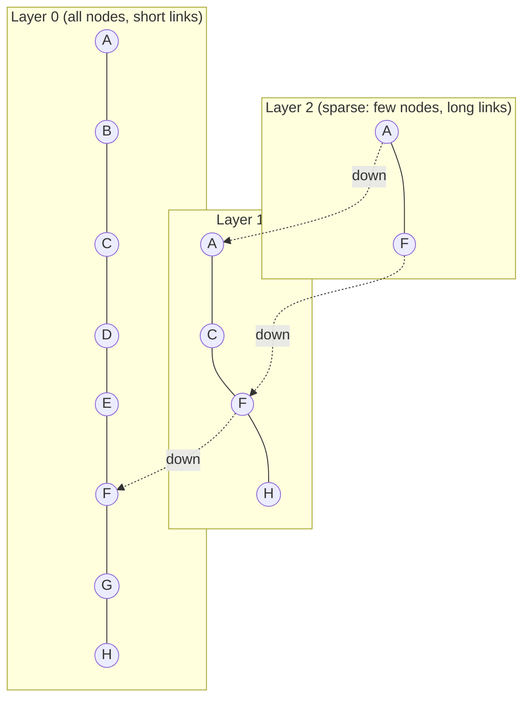
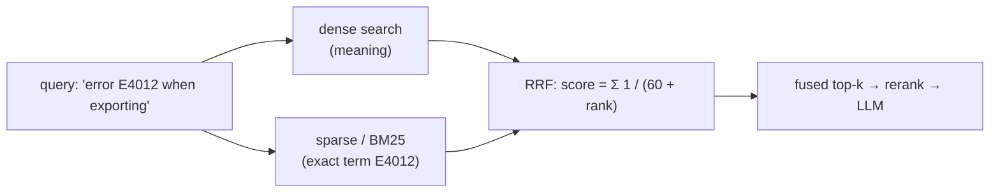
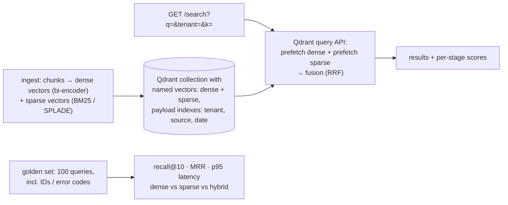

# Chapter 10 — Vector Databases

> **Volume 5 — AI Systems Engineering** · [Contents](index.md) · ← [Chapter 9 — Embeddings & RAG](ch09-embeddings-and-rag.md) · Next → [Chapter 11 — Agent Frameworks & Tool Use](ch11-agent-frameworks-and-tool-use.md)

---

## Concept

ANN indexes (HNSW/IVF), similarity metrics, hybrid search, and Qdrant/Milvus operations.

**In one sentence:** a vector database stores millions of embeddings with their metadata and answers "which stored vectors are closest to this one?" in milliseconds by using approximate nearest-neighbor (ANN) indexes — trading a sliver of accuracy for enormous speed — while also filtering by metadata and combining with keyword search.

**Mental model — finding a restaurant in a huge city.** Checking every restaurant (exact search) is slow. HNSW is a set of maps at different zoom levels: on the country map you jump to the right city, on the city map to the right district, then walk street by street to the closest match. IVF is dividing the city into neighborhoods and only searching the few neighborhoods nearest to you.

**Exact vs approximate search**

| | Exact (flat / brute force) | ANN |
|-|----------------------------|-----|
| Cost per query | O(n · d) — every vector | ~O(log n) (HNSW) or a fraction of n (IVF) |
| Recall | 100% | tunable, typically 95–99% |
| 1M × 768 dims | ~0.77 GFLOP/query — fine for small sets | milliseconds at millions to billions |
| Use | < ~100k vectors, or as ground truth for evaluation | production scale |

**Index types**

| Index | How | Pros | Cons | Tuning knobs |
|-------|-----|------|------|--------------|
| **HNSW** | a multi-layer proximity graph; greedy search from the top sparse layer down | excellent recall/latency; supports inserts | memory-hungry (vectors + graph in RAM); slower builds | `M` (links per node), `ef_construct`, `ef` (search breadth) |
| **IVF** (inverted file) | k-means clusters; search the `nprobe` nearest clusters | lower memory, fast builds, good on GPUs | recall depends on `nprobe`; needs training | `nlist`, `nprobe` |
| **PQ / SQ** (product / scalar quantization) | compress vectors (e.g. 768 floats → 96 bytes) | 4–32× less memory | lower accuracy (rescore with originals) | subvectors, bits |
| IVF-PQ, HNSW+SQ | combinations | billion-scale on modest hardware | complexity | |
| DiskANN | a graph index on SSD | huge datasets with little RAM | SSD latency | |

**Similarity metrics**

| Metric | Formula | Use when |
|--------|---------|----------|
| **Cosine** | `a·b / (‖a‖‖b‖)` | text embeddings (the direction carries meaning; length doesn't) — the usual default |
| Dot product | `a·b` | the model was trained for it, or vectors are normalized (then it equals cosine and is faster) |
| Euclidean (L2) | `‖a − b‖` | image/geometry features; on normalized vectors it ranks the same as cosine |

**Rule:** use the metric the embedding model was trained with (check its model card). Normalize once, and cosine = dot product.

**Filtering** — real queries are "nearest vectors *where* tenant = 42 AND lang = 'en' AND date > …". Post-filtering (search, then drop non-matching) can return too few results; good engines filter *during* graph traversal (Qdrant's filterable HNSW, Milvus partitions and scalar indexes). Index your payload fields.

**Hybrid search: when and why** — dense vectors capture meaning ("can't sign in" ≈ "login problem") but miss exact tokens: product codes, error IDs, names, rare terms. Sparse / keyword methods (BM25, SPLADE) nail exact terms but miss synonyms. **Hybrid** runs both and fuses the results (Reciprocal Rank Fusion, or weighted scores). Use it whenever queries contain identifiers, jargon, or rare words — i.e. most enterprise search.

**Operating a vector DB**

| Concern | Practice |
|---------|----------|
| Schema | one collection per embedding model/dimension; store `model_version` in the payload |
| Re-embedding | a new model → a new collection, backfill, switch by alias (blue-green) |
| Capacity | RAM ≈ n × d × 4 bytes × ~1.5 (HNSW overhead); 10M × 768 ≈ 46 GB → quantize or shard |
| Durability | snapshots, replicas; know your write-ahead log settings |
| Deletes / updates | upsert by stable ID (e.g. hash of doc + chunk index); deleting by filter when a doc changes |
| Monitoring | p95 latency, recall on a golden set (vs exact search), memory, indexing lag |

---

## Prereqs

* [Chapter 9 — Embeddings & RAG](ch09-embeddings-and-rag.md)

---

## Diagram

**An HNSW graph (layers + nearest-neighbor hops)**



```
 search for query ✚ (nearest is G):
 layer 2: enter at A → F is closer → move to F            (big jumps)
 layer 1: from F → H? no, F stays closest → go down
 layer 0: from F → G is closer → G's neighbors aren't closer → stop: G   (fine steps)
 visited ~6 nodes instead of all 8 (or all 10 million)
```

**IVF: search only the nearest clusters**

```
  ┌───────────┬───────────┬───────────┐
  │  c1 ·· ·  │  c2  · ·· │  c3 ·  ·  │     nlist = 9 clusters (k-means)
  ├───────────┼───────────┼───────────┤     nprobe = 2 → search c5 and c6 only
  │  c4 · ··  │ [c5 ·✚··] │ [c6 ·· · ]│     ≈ 2/9 of the vectors scanned
  ├───────────┼───────────┼───────────┤     a true neighbor in c8 would be missed
  │  c7 ··  · │  c8 · ·   │  c9 ···   │     → raise nprobe for recall, lower it for speed
  └───────────┴───────────┴───────────┘
```

**Hybrid search with Reciprocal Rank Fusion**



---

## Example

```python
# Qdrant: collection, upsert with payload, filtered cosine search
from qdrant_client import QdrantClient, models
from sentence_transformers import SentenceTransformer

client = QdrantClient(":memory:")                     # or QdrantClient(url="http://localhost:6333")
emb = SentenceTransformer("all-MiniLM-L6-v2")

client.create_collection(
    "kb",
    vectors_config=models.VectorParams(size=384, distance=models.Distance.COSINE),
    hnsw_config=models.HnswConfigDiff(m=16, ef_construct=128),
)
client.create_payload_index("kb", field_name="tenant", field_schema="keyword")

docs = [
    (1, "Annual plans can be refunded within 30 days.", {"tenant": "acme", "lang": "en"}),
    (2, "Use 'Forgot password' on the login page.", {"tenant": "acme", "lang": "en"}),
    (3, "Error E4012 means the export exceeded 10,000 rows.", {"tenant": "acme", "lang": "en"}),
    (4, "Refunds are not available for monthly plans.", {"tenant": "globex", "lang": "en"}),
]
client.upsert("kb", [
    models.PointStruct(id=i, vector=emb.encode(t, normalize_embeddings=True).tolist(), payload={"text": t, **p})
    for i, t, p in docs
])

hits = client.query_points(
    "kb",
    query=emb.encode("can I get my money back?", normalize_embeddings=True).tolist(),
    query_filter=models.Filter(must=[models.FieldCondition(key="tenant", match=models.MatchValue(value="acme"))]),
    search_params=models.SearchParams(hnsw_ef=64),
    limit=2,
).points
for h in hits:
    print(round(h.score, 3), h.payload["text"])        # the acme refund doc first; globex is never returned
```

```python
# Hybrid: fuse dense and keyword rankings with Reciprocal Rank Fusion
def rrf(*rankings, k=60):
    scores = {}
    for ranking in rankings:
        for rank, doc_id in enumerate(ranking, start=1):
            scores[doc_id] = scores.get(doc_id, 0.0) + 1.0 / (k + rank)
    return sorted(scores, key=scores.get, reverse=True)

dense = [2, 1, 3]          # ids ranked by vector similarity
keyword = [3, 1]           # ids ranked by BM25 (exact 'E4012' match)
print(rrf(dense, keyword)) # [3, 1, 2] — docs found by both lists rise above dense-only doc 2
```

```python
# Compare metrics: on normalized vectors, cosine and dot give identical rankings
import numpy as np
rng = np.random.default_rng(0)
X = rng.normal(size=(1000, 64)); X /= np.linalg.norm(X, axis=1, keepdims=True)
q = X[0] + 0.1 * rng.normal(size=64)
cos = X @ q / np.linalg.norm(q); dot = X @ q; l2 = -np.linalg.norm(X - q, axis=1)
print(np.array_equal(np.argsort(-cos)[:10], np.argsort(-dot)[:10]),
      np.array_equal(np.argsort(-cos)[:10], np.argsort(-l2)[:10]))   # True True
```

---

## Exercises

1. Insert and query vectors with metadata filters.

   <details><summary>Solution</summary>See the Qdrant example: create a payload index on the filter fields, upsert points with payloads, and query with a <code>Filter</code> (<code>must</code>, <code>should</code>, <code>must_not</code>; ranges on dates). Verify that the filter is applied during search (results stay at the requested <code>limit</code> even when only 1% of points match) and that another tenant's data can never be returned.</details>

2. Compare cosine vs dot vs Euclidean for a task.

   <details><summary>Solution</summary>On L2-normalized vectors all three produce the same ranking (shown above), so choose dot product for speed. On unnormalized vectors, dot product favors long vectors (often "popular" or long texts); cosine ignores length; L2 penalizes length differences. Measure recall@10 on a labeled query set for your embedding model with each metric, and use the one the model card recommends unless the evaluation disagrees.</details>

3. You have 20M chunks × 1024-dim float32 embeddings. Estimate the RAM for HNSW, and name two ways to cut it.

   <details><summary>Solution</summary>Vectors: 20M × 1024 × 4 B ≈ 82 GB, plus the graph (~M × 2 links × 4–8 B per node ≈ a few GB) → ~90 GB. Cut it with scalar quantization (int8: ~4×) or product quantization (8–32×), keeping full vectors on disk for rescoring; smaller or Matryoshka-truncated embeddings (e.g. 256 dims); or shard across nodes.</details>

---

## Mini project

**A hybrid search service (dense vectors + keyword) on Qdrant.**



**Steps**

1. Run Qdrant in Docker; create a collection with a dense vector and a sparse vector (Qdrant supports both as named vectors).
2. Ingest a corpus with realistic identifiers (error codes, SKUs, names) plus ordinary prose.
3. `/search` uses Qdrant's query API with two prefetches (dense, sparse) and RRF fusion, plus tenant filters.
4. Build a golden query set and compare dense-only, sparse-only, and hybrid on recall@10 and MRR; also measure p95 latency.
5. Tune `hnsw_ef` and record the recall vs latency curve against exact search as ground truth.

**Done when:** hybrid wins on queries with identifiers without losing on natural-language queries, and you can show the recall/latency trade-off for `ef`.

---

## Open source

* [`qdrant/qdrant`](https://github.com/qdrant/qdrant) — Rust; filterable HNSW, named dense and sparse vectors, quantization, and a hybrid query API.
* [`milvus-io/milvus`](https://github.com/milvus-io/milvus) — distributed; many index types (HNSW, IVF-PQ, DiskANN, GPU indexes), partitions, and scalar filtering. See also FAISS (the library behind many engines), pgvector, and the ann-benchmarks site.

---

## Interview

1. **"HNSW — how does it stay fast?"**
   <details><summary>Answer</summary>It builds a hierarchy of proximity graphs: upper layers contain few nodes with long-range links, and the bottom layer contains every node with short links. A search starts at the top, greedily moves to the neighbor closest to the query, drops a layer, and repeats, so it covers large distances in a few hops and then refines locally — roughly logarithmic in dataset size. The <code>ef</code> parameter controls how many candidates are kept during search, trading latency for recall. The costs are memory for the graph and slower index builds.</details>

2. **"When hybrid search over pure vector?"**
   <details><summary>Answer</summary>When queries include exact tokens that embeddings handle poorly — product codes, error IDs, names, acronyms, rare jargon, numbers — or when the domain vocabulary differs from the embedding model's training data. Keyword (BM25/sparse) retrieval catches exact matches while dense retrieval catches paraphrases. Fusing them (e.g. with RRF) is robust and cheap, so it's a sensible default for enterprise search and RAG; pure vector suffices for purely conversational, semantic queries.</details>

---

## Checklist

- [ ] run ANN queries
- [ ] filter by metadata
- [ ] choose a similarity metric deliberately

---

> [Contents](index.md) · ← [Chapter 9 — Embeddings & RAG](ch09-embeddings-and-rag.md) · Next → [Chapter 11 — Agent Frameworks & Tool Use](ch11-agent-frameworks-and-tool-use.md)
