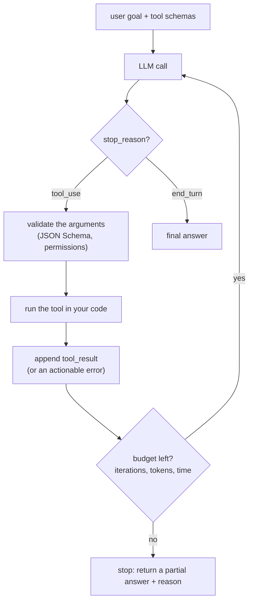
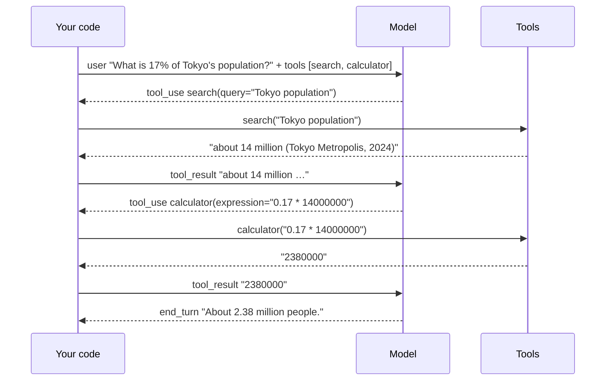
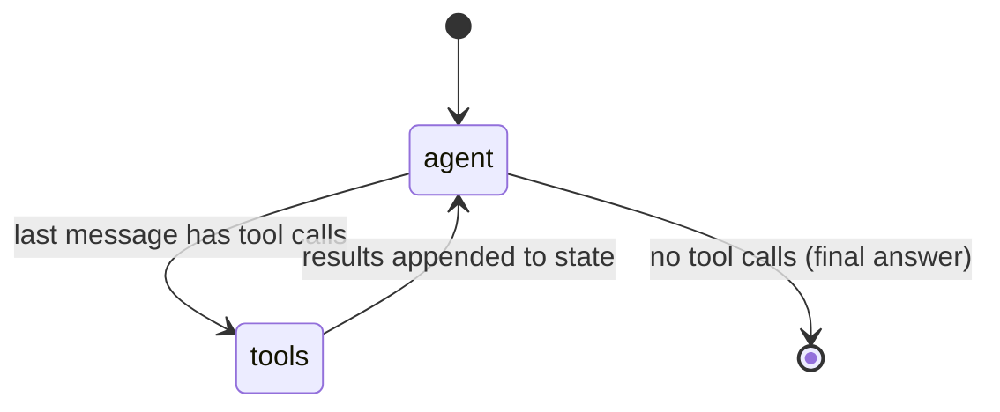
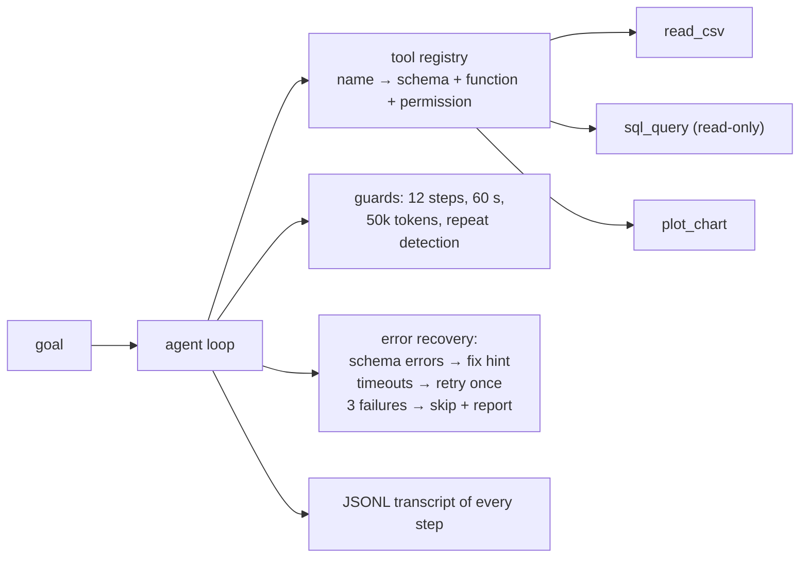
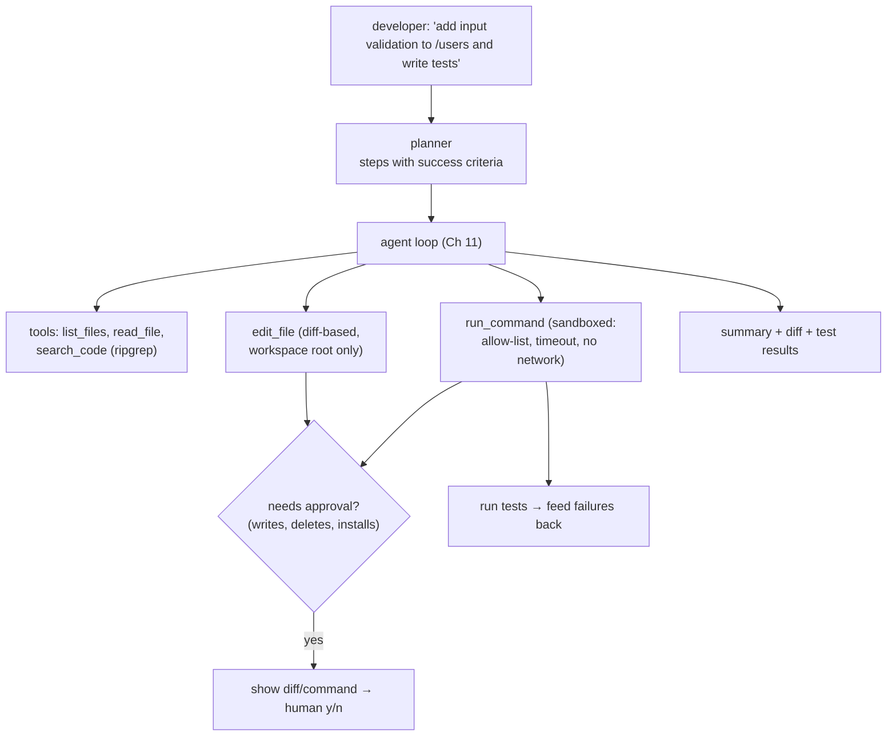

# Chapter 11 — Agent Frameworks & Tool Use

> **Volume 5 — AI Systems Engineering** · [Contents](index.md) · ← [Chapter 10 — Vector Databases](ch10-vector-databases.md) · Next → [Chapter 12 — Agent Memory](ch12-agent-memory.md)

---

## Concept

ReAct-style agents, tool calling, planning loops, and frameworks (LangGraph, and the patterns beneath them).

**In one sentence:** an agent is an LLM in a loop — it reads the goal, decides which tool to call, your code runs that tool, the result goes back into the context, and the loop repeats until the model says it's done or a limit stops it.

**Mental model — a new intern with a phone.** The intern (the LLM) can't touch anything directly. They can only *ask* you: "please run `search('flight prices')`". You run it, hand back the answer, and they decide the next step. You stay in control of every real action — and you set a rule like "at most 10 calls, then report back".

**How tool calling works under the hood**

| Step | What happens |
|------|--------------|
| 1. Declare tools | you send each tool's name, description, and a **JSON Schema** for its input with the request |
| 2. Model decides | the model outputs a structured `tool_use` block (name + JSON arguments) instead of, or next to, text; `stop_reason = "tool_use"` |
| 3. You execute | *your* code validates the arguments and runs the function — the model never runs anything |
| 4. Return result | you send a `tool_result` block (matched by `tool_use_id`), including errors as text with `is_error: true` |
| 5. Repeat | the model reads the result and either calls another tool or answers (`stop_reason = "end_turn"`) |

The model was trained to emit tool calls in this format; the "magic" is just structured output plus your loop.

**Agent patterns**

| Pattern | Idea | Use when |
|---------|------|----------|
| **ReAct** | interleave reasoning and actions: think → act → observe → repeat | open-ended tasks with a few tools |
| Plan-and-execute | first write a plan (list of steps), then run each step, re-plan on failure | long, multi-step tasks; makes progress visible |
| Router | one LLM call picks which specialist path or tool handles the request | many distinct request types |
| Reflection / critic | a second pass checks the result and asks for fixes | quality-critical outputs (code, reports) |
| Workflow (fixed graph) | the steps are code; the LLM fills in each step | predictable processes — often better than a free agent |

**Frameworks vs the loop beneath them** — LangGraph models an agent as a *state graph*: nodes (LLM call, tool node), edges (conditional: "if the model asked for a tool, go to the tool node"), a shared state object, checkpoints for pause/resume, and human-in-the-loop interrupts. Others: the Claude Agent SDK, OpenAI Agents SDK, LlamaIndex, CrewAI. All of them wrap the same ~30-line loop. Learn the loop first; adopt a framework when you need persistence, streaming, or complex graphs.

**Keeping an agent from looping forever**

| Guard | How |
|-------|-----|
| Max iterations | hard cap (e.g. 15 tool calls), then return a partial answer |
| Token / cost / time budget | stop when the budget is spent |
| Repeat detection | the same tool with the same arguments twice → tell the model, or stop |
| Progress check | require the plan's step counter to advance |
| Good tool errors | return *actionable* errors ("date must be YYYY-MM-DD") so the model can fix itself instead of retrying blindly |
| Human checkpoint | pause for approval before destructive or expensive actions |

---

## Prereqs

* [Chapter 6 — Prompt Engineering & Structured Output](ch06-prompt-engineering-and-structured-output.md)

---

## Diagram

**The agent loop: plan → call tool → observe → repeat until done**



**What the messages look like**



**LangGraph's view of the same loop**



---

## Example

```python
import json, anthropic

client = anthropic.Anthropic()

TOOLS = [
    {"name": "search",
     "description": "Search the web. Returns short text snippets. Use for facts you don't know.",
     "input_schema": {"type": "object",
                      "properties": {"query": {"type": "string"}},
                      "required": ["query"]}},
    {"name": "calculator",
     "description": "Evaluate an arithmetic expression like '0.17 * 14000000'. Only + - * / ( ) and numbers.",
     "input_schema": {"type": "object",
                      "properties": {"expression": {"type": "string"}},
                      "required": ["expression"]}},
]

def search(query: str) -> str:
    return "Tokyo Metropolis population: about 14 million (2024)."   # stub; call a real API here

def calculator(expression: str) -> str:
    if not set(expression) <= set("0123456789.+-*/() "):
        raise ValueError("only numbers and + - * / ( ) are allowed")
    return str(eval(expression, {"__builtins__": {}}))              # restricted after the check

HANDLERS = {"search": search, "calculator": calculator}

def run_agent(goal: str, max_steps: int = 8) -> str:
    messages = [{"role": "user", "content": goal}]
    seen = set()
    for step in range(max_steps):
        resp = client.messages.create(model="claude-sonnet-5-5", max_tokens=1024,
                                      tools=TOOLS, messages=messages)
        messages.append({"role": "assistant", "content": resp.content})
        if resp.stop_reason != "tool_use":
            return "".join(b.text for b in resp.content if b.type == "text")

        results = []
        for block in resp.content:
            if block.type != "tool_use":
                continue
            key = (block.name, json.dumps(block.input, sort_keys=True))
            try:
                if key in seen:
                    raise RuntimeError("you already made this exact call; use the earlier result")
                seen.add(key)
                out, err = HANDLERS[block.name](**block.input), False
            except Exception as e:                          # errors go BACK to the model
                out, err = f"error: {e}", True
            results.append({"type": "tool_result", "tool_use_id": block.id,
                            "content": out, "is_error": err})
        messages.append({"role": "user", "content": results})
    return "Stopped: step limit reached. Partial progress is in the transcript."

print(run_agent("What is 17% of Tokyo's population?"))
```

---

## Exercises

1. Build an agent with two tools.

   <details><summary>Solution</summary>Use the loop above with <code>search</code> and <code>calculator</code>. Write tool descriptions that say <i>when</i> to use each tool and what the output looks like — descriptions matter more than names. Test three goals: one that needs no tool, one that needs one, and one that needs both in order.</details>

2. Add a planner that decomposes a task.

   <details><summary>Solution</summary>First call: "Break this goal into at most 5 numbered steps; output JSON <code>{"steps": [...]}</code>" (use structured output from <a href="ch06-prompt-engineering-and-structured-output.md">Ch 6</a>). Then run the tool loop once per step, passing the plan and results so far. If a step fails twice, ask the planner to re-plan from the current state. Log the plan so humans can see progress.</details>

3. The model keeps calling `search` with slightly different queries and never answers. Name three fixes.

   <details><summary>Solution</summary>(1) A hard step cap plus a final "answer with what you have" call. (2) A better tool result: return richer snippets so one search is enough, or say "no better results exist". (3) A system prompt rule: "after 2 searches, answer or say you don't know". Also track spend and stop on budget.</details>

---

## Mini project

**A tool-calling agent with bounded iterations and error recovery.**



**Steps**

1. A `Tool` dataclass: name, description, JSON Schema, function, and `dangerous` flag.
2. Validate arguments with `jsonschema` before running; return schema errors as actionable text.
3. Wrap each tool with a timeout and one retry for transient errors.
4. Guards: step, time, and token budgets; repeat detection; a final "summarize progress" call when a limit hits.
5. Log every step to JSONL; write 10 test goals including ones that must fail gracefully.

**Done when:** all 10 goals end with an answer or a clear partial result, no run exceeds its budget, and a broken tool never crashes the agent.

---

## Build #3

**An AI Coding Assistant — read/write files, run commands, plan and execute tasks.**



**Steps**

1. File tools restricted to one workspace directory (resolve paths; reject `..` and symlinks leaving the root).
2. `edit_file` takes an exact old string and new string (like a search-and-replace), so edits are small and reviewable; refuse if the old string isn't unique.
3. `run_command` in a container or subprocess with an allow-list (`pytest`, `ruff`, `git diff`), a 60 s timeout, no network, and output truncated to the last 200 lines.
4. Plan first, then execute step by step; after each edit, run the tests and feed failures back.
5. Ask for approval before writes and any command not on the allow-list; keep a transcript.
6. Evaluate on 5 small tasks in a sample repo (add a function + test, fix a failing test, rename safely).

**Done when:** it completes at least 4 of the 5 tasks with passing tests, never touches files outside the workspace, and every write was shown to you first.

---

## Open source

* [`langchain-ai/langgraph`](https://github.com/langchain-ai/langgraph) — agents as state graphs: `StateGraph`, conditional edges, `ToolNode`, checkpointers, and `interrupt` for human approval.
* [`openai/openai-python`](https://github.com/openai/openai-python) (tool calling) — the function-calling request and response shapes; compare with the Anthropic Messages API `tools` / `tool_use` / `tool_result` blocks.

---

## Interview

1. **"How does tool calling work under the hood?"**
   <details><summary>Answer</summary>You send tool definitions (name, description, JSON Schema) with the request. The model, trained to do so, emits a structured tool-call block with a name and JSON arguments and stops. Your application validates and executes the call, then sends the result back as a tool-result message tied to the call ID. The model continues from there. The model never executes anything itself; the loop and all side effects live in your code.</details>

2. **"How do you keep an agent from looping forever?"**
   <details><summary>Answer</summary>Hard limits on steps, tokens, time, and cost; detection of repeated identical calls; actionable tool errors so the model can correct itself; prompts that tell it when to stop or admit uncertainty; progress tracking against a plan; and a graceful exit that returns partial results with the reason. For risky or long tasks, add human checkpoints.</details>

---

## Checklist

- [ ] define tool schemas
- [ ] bound the loop
- [ ] handle tool errors gracefully

---

> [Contents](index.md) · ← [Chapter 10 — Vector Databases](ch10-vector-databases.md) · Next → [Chapter 12 — Agent Memory](ch12-agent-memory.md)
