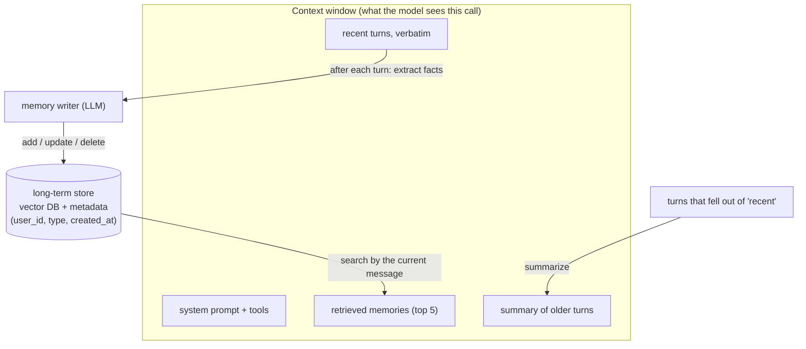
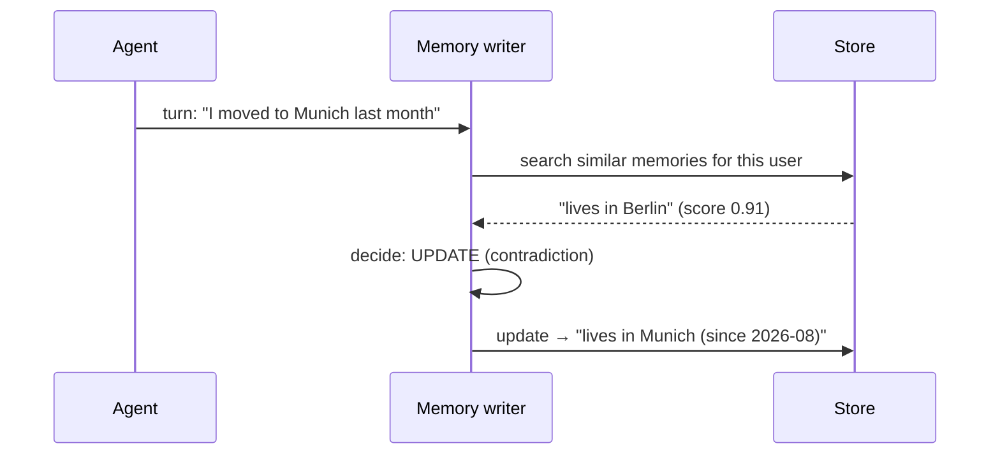
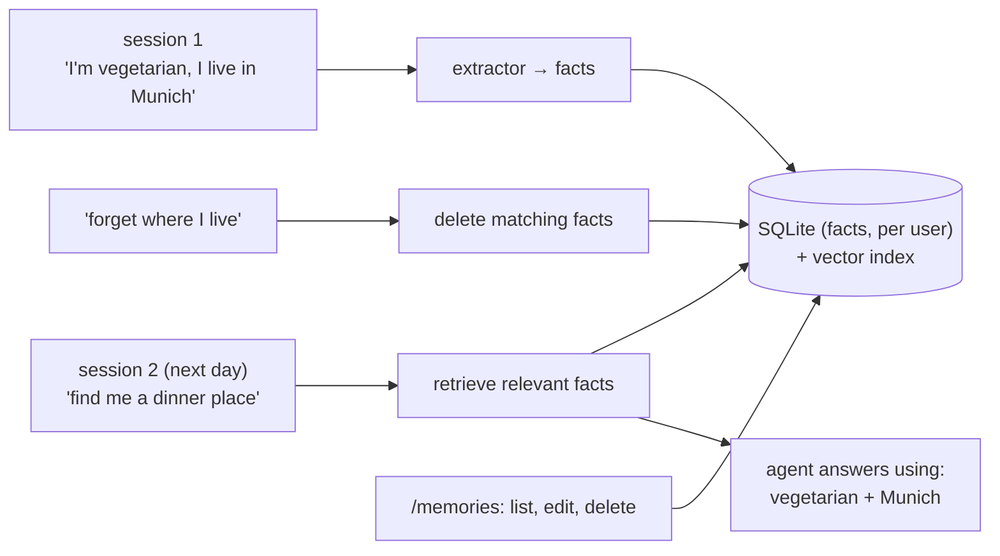

# Chapter 12 — Agent Memory

> **Volume 5 — AI Systems Engineering** · [Contents](index.md) · ← [Chapter 11 — Agent Frameworks & Tool Use](ch11-agent-frameworks-and-tool-use.md) · Next → [Chapter 13 — MCP & A2A](ch13-mcp-and-a2a.md)

---

## Concept

Short-term (context) vs long-term memory, summarization, and retrieval-backed memory.

**In one sentence:** an LLM remembers nothing between calls — "memory" is whatever your code chooses to put back into the context window, so you keep recent turns verbatim, compress older ones into summaries, and store durable facts outside the model to retrieve when they become relevant.

**Mental model — a person with a notebook.** Working memory is what you're holding in your head right now (the context window: limited, perfect recall). Your notebook's summary page is "what happened so far" (summarized history). The filing cabinet is everything you ever learned, searchable by topic (a vector store of long-term memories). You don't read the whole cabinet before every sentence — you look up what's relevant.

**Kinds of memory**

| Kind | Holds | Where it lives | Example |
|------|-------|----------------|---------|
| **Working (short-term)** | the current conversation and tool results | the context window | the last 10 turns |
| **Summarized history** | a compressed story of older turns | a string in the prompt | "User is planning a Lisbon trip in May; budget €1,500" |
| **Episodic (long-term)** | specific past events and sessions | a database / vector store | "On 3 March we fixed the CSV import bug" |
| **Semantic (long-term)** | stable facts and preferences | key–value or vector store | "Prefers Python; timezone Europe/Berlin" |
| **Procedural** | how to do things | system prompt, skills, files | "Always run tests before committing" |

**Why not just use a huge context?** Long contexts cost more per call (you pay for every token every turn), are slower, and models use information in the middle of very long prompts less reliably. A curated context usually beats a stuffed one.

**The context budget** — decide how the window is spent, for example for a 200k-token model limited to 30k per call:

| Slot | Budget |
|------|-------:|
| System prompt + tool definitions | 3k |
| Retrieved long-term memories | 2k |
| Summary of older history | 1k |
| Recent turns (verbatim) | 16k |
| Current tool results | 6k |
| Space for the answer | 2k |

**Writing memories (the hard part)**

| Question | Good practice |
|----------|---------------|
| *What* to store? | durable facts, preferences, decisions, and outcomes — not every message |
| *When*? | after each turn (in the background), or at session end |
| How to avoid duplicates and contradictions? | before inserting, search for similar memories; update or replace instead of appending ("moved to Munich" replaces "lives in Berlin") |
| How to forget? | TTLs, decay by age and use, user-driven deletion ("forget that"), privacy rules |
| Whose memory? | scope by user and tenant; never retrieve across users |

---

## Prereqs

* [Chapter 9 — Embeddings & RAG](ch09-embeddings-and-rag.md)
* [Chapter 11 — Agent Frameworks & Tool Use](ch11-agent-frameworks-and-tool-use.md)

---

## Diagram

**The memory hierarchy**



**Sliding window + rolling summary**

```
 turn:     1  2  3  4  5  6  7  8  9  10 11 12
 verbatim:                   [7  8  9  10 11 12]   ← last 6 turns kept exactly
 summary:  [1..6 compressed into ~200 tokens]      ← updated when turns leave the window
 tokens:   without memory design ~24k and growing; with it ~6k and flat
```

**Writing a memory without duplicates**



---

## Example

```python
import anthropic
client = anthropic.Anthropic()
KEEP_RECENT = 6

def summarize(old_summary: str, turns: list[dict]) -> str:
    text = "\n".join(f"{t['role']}: {t['content']}" for t in turns)
    resp = client.messages.create(
        model="claude-haiku-4-5-20251001", max_tokens=300,
        messages=[{"role": "user", "content":
            "Update the running summary of this conversation. Keep facts, decisions, open "
            "questions, and user preferences. Drop small talk. Max 150 words.\n\n"
            f"Current summary:\n{old_summary or '(none)'}\n\nNew turns:\n{text}"}])
    return resp.content[0].text

class Conversation:
    def __init__(self):
        self.summary, self.turns = "", []

    def add(self, role, content):
        self.turns.append({"role": role, "content": content})
        if len(self.turns) > KEEP_RECENT + 2:                 # compress in chunks, not every turn
            old, self.turns = self.turns[:-KEEP_RECENT], self.turns[-KEEP_RECENT:]
            self.summary = summarize(self.summary, old)

    def context(self, memories: list[str]) -> tuple[str, list[dict]]:
        system = "You are a helpful travel assistant."
        if memories:
            system += "\n\nKnown about this user:\n" + "\n".join(f"- {m}" for m in memories)
        if self.summary:
            system += f"\n\nEarlier in this conversation:\n{self.summary}"
        return system, self.turns
```

```python
# Long-term memory with embeddings (any embedding model + a vector store; here Chroma)
import chromadb, uuid
store = chromadb.PersistentClient("memdb").get_or_create_collection("memories")

def remember(user_id: str, fact: str):
    hits = store.query(query_texts=[fact], n_results=1, where={"user_id": user_id})
    if hits["ids"][0] and hits["distances"][0][0] < 0.15:      # near-duplicate → update
        store.update(ids=[hits["ids"][0][0]], documents=[fact])
    else:
        store.add(ids=[str(uuid.uuid4())], documents=[fact], metadatas=[{"user_id": user_id}])

def recall(user_id: str, query: str, k: int = 5) -> list[str]:
    res = store.query(query_texts=[query], n_results=k, where={"user_id": user_id})
    return res["documents"][0]

remember("u1", "Prefers window seats and vegetarian meals")
print(recall("u1", "book me a flight to Lisbon"))
```

---

## Exercises

1. Implement conversation summarization.

   <details><summary>Solution</summary>See <code>Conversation</code>: keep the last N turns verbatim, and fold older turns into a rolling summary with a cheap model when the buffer overflows. Test it with a 40-turn conversation where a key fact appears in turn 3 and is needed in turn 38: the fact must survive in the summary. Compare token counts per call with and without summarization.</details>

2. Store and retrieve long-term memory via embeddings.

   <details><summary>Solution</summary>See <code>remember</code>/<code>recall</code>. Add an LLM "memory extractor" that turns each turn into zero or more short facts (most turns produce none), scope everything by <code>user_id</code>, update near-duplicates instead of adding them, and inject the top-k recalled facts into the system prompt. Test across two sessions: a preference stated on Monday is used on Friday.</details>

3. Why is "store every message in the vector DB and retrieve the top 5" a weak memory design?

   <details><summary>Solution</summary>Raw messages are noisy ("ok thanks!"), redundant, and contradictory over time, so retrieval returns chit-chat or outdated facts. Extracting durable facts, updating them on change, and attaching metadata (type, date) gives far better recall per token.</details>

---

## Mini project

**An agent with persistent memory across sessions.**



**Steps**

1. A chat agent with a rolling summary for the current session.
2. After each turn, a background extractor returns `add` / `update` / `delete` operations as JSON.
3. Store facts with `user_id`, `type` (preference, profile, event), `created_at`, and `last_used_at`.
4. Retrieve the top 5 facts for each new message and show which ones were used.
5. Support "forget X" and a `/memories` view so users control their data.
6. Test with 3 scripted multi-session scenarios, including a contradiction and a deletion.

**Done when:** facts carry across restarts, contradictions are updated rather than duplicated, deletions really remove data, and per-call context stays under your token budget.

---

## Open source

* [`mem0ai/mem0`](https://github.com/mem0ai/mem0) — a memory layer that extracts facts and decides add/update/delete with an LLM, backed by vector and graph stores.
* [`letta-ai/letta`](https://github.com/letta-ai/letta) — formerly MemGPT: the agent manages its own memory tiers (core memory blocks, recall, archival) with tools, like an OS paging memory.

---

## Interview

1. **"Short vs long-term memory in agents?"**
   <details><summary>Answer</summary>Short-term memory is the context window: recent turns and tool results, with perfect recall but a limited and expensive budget, lost when the session ends. Long-term memory lives outside the model (databases, vector stores, files) and persists across sessions; the application writes selected facts to it and retrieves relevant ones into the context when needed. Good systems combine a verbatim recent window, a rolling summary, and retrieved long-term facts.</details>

2. **"How do you prevent context overflow?"**
   <details><summary>Answer</summary>Set an explicit token budget per slot. Keep only the last N turns verbatim; summarize older ones. Truncate or summarize large tool outputs (keep the head and tail, or extract the relevant part). Retrieve only the top-k relevant memories instead of injecting everything. Count tokens before each call and trim by priority. For long tasks, have the agent write notes to files and re-read them.</details>

---

## Checklist

- [ ] summarize history
- [ ] retrieve relevant memories
- [ ] cap context budget

---

> [Contents](index.md) · ← [Chapter 11 — Agent Frameworks & Tool Use](ch11-agent-frameworks-and-tool-use.md) · Next → [Chapter 13 — MCP & A2A](ch13-mcp-and-a2a.md)
