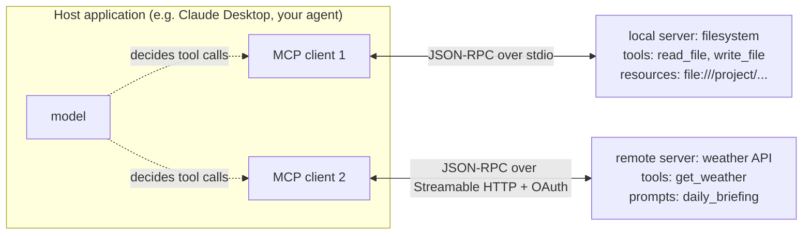
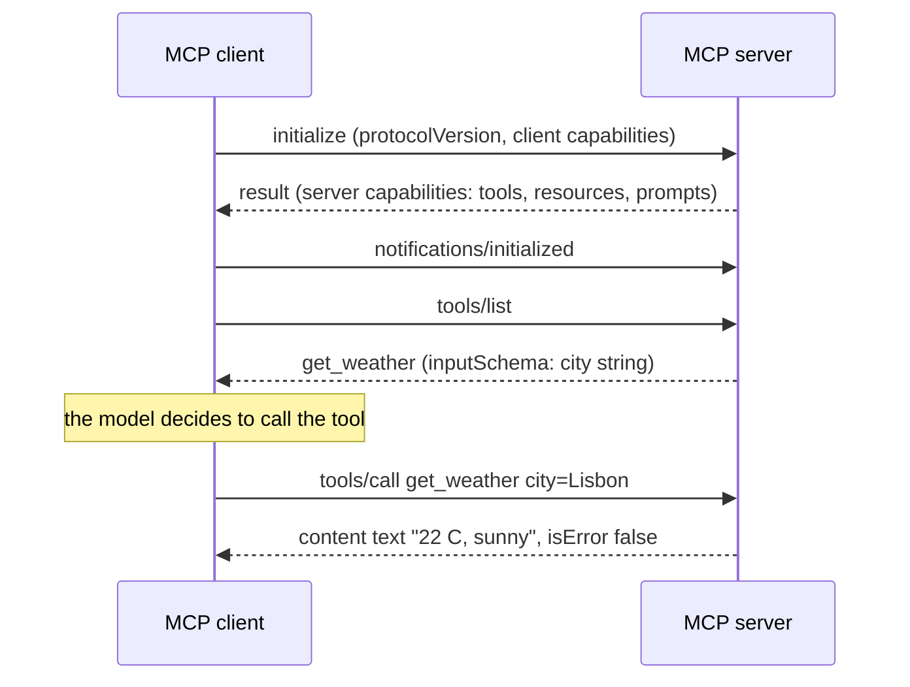
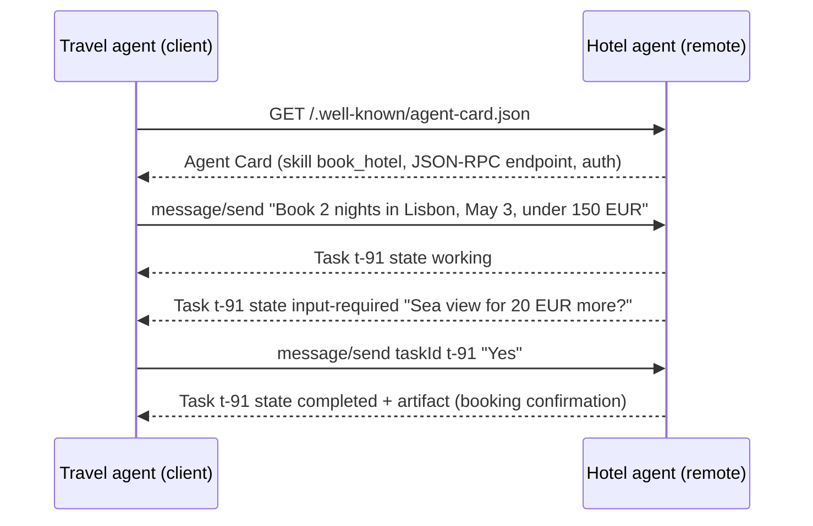
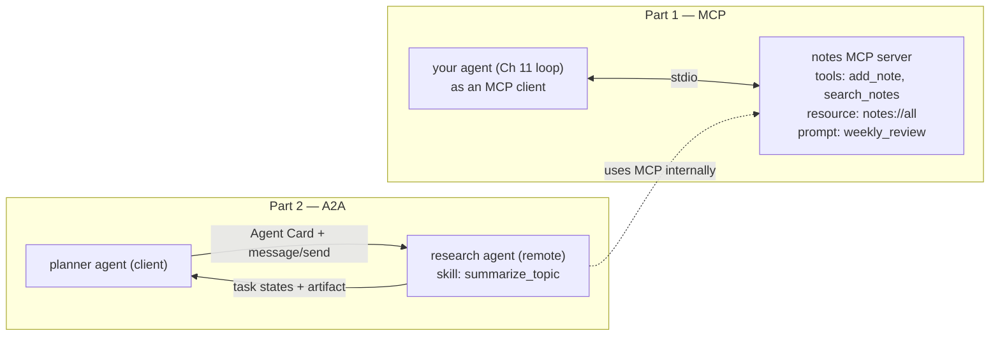

# Chapter 13 — MCP & A2A

> **Volume 5 — AI Systems Engineering** · [Contents](index.md) · ← [Chapter 12 — Agent Memory](ch12-agent-memory.md) · Next → [Chapter 14 — Multi-Agent Systems](ch14-multi-agent-systems.md)

---

## Concept

The Model Context Protocol (tools/resources for agents) and Agent-to-Agent protocol (interoperability).

**In one sentence:** MCP is a standard plug that lets any AI application connect to any tool or data source through one protocol instead of custom glue code, and A2A is a standard way for independent agents — possibly built by different teams or vendors — to discover each other and hand off tasks.

**Mental model — USB and a phone network.** MCP is USB for AI apps: a laptop (the host app) can use any keyboard, drive, or camera (MCP servers) that speaks USB, without a custom driver for each pair. A2A is the phone network between companies: each agent has a public listing (its Agent Card), you call it, describe the job, and it reports back as the job progresses.

**MCP — the Model Context Protocol**

| Piece | Meaning |
|-------|---------|
| **Host** | the AI application the user works in (Claude Desktop, Claude Code, an IDE, your agent) |
| **Client** | a connector inside the host; one client per server connection |
| **Server** | a program exposing capabilities (GitHub, a database, a file system, your internal API) |
| Wire format | **JSON-RPC 2.0** messages |
| Transports | **stdio** (the host launches the server as a local subprocess) or **Streamable HTTP** (a remote server over HTTP, optionally streaming with SSE) |
| Lifecycle | `initialize` → capability negotiation → `notifications/initialized` → normal operation |

**What a server can offer**

| Primitive | Controlled by | Methods | Example |
|-----------|---------------|---------|---------|
| **Tools** | the model decides to call them | `tools/list`, `tools/call` | `get_weather(city)`, `create_issue(title, body)` |
| **Resources** | the application / user chooses what to attach | `resources/list`, `resources/read` (URIs like `file:///…`, `db://orders/42`) | a file, a table schema, a log |
| **Prompts** | the user picks them (e.g. slash commands) | `prompts/list`, `prompts/get` | "summarize this PR" template |

Clients can offer features back to servers too, such as *sampling* (the server asks the host's model for a completion) and *elicitation* (the server asks the user for input). Remote servers use OAuth 2.1 for authorization.

**What MCP standardizes:** discovery (what can this server do?), invocation (call with JSON arguments matching a JSON Schema), results and errors, and notifications (e.g. "the tool list changed"). It turns an N × M integration problem (every app × every tool) into N + M.

**A2A — the Agent2Agent protocol** (open source, originally from Google, now a Linux Foundation project)

| Piece | Meaning |
|-------|---------|
| **Agent Card** | a JSON document (commonly at `/.well-known/agent-card.json`) describing the agent: name, skills, endpoint, supported input/output types, auth requirements |
| Client agent / remote agent | the one delegating / the one doing the work |
| Transport | JSON-RPC 2.0 over HTTP(S); streaming via SSE; optional push notifications (webhooks) for long jobs |
| **Task** | the unit of work, with an ID and a lifecycle: `submitted` → `working` → (`input-required`) → `completed` / `failed` / `canceled` |
| Message / Part | turns between agents; parts can be text, files, or structured data |
| **Artifact** | the output the task produces |

**MCP vs A2A**

| | MCP | A2A |
|-|-----|-----|
| Connects | an agent ↔ tools and data | an agent ↔ another agent |
| The other side is | a capability with a schema (usually deterministic) | an autonomous peer with its own model, tools, and state (opaque) |
| Interaction | call a function, get a result | delegate a task that may take long, ask follow-up questions, and stream progress |
| Use when | "let my agent read our tickets DB" | "let our travel agent ask the partner's booking agent to book a hotel" |

They complement each other: an A2A agent often uses MCP servers internally.

---

## Prereqs

* [Chapter 11 — Agent Frameworks & Tool Use](ch11-agent-frameworks-and-tool-use.md)

---

## Diagram

**MCP client ↔ server**



**The MCP session**



**An A2A task hand-off**



---

## Example

```python
# An MCP server exposing a get_weather tool (official Python SDK, FastMCP API)
# pip install "mcp[cli]"
from mcp.server.fastmcp import FastMCP

mcp = FastMCP("weather")

@mcp.tool()
def get_weather(city: str) -> str:
    """Current weather for a city. Returns temperature (C) and conditions."""
    fake = {"lisbon": "22 C, sunny", "oslo": "9 C, rain"}
    return fake.get(city.lower(), f"no data for {city}")

@mcp.resource("weather://cities")
def cities() -> str:
    """The list of supported cities."""
    return "Lisbon, Oslo"

@mcp.prompt()
def packing_advice(city: str) -> str:
    return f"Check the weather in {city} with get_weather and suggest what to pack."

if __name__ == "__main__":
    mcp.run()          # stdio by default; mcp.run(transport="streamable-http") for a remote server
```

```python
# An MCP client: launch the server over stdio, list tools, call one
import asyncio
from mcp import ClientSession, StdioServerParameters
from mcp.client.stdio import stdio_client

async def main():
    params = StdioServerParameters(command="python", args=["weather_server.py"])
    async with stdio_client(params) as (read, write):
        async with ClientSession(read, write) as session:
            await session.initialize()
            tools = await session.list_tools()
            print([t.name for t in tools.tools])                    # ['get_weather']
            result = await session.call_tool("get_weather", {"city": "Lisbon"})
            print(result.content[0].text)                           # 22 C, sunny

asyncio.run(main())
```

```json
// Register the server in a host (e.g. claude_desktop_config.json or .mcp.json)
{ "mcpServers": { "weather": { "command": "python", "args": ["weather_server.py"] } } }
```

```json
// A2A: an Agent Card (abridged) and a JSON-RPC task request
{
  "name": "Hotel Booking Agent",
  "description": "Finds and books hotels.",
  "url": "https://hotels.example.com/a2a",
  "version": "1.0.0",
  "capabilities": { "streaming": true, "pushNotifications": true },
  "defaultInputModes": ["text/plain"],
  "defaultOutputModes": ["text/plain", "application/json"],
  "skills": [{ "id": "book_hotel", "name": "Book a hotel",
               "description": "Book rooms given a city, dates, and budget." }]
}

{ "jsonrpc": "2.0", "id": 1, "method": "message/send",
  "params": { "message": { "role": "user", "messageId": "m-1",
    "parts": [{ "kind": "text", "text": "Book 2 nights in Lisbon from May 3, under 150 EUR" }] } } }
```

(Field names follow the A2A spec at the time of writing; check the current spec version before building.)

---

## Exercises

1. Build an MCP server with one tool.

   <details><summary>Solution</summary>Use the FastMCP example: the function signature and docstring become the tool's input schema and description. Test it with the MCP Inspector (<code>mcp dev weather_server.py</code>), then register it in a host and ask the model a question that needs the tool. Return clear errors (e.g. unknown city) as tool results rather than crashing.</details>

2. Design an A2A message exchange for a task hand-off.

   <details><summary>Solution</summary>Client fetches the remote Agent Card and checks the skill and auth scheme. It sends <code>message/send</code> (or <code>message/stream</code>) with the task description and constraints. The remote returns a Task in <code>working</code>, may move to <code>input-required</code> with a question, the client answers with a message on the same task ID, and the task ends <code>completed</code> with an artifact (or <code>failed</code> with a reason). For long jobs, register a push-notification webhook. Log the task ID on both sides for tracing.</details>

3. Your team wants to connect an agent to Postgres. MCP or A2A?

   <details><summary>Solution</summary>MCP: a database is a capability with a clear schema, not an autonomous peer. Expose a read-only <code>query</code> tool plus schema resources, with row limits and least-privilege credentials.</details>

---

## Mini project

**An MCP server + client, plus a two-agent A2A hand-off.**



**Steps**

1. Notes server: SQLite-backed tools with clear JSON Schemas, a resource listing all notes, and a prompt template.
2. Turn your Ch 11 agent into an MCP client: at startup, `list_tools` and convert each MCP tool into the model's tool format; route tool calls to `call_tool`.
3. Add a second transport: run the same server over Streamable HTTP.
4. Write a research agent that serves an Agent Card and handles `message/send`, returning task states and a summary artifact (use the A2A SDK or a small FastAPI app following the spec).
5. The planner agent discovers it, delegates "summarize my notes about X", handles an `input-required` question, and saves the artifact as a new note via MCP.

**Done when:** the agent uses the notes server with no tool-specific code, and the planner completes a full A2A task lifecycle including one follow-up question.

---

## Open source

* [`modelcontextprotocol/python-sdk`](https://github.com/modelcontextprotocol/python-sdk) — official SDK (FastMCP server API, clients, stdio and Streamable HTTP transports); see also the spec at modelcontextprotocol.io and the `modelcontextprotocol/servers` reference servers.
* [`a2aproject/A2A`](https://github.com/a2aproject/A2A) — the A2A specification, samples, and SDKs.

---

## Interview

1. **"What does MCP standardize?"**
   <details><summary>Answer</summary>How AI applications (hosts, via clients) discover and use external capabilities provided by servers: a JSON-RPC 2.0 message format, a lifecycle with capability negotiation, stdio and Streamable HTTP transports, and three server primitives — tools (model-invoked functions with JSON Schema inputs), resources (context data addressed by URI), and prompts (reusable templates) — plus client features like sampling and elicitation, and OAuth for remote servers. Build a connector once and it works in every compliant host.</details>

2. **"Why A2A over ad-hoc APIs?"**
   <details><summary>Answer</summary>Agent-to-agent work isn't a single function call: tasks can be long-running, need clarifying questions, stream progress, and produce artifacts, and the peer is opaque (its own model and tools). A2A standardizes discovery (Agent Cards), the task lifecycle and states, messages with multi-part content, streaming and push notifications, and auth. That lets agents from different teams or vendors interoperate without bespoke integrations for each pair.</details>

---

## Checklist

- [ ] expose tools via MCP
- [ ] hand off tasks between agents
- [ ] know when each protocol applies

---

> [Contents](index.md) · ← [Chapter 12 — Agent Memory](ch12-agent-memory.md) · Next → [Chapter 14 — Multi-Agent Systems](ch14-multi-agent-systems.md)
