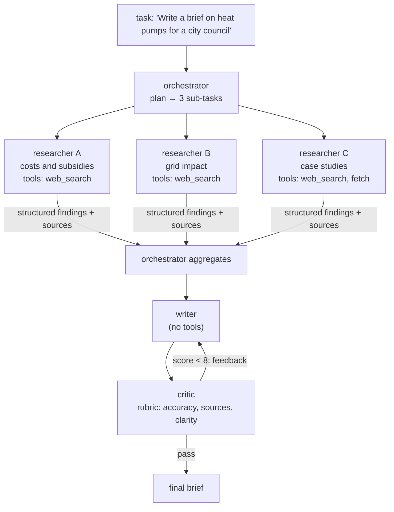
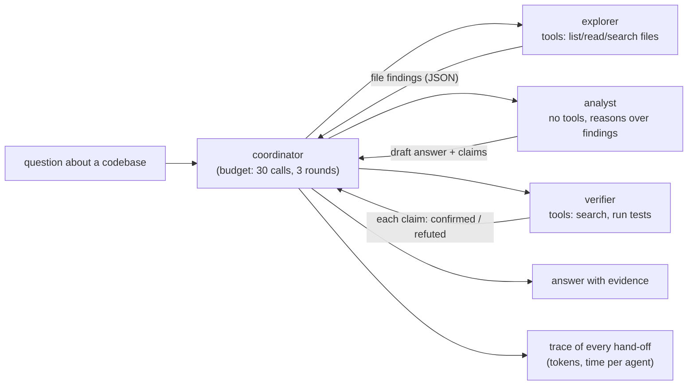
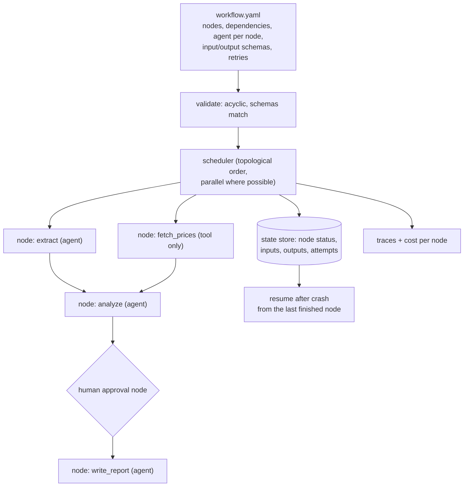

# Chapter 14 — Multi-Agent Systems

> **Volume 5 — AI Systems Engineering** · [Contents](index.md) · ← [Chapter 13 — MCP & A2A](ch13-mcp-and-a2a.md) · Next → [Chapter 15 — Voice Agents](ch15-voice-agents.md)

---

## Concept

Orchestration vs choreography, agent roles, shared state, and coordination patterns.

**In one sentence:** a multi-agent system splits a big task among several LLM "agents" with focused roles and tools — coordinated either by a central orchestrator or by agents reacting to each other's events — and it only pays off when the parallelism or specialization is worth the extra tokens, latency, and failure modes.

**Mental model — a newsroom.** The editor (orchestrator) assigns stories to a researcher, a writer, and a fact-checker, then assembles the paper. That's orchestration. Alternatively, reporters post finished pieces to a shared board and whoever is responsible for the next step picks them up — choreography. Either way, too many people passing notes means nothing gets printed.

**Orchestration vs choreography**

| | Orchestration | Choreography |
|-|---------------|--------------|
| Control | one coordinator decides who does what, when | each agent reacts to events or messages on a shared bus/board |
| Visibility | the flow is in one place; easy to trace and debug | the flow emerges; harder to see end to end |
| Coupling | the coordinator knows every agent | agents know only the events |
| Failure handling | central retries, timeouts, fallbacks | each agent handles its own; needs good monitoring |
| Fits | most LLM systems today | event-driven pipelines, loosely coupled teams (see [Vol 4 Ch 10](../volume-4-high-level-design/ch10-event-driven-systems.md)) |

**Coordination patterns**

| Pattern | Shape | Example |
|---------|-------|---------|
| **Orchestrator–workers** (fan-out / fan-in) | the lead splits the task, workers run in parallel, the lead aggregates | research: 5 sub-questions researched in parallel, then merged |
| **Pipeline** (sequential) | A → B → C, each transforms the output | draft → edit → format |
| **Generator–critic** (evaluator-optimizer) | one produces, another scores and requests changes, loop until pass | code + reviewer; essay + rubric grader |
| Router / handoff | a triage agent passes the conversation to a specialist | support: billing vs technical |
| Debate / voting | several agents answer; a judge or majority picks | high-stakes classification |
| Blackboard | agents read and write a shared structured state | planning with many constraints |

**Roles** — give each agent a narrow job, its own system prompt, and *only* the tools it needs (least privilege). Clear output contracts (JSON schemas) between agents make aggregation reliable.

**Sharing context**

| Method | Pros | Cons |
|--------|------|------|
| Pass full transcripts | nothing lost | tokens grow fast; distracts the next agent |
| **Pass structured summaries / artifacts** | compact, typed | the author must decide what matters |
| Shared state object (LangGraph state, a blackboard) | one source of truth | concurrent writes need rules |
| Shared memory store / files | persistent, large | retrieval quality matters ([Ch 12](ch12-agent-memory.md)) |

**Costs to bound** — tokens multiply (each agent re-reads context), latency adds up in sequential chains, errors compound (5 agents at 95% each ≈ 77% end to end), and agents can loop by delegating back and forth. Rules: start with one agent and add more only when evals show a gain; cap rounds and total budget; keep a single owner of the final answer; trace every hand-off ([Ch 16](ch16-ai-observability.md)).

---

## Prereqs

* [Chapter 12 — Agent Memory](ch12-agent-memory.md)
* [Chapter 13 — MCP & A2A](ch13-mcp-and-a2a.md)

---

## Diagram

**An orchestrator fanning out to specialist agents, then aggregating**



**Orchestration vs choreography**

```
 ORCHESTRATION                         CHOREOGRAPHY
        ┌──────────┐                   researcher ──"findings.ready"──► [event bus]
        │  lead    │                                                      │
        └┬───┬───┬─┘                   writer ◄──── subscribes ─────────┤
   ┌─────┘   │   └─────┐               writer ──"draft.ready"──────────►│
   ▼         ▼         ▼               critic ◄──── subscribes ─────────┘
 agent A  agent B   agent C            no one sees the whole flow unless you trace it
```

**Why errors compound**

```
 per-step success:   0.95   0.95   0.95   0.95   0.95
 chain success:      0.95 → 0.90 → 0.86 → 0.81 → 0.77
 add verification steps and fewer hand-offs to keep this high
```

---

## Example

```python
import asyncio, json, anthropic
client = anthropic.AsyncAnthropic()

async def ask(system: str, prompt: str, model="claude-sonnet-5-5", max_tokens=1500) -> str:
    r = await client.messages.create(model=model, max_tokens=max_tokens, system=system,
                                     messages=[{"role": "user", "content": prompt}])
    return r.content[0].text

async def researcher(sub_question: str) -> dict:
    text = await ask("You are a careful researcher. Return JSON: "
                     '{"claims": [{"text": str, "source": str}], "open_questions": [str]}',
                     sub_question)
    return json.loads(text)

async def writer(task: str, findings: list[dict], feedback: str = "") -> str:
    return await ask("You write clear 1-page briefs. Use only the given findings; cite sources.",
                     f"Task: {task}\nFindings: {json.dumps(findings)}\nFeedback to address: {feedback}")

async def critic(task: str, draft: str) -> dict:
    text = await ask("You grade briefs 1-10 on accuracy, sourcing, clarity. Return JSON "
                     '{"score": int, "feedback": str}.', f"Task: {task}\nDraft:\n{draft}",
                     model="claude-opus-5-5", max_tokens=500)
    return json.loads(text)

async def run(task: str, max_rounds: int = 3) -> str:
    plan = json.loads(await ask('Split the task into 3 independent research questions. JSON {"questions": [str]}', task))
    findings = await asyncio.gather(*(researcher(q) for q in plan["questions"]))   # fan-out, parallel
    draft, feedback = "", ""
    for _ in range(max_rounds):                                                   # bounded critic loop
        draft = await writer(task, findings, feedback)
        review = await critic(task, draft)
        if review["score"] >= 8:
            break
        feedback = review["feedback"]
    return draft

print(asyncio.run(run("Write a brief on heat pumps for a city council")))
```

(In production, validate each JSON response with a schema and retry on parse errors — see [Ch 6](ch06-prompt-engineering-and-structured-output.md).)

---

## Exercises

1. Design a multi-agent team for a task.

   <details><summary>Solution</summary>Task: "triage and fix a bug report". Roles: a triage agent (reads the report, reproduces it, labels it; tools: repo search, run tests); a fixer (edits code; tools: read/edit files, run tests); a reviewer (reads the diff against a checklist; no write tools). Orchestrator flow: triage → fixer ↔ reviewer (max 3 rounds) → PR. Contracts: triage outputs <code>{repro_steps, failing_test, suspected_files}</code>; the reviewer outputs <code>{approve: bool, issues: []}</code>. Budget: 40 tool calls total.</details>

2. Implement an orchestrator that aggregates sub-results.

   <details><summary>Solution</summary>See <code>run</code>: plan → <code>asyncio.gather</code> the workers → merge. Aggregation tips: require each worker to return structured claims with sources; deduplicate claims; flag contradictions for the writer; handle a failed worker by continuing with the rest and noting the gap, instead of failing the whole task.</details>

3. Your 4-agent system scores the same as a single agent on your eval set but costs 5×. What do you do?

   <details><summary>Solution</summary>Go back to the single agent (perhaps with better tools or prompts). Multi-agent designs must earn their cost through measured gains: parallel speed on broad tasks, or quality from verification. Keep only the parts that move the eval — often just a critic step.</details>

---

## Mini project

**A small multi-agent system with defined roles and a coordinator.**



**Steps**

1. Three roles with separate system prompts, tools, and JSON output schemas.
2. A coordinator that plans, calls roles, passes *structured summaries* (not full transcripts), and owns the final answer.
3. Budgets: total calls, rounds, and tokens; a graceful stop that reports what's unverified.
4. Record tokens and time per agent per task.
5. Compare against a single agent with all tools on 10 questions: accuracy, tokens, and latency.

**Done when:** the table of results shows whether the multi-agent version is worth it, and every answer lists which claims were verified.

---

## Build #4

**An AI Workflow Engine — DAG-based task graphs with agents at each node.**



**Steps**

1. A YAML format: each node has an `agent` (prompt, model, tools) or a plain `tool`, `needs:` dependencies, input/output JSON Schemas, `retries`, and `timeout`.
2. Validate the graph (no cycles, with the topological sort from [Vol 1 Ch 34](../volume-1-cs-foundations/ch34-graph-algorithms-dfs-bfs-topological-sort-and.md)) and schema compatibility between connected nodes.
3. A scheduler runs ready nodes concurrently; outputs are validated against their schema before downstream nodes start.
4. Persist node states in SQLite so a crashed run resumes; cache node outputs by input hash.
5. Human-approval nodes pause the run until approved via CLI or API.
6. Per-node traces, tokens, and cost; a run summary at the end.
7. Ship 2 example workflows (a research report, invoice processing).

**Done when:** both workflows run end to end, independent nodes run in parallel, killing the process mid-run and restarting resumes without redoing finished nodes, and a schema violation stops the run with a clear error.

---

## Open source

* [`langchain-ai/langgraph`](https://github.com/langchain-ai/langgraph) — multi-agent graphs, supervisor and swarm patterns, shared state, and checkpointing.
* [`crewAIInc/crewAI`](https://github.com/crewAIInc/crewAI) — role-based agents ("crews") with tasks and processes (sequential, hierarchical). See also Anthropic's engineering posts on building effective agents and on its multi-agent research system.

---

## Interview

1. **"Orchestration vs choreography?"**
   <details><summary>Answer</summary>Orchestration has a central coordinator that decides which agent runs when and aggregates results — easy to reason about, trace, and bound, but a central point of logic. Choreography has agents reacting to events or messages without a central controller — loosely coupled and extensible, but the end-to-end flow is implicit and harder to debug and bound. For LLM agents, orchestration is usually the safer default, with choreography for event-driven integrations.</details>

2. **"How do agents share context?"**
   <details><summary>Answer</summary>By passing messages or artifacts, a shared state object, or a shared memory store. Best practice is to pass compact, structured outputs (JSON with claims, sources, and decisions) rather than full transcripts, give each agent only the context its role needs, keep one source of truth for shared state with clear write rules, and record hand-offs in traces so you can see what each agent knew.</details>

---

## Checklist

- [ ] assign clear roles
- [ ] aggregate results
- [ ] bound coordination overhead

---

> [Contents](index.md) · ← [Chapter 13 — MCP & A2A](ch13-mcp-and-a2a.md) · Next → [Chapter 15 — Voice Agents](ch15-voice-agents.md)
