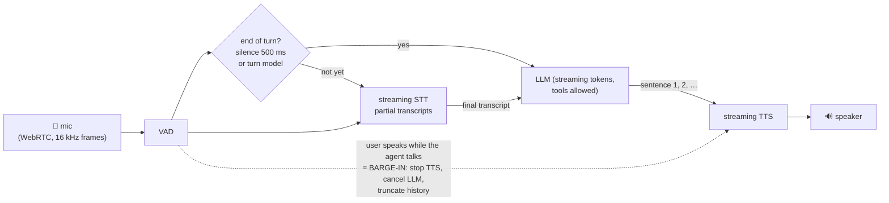
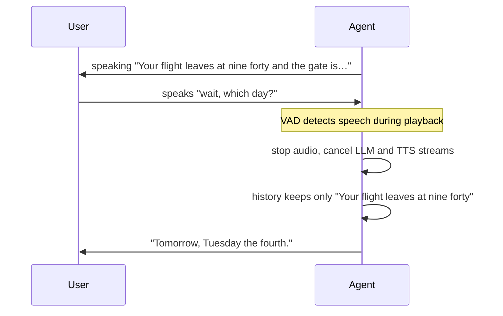
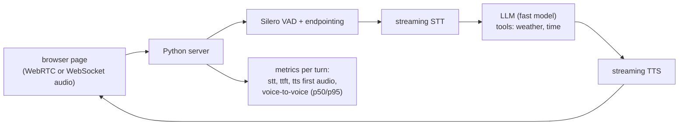
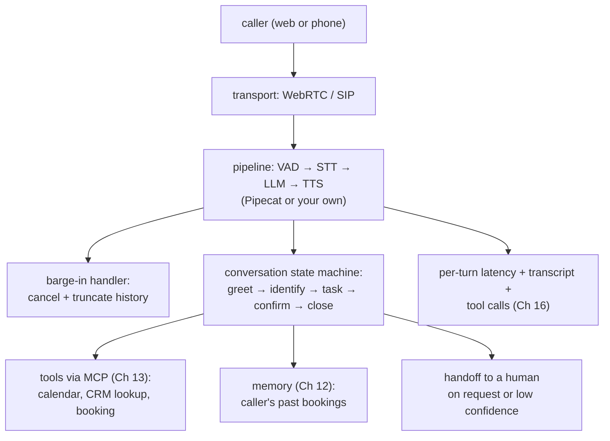

# Chapter 15 — Voice Agents

> **Volume 5 — AI Systems Engineering** · [Contents](index.md) · ← [Chapter 14 — Multi-Agent Systems](ch14-multi-agent-systems.md) · Next → [Chapter 16 — AI Observability](ch16-ai-observability.md)

---

## Concept

Speech-to-text, LLM turn-taking, text-to-speech, latency budgets, and interruption handling.

**In one sentence:** a voice agent is a real-time pipeline — listen, detect when the person has finished speaking, transcribe, think, and speak back — where every stage must stream so the reply starts within about a second, and where the user can interrupt at any moment.

**Mental model — a phone call with a very fast interpreter.** Humans leave only ~200–300 ms between turns in conversation. Anything over ~1 second feels laggy; over 2 seconds, people start repeating themselves. So the agent can't wait for a whole paragraph: it must start speaking the first sentence while still "thinking" about the rest — and stop instantly if you cut in.

**The pipeline**

| Stage | Job | Tools / models | Streaming? |
|-------|-----|----------------|:-:|
| Audio transport | carry mic audio in and speech out | WebRTC (browser/mobile), telephony (SIP/Twilio), WebSockets | yes |
| **VAD** (voice activity detection) | is someone speaking right now? | Silero VAD, WebRTC VAD | yes |
| **Turn detection / endpointing** | has the user *finished* their turn? | silence timeout (e.g. 500–800 ms) and/or a semantic turn model | yes |
| **STT** (speech-to-text) | audio → text | Whisper (and faster-whisper), Deepgram, AssemblyAI, cloud APIs | partial transcripts |
| **LLM** | decide what to say / do (tools!) | any chat model; keep replies short and speakable | token streaming |
| **TTS** (text-to-speech) | text → audio | ElevenLabs, Cartesia, OpenAI, Piper (local) | start from the first sentence |
| Alternative: speech-to-speech | one model hears and speaks | realtime speech models | yes |

**A latency budget (voice-to-voice, target < 1 s)**

| Step | Budget |
|------|-------:|
| endpointing (silence detection) | 300–500 ms |
| final STT transcript | 100–200 ms |
| LLM time to first token | 200–400 ms |
| TTS time to first audio | 100–200 ms |
| network + audio buffering | 50–150 ms |
| **total** | **~0.8–1.4 s** |

**How to hit low latency** — stream every stage and *overlap* them; send the LLM output to TTS sentence by sentence; use a fast model for conversation (and a bigger one only via tools when needed); keep prompts short; colocate services in one region; reuse warm connections; prefer WebRTC over plain HTTP; say a short filler ("let me check…") before slow tool calls.

**Barge-in (interruption)** — when VAD detects the user speaking while the agent is talking: stop TTS playback immediately, cancel in-flight LLM and TTS generation, **truncate the conversation history** to what was actually spoken (the model shouldn't believe it said the unheard part), then listen. Tune it so coughs, "mm-hm", and the agent's own echo (use echo cancellation) don't trigger it.

**Voice-specific prompting** — no markdown, lists, or URLs (they sound terrible); short sentences; spell out numbers the way people say them; confirm important details back ("that's May third, right?"); handle mis-transcriptions gracefully.

---

## Prereqs

* [Chapter 11 — Agent Frameworks & Tool Use](ch11-agent-frameworks-and-tool-use.md)

---

## Diagram

**The audio pipeline with a turn-taking loop**



**Where the time goes — sequential vs overlapped**

```
 SEQUENTIAL (feels slow: ~3.2 s)
 |── end silence 500 ──|── full STT 600 ──|── full LLM reply 1500 ──|── full TTS 600 ──| 🔊

 STREAMING + OVERLAP (~0.9 s to first audio)
 |── end silence 400 ──|─STT 150─|─LLM first sentence 250─|─TTS first chunk 120─| 🔊 …
                                          └─ LLM keeps generating while sentence 1 plays
```

**Barge-in**



---

## Example

```python
# A minimal streaming loop (conceptual): STT → LLM → TTS with sentence chunking and barge-in.
import asyncio, re, anthropic
client = anthropic.AsyncAnthropic()
SYSTEM = ("You are a friendly voice assistant. Speak in short sentences. No lists, markdown, "
          "or URLs. Say numbers as words when natural.")
SENTENCE_END = re.compile(r"([.!?])\s")

async def speak_reply(history, tts, player, interrupted: asyncio.Event):
    spoken, buf = [], ""
    async with client.messages.stream(model="claude-haiku-4-5-20251001", max_tokens=300,
                                      system=SYSTEM, messages=history) as stream:
        async for text in stream.text_stream:
            if interrupted.is_set():
                break                                   # barge-in: stop generating
            buf += text
            while (m := SENTENCE_END.search(buf)):      # send whole sentences to TTS ASAP
                sentence, buf = buf[:m.end()].strip(), buf[m.end():]
                await player.play(tts.stream(sentence), stop_event=interrupted)
                if interrupted.is_set():
                    break
                spoken.append(sentence)
    if buf.strip() and not interrupted.is_set():
        await player.play(tts.stream(buf.strip()), stop_event=interrupted)
        spoken.append(buf.strip())
    # Record ONLY what the user actually heard
    history.append({"role": "assistant", "content": " ".join(spoken) or "(interrupted)"})

async def conversation(mic, stt, tts, player, vad):
    history = []
    while True:
        user_text = await stt.listen_until_end_of_turn(mic, vad)    # streaming STT + endpointing
        history.append({"role": "user", "content": user_text})
        interrupted = asyncio.Event()
        watcher = asyncio.create_task(vad.wait_for_speech(set_event=interrupted))  # barge-in detector
        await speak_reply(history, tts, player, interrupted)
        watcher.cancel()
```

```python
# Real frameworks wire this for you. Pipecat, for example, composes processors into a pipeline:
# pipeline = Pipeline([transport.input(), stt, context_aggregator.user(), llm, tts,
#                      transport.output(), context_aggregator.assistant()])
# with VAD-based interruptions enabled in the transport params.
```

```bash
# Measure each stage — log timestamps per turn
# turn 7: speech_end=0 ms  stt_final=+160  llm_first_token=+410  tts_first_audio=+540  → 540 ms ✅
```

---

## Exercises

1. Wire STT → LLM → TTS into one loop.

   <details><summary>Solution</summary>Start simple: record until 700 ms of silence (VAD), transcribe with faster-whisper, stream the LLM reply, and synthesize sentence by sentence with a local TTS (Piper) or an API. Log timestamps at each boundary and compute voice-to-voice latency per turn. Then switch STT to streaming partials and see the gain.</details>

2. Add interruption (barge-in) handling.

   <details><summary>Solution</summary>Run VAD on the mic while the agent plays audio (with echo cancellation, or headphones for testing). When speech lasts over ~200 ms, set an interrupt event: stop playback, cancel the LLM and TTS tasks, and save only the sentences actually played to history. Test with a scripted interruption mid-sentence and verify the next answer doesn't refer to unheard content.</details>

3. Users complain the agent cuts them off when they pause to think. What do you change?

   <details><summary>Solution</summary>The endpointing is too aggressive. Lengthen the silence threshold (e.g. 500 → 800 ms), add a semantic turn detector that waits when the transcript looks unfinished ("I'd like to book a…"), or adapt the threshold per user. Measure the trade-off: fewer cut-offs vs slightly higher latency.</details>

---

## Mini project

**A voice assistant with low-latency turn-taking.**



**Steps**

1. A browser page that streams mic audio to a server and plays audio back.
2. VAD + endpointing; streaming STT; streaming LLM; sentence-chunked streaming TTS.
3. Two tools (weather, time) with a spoken filler for slow calls.
4. Per-turn timing logs; a small report of p50 and p95 voice-to-voice latency over 20 turns.
5. Tune: model choice, silence threshold, and chunking; record each change's effect.

**Done when:** p50 voice-to-voice latency is under ~1 s on your setup, and the latency report shows which stage dominates.

---

## Build #5

**A Voice Agent — full STT/LLM/TTS with interruptions and conversation state.**



**Steps**

1. Pick a use case, e.g. a restaurant booking line; define the state machine (greet → collect date, time, party size → check availability → confirm → close).
2. Build the pipeline with streaming stages and barge-in that truncates history correctly.
3. Tools for availability and booking; always confirm details back before booking.
4. Conversation state tracked outside the LLM (slots filled so far), so a restart or interruption doesn't lose progress.
5. Handle silence ("are you still there?"), mis-transcription (re-ask), and "talk to a person" (handoff).
6. Log per-turn latencies, transcripts, and tool calls; run 10 scripted test calls, including interruptions and corrections.

**Done when:** 9 of 10 scripted calls end with a correct booking or a clean handoff, interruptions never produce answers about unheard text, and p95 voice-to-voice latency stays within your budget.

---

## Open source

* [`openai/whisper`](https://github.com/openai/whisper) — open speech recognition models; `SYSTRAN/faster-whisper` is a much faster CTranslate2 implementation for real-time use.
* [`pipecat-ai/pipecat`](https://github.com/pipecat-ai/pipecat) — a framework for real-time voice and multimodal agents: transports, VAD, STT/LLM/TTS services, interruptions, and pipelines. See also LiveKit Agents.

---

## Interview

1. **"How do you hit low latency in voice?"**
   <details><summary>Answer</summary>Stream and overlap every stage: streaming STT with partial results, fast endpointing (VAD plus a semantic turn detector), a fast LLM with a short prompt and a streamed reply, TTS started on the first sentence, and a low-latency transport (WebRTC). Colocate services, keep connections warm, measure each stage per turn, and use fillers for slow tool calls. Target under ~1 s voice-to-voice.</details>

2. **"What is barge-in?"**
   <details><summary>Answer</summary>The user interrupting while the agent is speaking. Handling it means detecting speech during playback (with echo cancellation and some filtering so noise and "mm-hm" don't trigger it), stopping audio immediately, cancelling in-flight LLM and TTS generation, truncating the conversation history to what the user actually heard, and then processing the new utterance. Without it, voice agents feel robotic and frustrating.</details>

---

## Checklist

- [ ] stream audio
- [ ] handle interruptions
- [ ] keep turn-taking under budget

---

> [Contents](index.md) · ← [Chapter 14 — Multi-Agent Systems](ch14-multi-agent-systems.md) · Next → [Chapter 16 — AI Observability](ch16-ai-observability.md)
