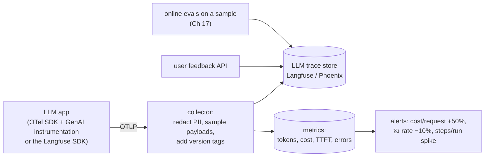
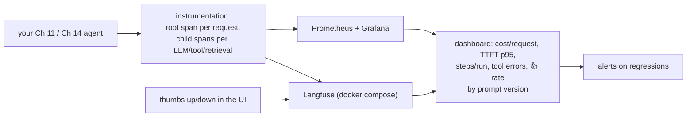

# Chapter 16 — AI Observability

> **Volume 5 — AI Systems Engineering** · [Contents](index.md) · ← [Chapter 15 — Voice Agents](ch15-voice-agents.md) · Next → [Chapter 17 — Evaluation](ch17-evaluation.md)

---

## Concept

Tracing LLM calls, token usage, latency, and quality signals; the three pillars applied to AI.

**In one sentence:** AI observability records every step of an LLM application — each model call with its prompt, output, tokens, cost, and latency, plus every retrieval and tool call — as linked traces, so you can answer "why did it say that?", "why was it slow?", and "why did the bill double?".

**Mental model — a flight recorder.** A normal service can tell you "request failed, 500". An LLM app often *succeeds* technically but gives a wrong or odd answer. So you need the flight recorder: every instrument reading (inputs, retrieved chunks, tool results, model outputs) for every flight, so that after a bad landing you can replay exactly what happened.

**The three pillars, applied to AI**

| Signal | Classic service | LLM application adds |
|--------|-----------------|----------------------|
| **Traces** | spans for HTTP and DB calls | spans for each LLM call, retrieval, tool call, and agent step — with prompts, outputs, model, parameters |
| **Metrics** | rate, errors, duration | tokens in/out, **cost**, time to first token (TTFT), tokens per second, cache hit rate, tool error rate, steps per agent run |
| **Logs** | events | full prompt/response payloads (sampled, redacted), guardrail decisions |
| **Quality** (new) | — | user feedback 👍/👎, eval scores on sampled traffic, refusal rate, hallucination/groundedness checks |

**What to trace in an LLM app**

| Span | Key attributes |
|------|---------------|
| request / session | user or tenant ID (hashed), session ID, route, prompt version |
| retrieval | query, top-k doc IDs, scores, latency |
| **LLM call** | model, temperature, max_tokens, **input/output/cached tokens**, stop reason, TTFT, total latency, cost |
| tool call | tool name, arguments, result size, error, latency |
| agent step | step number, decision, budget left |
| guardrail | check name, pass/block, reason |

OpenTelemetry's **GenAI semantic conventions** standardize attribute names such as `gen_ai.request.model`, `gen_ai.usage.input_tokens`, and `gen_ai.usage.output_tokens`, so traces work across tools (Langfuse, Arize Phoenix, LangSmith, Datadog…).

**Metrics that matter for cost**

| Metric | Why |
|--------|-----|
| input tokens and output tokens per request, per route | output tokens usually cost several times more than input |
| cached input tokens / prompt-cache hit rate | cached reads are much cheaper |
| cost per request, per user, per tenant, per feature | unit economics ([Vol 1 Ch 59](../volume-1-cs-foundations/ch59-cost-awareness-in-the-cloud.md)) |
| calls per request / steps per agent run | agents multiply cost; a loop bug shows up here first |
| model mix | how much traffic goes to each model tier |

**Privacy** — prompts contain user data. Redact PII before export, restrict access to payloads, set retention limits, and allow opting out of payload capture per tenant.

**Alerting on quality regressions** — alert on drops in thumbs-up rate, rising refusal or error rates, groundedness scores from sampled online evals, sudden changes in output length, and cost or step spikes after a deploy. Tag every trace with the **prompt and model version** so you can compare before and after.

---

## Prereqs

* [Vol 2 Ch 14 — Observability: Logs, Metrics & Traces](../volume-2-software-engineering/ch14-observability-logs-metrics-and-traces.md)

---

## Diagram

**A trace of an agent run**

```
 trace 7f2c… "answer_support_question"   user=u_93af (hashed)  prompt=v14  total 4.8 s  $0.021
 ├─ retrieval  vector_search            ██                         180 ms   k=5, top score 0.83
 ├─ llm  claude-sonnet-5-5  step 1      ██████                     1.4 s    in 3,210 · out 142 · TTFT 420 ms
 │    stop_reason=tool_use
 ├─ tool  get_order_status(order=8812)  ███                        620 ms   ok
 ├─ llm  claude-sonnet-5-5  step 2      ████████                   1.9 s    in 3,480 · out 311
 ├─ guardrail  pii_output_check         ▏                           12 ms   pass
 └─ feedback  👎  "wrong refund policy"                                     ← link to the prompt + retrieved docs
```

**Instrumentation flow**



---

## Example

```python
# Manual OpenTelemetry spans with GenAI attributes around each LLM and tool call
import time, anthropic
from opentelemetry import trace, metrics

tracer = trace.get_tracer("support-agent")
meter = metrics.get_meter("support-agent")
tokens = meter.create_counter("gen_ai.client.token.usage", unit="{token}")
cost_usd = meter.create_counter("llm_cost_usd", unit="USD")
client = anthropic.Anthropic()

PRICE = {"claude-sonnet-5-5": (3.00, 15.00)}      # USD per 1M input/output tokens (example values — use your real price sheet)

def llm_call(messages, model="claude-sonnet-5-5", step=0, **kw):
    with tracer.start_as_current_span(f"chat {model}") as span:
        span.set_attributes({"gen_ai.operation.name": "chat", "gen_ai.request.model": model,
                             "agent.step": step, "prompt.version": "v14"})
        t0 = time.perf_counter()
        resp = client.messages.create(model=model, messages=messages, max_tokens=1024, **kw)
        u = resp.usage
        span.set_attributes({"gen_ai.usage.input_tokens": u.input_tokens,
                             "gen_ai.usage.output_tokens": u.output_tokens,
                             "gen_ai.response.finish_reasons": [resp.stop_reason],
                             "latency_ms": int((time.perf_counter() - t0) * 1000)})
        tokens.add(u.input_tokens, {"gen_ai.token.type": "input", "model": model})
        tokens.add(u.output_tokens, {"gen_ai.token.type": "output", "model": model})
        pin, pout = PRICE[model]
        cost_usd.add(u.input_tokens / 1e6 * pin + u.output_tokens / 1e6 * pout, {"model": model})
        return resp

def tool_call(name, fn, **args):
    with tracer.start_as_current_span(f"execute_tool {name}") as span:
        span.set_attributes({"gen_ai.tool.name": name})
        try:
            return fn(**args)
        except Exception as e:
            span.record_exception(e); span.set_status(trace.Status(trace.StatusCode.ERROR)); raise
```

```python
# Or with Langfuse's decorator (it nests spans automatically)
from langfuse import observe

@observe()
def retrieve(query): ...

@observe()
def answer(question):
    docs = retrieve(question)
    return llm_call([{"role": "user", "content": f"{docs}\n\n{question}"}])
```

---

## Exercises

1. Instrument an agent with spans.

   <details><summary>Solution</summary>Wrap the whole run in a root span, and each LLM call, tool call, and retrieval in child spans (as above), so the trace tree mirrors the agent loop. Attach model, prompt version, step number, token usage, and stop reason. Export to Langfuse or Phoenix via OTLP and check that one agent run appears as one tree.</details>

2. Add token/latency metrics per step.

   <details><summary>Solution</summary>Counters for input/output tokens and cost labeled by model and route (low cardinality — no user IDs); histograms for TTFT and total latency per step type; a counter for tool errors by tool. Dashboards: cost per request p50/p95, tokens per step, steps per run. Put per-user detail on spans, not metric labels.</details>

3. Cost doubled overnight but traffic didn't change. How do you find out why with your traces?

   <details><summary>Solution</summary>Compare traces before and after by prompt/model version: look for more steps per run (an agent loop), longer outputs, larger retrieved contexts, a cache-hit drop, or traffic moved to a bigger model. The version tag on each trace points to the deploy that caused it.</details>

---

## Mini project

**Add full observability to an agent pipeline with a trace dashboard.**



**Steps**

1. Run Langfuse (or Phoenix) locally; instrument your agent with nested spans and GenAI attributes.
2. Redact emails and phone numbers from payloads before export; sample full payloads at 20%, but always keep metadata.
3. Export token, cost, and latency metrics to Prometheus; build a Grafana dashboard.
4. Add a feedback endpoint that attaches 👍/👎 to the trace ID.
5. Deploy a "bad" prompt version (verbose, extra tool calls) and show the dashboard catching it by version.

**Done when:** any bad answer can be traced back to its exact prompt, retrieved docs, and tool results in under a minute, and the prompt regression shows up on the dashboard and fires an alert.

---

## Open source

* [`langfuse/langfuse`](https://github.com/langfuse/langfuse) — open-source LLM observability: traces, sessions, token and cost tracking, prompt management, scores and evals.
* [`open-telemetry/opentelemetry-python`](https://github.com/open-telemetry/opentelemetry-python) — the SDK; see the OpenTelemetry GenAI semantic conventions and `Arize-ai/phoenix` / OpenLLMetry for LLM instrumentation.

---

## Interview

1. **"What do you trace in an LLM app?"**
   <details><summary>Answer</summary>Every step as a span in one trace per request: retrieval (query, returned doc IDs and scores), each LLM call (model, parameters, prompt version, input/output/cached tokens, stop reason, TTFT, latency, cost, and — sampled and redacted — the prompt and output), each tool call (name, arguments, result size, errors), agent steps and budgets, guardrail decisions, and user feedback linked to the trace. That lets you debug wrong answers, latency, and cost from the same view.</details>

2. **"Which metrics matter for cost?"**
   <details><summary>Answer</summary>Input and output tokens (output is priced higher), cached-token share or prompt-cache hit rate, calls or steps per request, model mix, and cost per request, per user or tenant, and per feature — sliced by prompt and model version. Watch for spikes in steps per run and output length, which usually signal a loop or prompt regression.</details>

---

## Checklist

- [ ] trace every LLM/tool call
- [ ] track token cost
- [ ] alert on quality regressions

---

> [Contents](index.md) · ← [Chapter 15 — Voice Agents](ch15-voice-agents.md) · Next → [Chapter 17 — Evaluation](ch17-evaluation.md)
