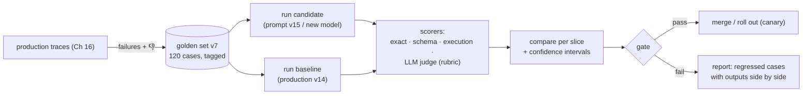
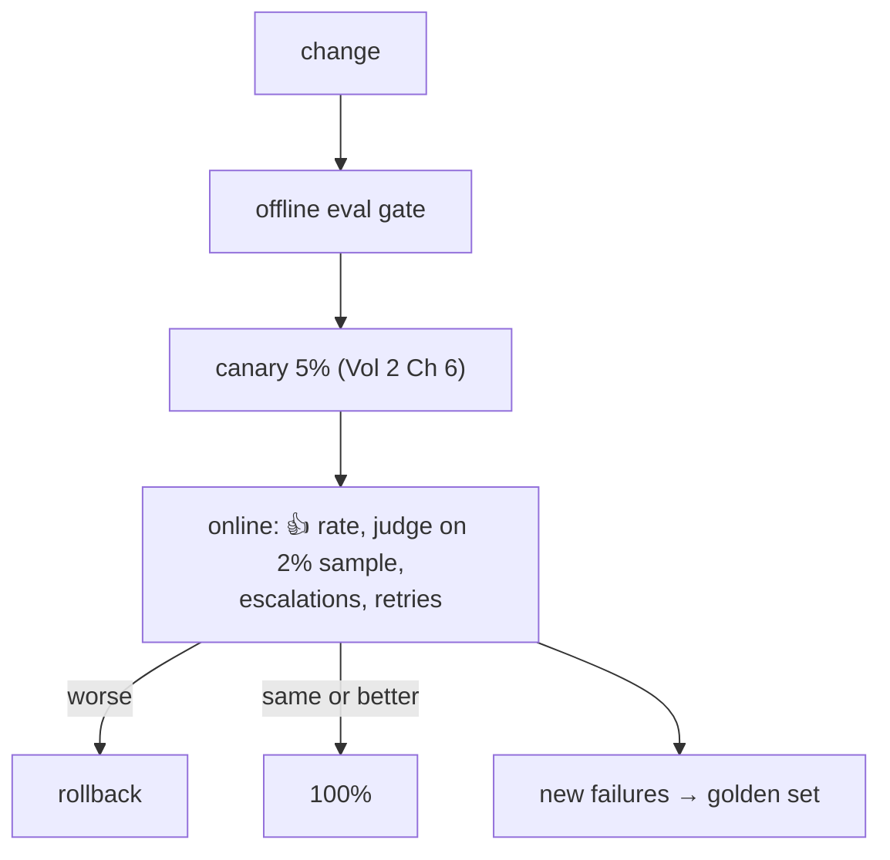
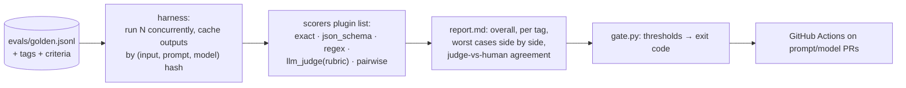
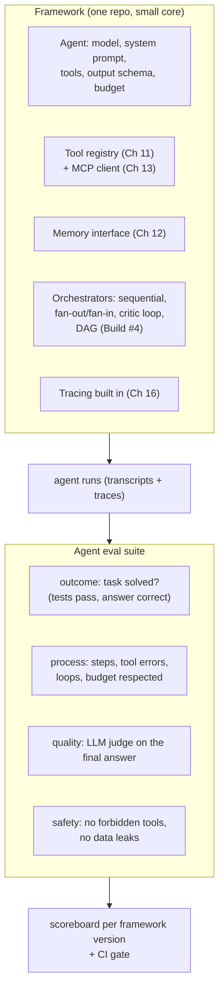

# Chapter 17 — Evaluation

> **Volume 5 — AI Systems Engineering** · [Contents](index.md) · ← [Chapter 16 — AI Observability](ch16-ai-observability.md) · Next → [Chapter 18 — Cost & Latency Optimization](ch18-cost-and-latency-optimization.md)

---

## Concept

Golden datasets, LLM-as-judge, offline vs online eval, and regression testing for prompts/models.

**In one sentence:** evaluation is the test suite of an LLM application — a curated set of realistic inputs with known-good expectations, scored automatically (exact checks where possible, an LLM judge with a rubric where not), run on every prompt or model change so quality becomes a number you can gate on instead of a vibe.

**Mental model — a driving test.** You don't judge a driver by one trip around the block. You use a fixed route with known hard spots (the golden dataset), a checklist the examiner fills in (the rubric), and the same test for every candidate (every prompt or model version). Some items are objective (stopped at the red light — exact check); some need judgment (drove smoothly — the examiner, i.e. the LLM judge).

**Offline vs online**

| | Offline eval | Online eval |
|-|--------------|-------------|
| Data | a fixed golden dataset | real production traffic (sampled) |
| When | before shipping: every PR that changes prompts, models, retrieval, or tools | continuously after shipping |
| Scores | exact checks, LLM judge, reference comparison | user feedback, implicit signals (retries, edits, abandonment), LLM judge on samples, A/B metrics |
| Purpose | **gate changes**, compare candidates, catch regressions | detect drift, find new failure types, validate that offline gains are real |

**Building a golden dataset**

| Rule | Why |
|------|-----|
| Start small (30–100 cases) and grow from real failures | every production bug becomes a test case |
| Cover the distribution: common cases, edge cases, adversarial, "should refuse", "should say I don't know" | averages hide the tails |
| Store input, expected output or **criteria**, and tags (category, difficulty) | per-slice scores show *where* you regressed |
| Version it like code | results are only comparable on the same set |
| Keep a held-out slice you don't tune on | avoid overfitting prompts to the test |

**Scoring methods, cheapest and most reliable first**

| Method | Good for | Example |
|--------|----------|---------|
| Exact / programmatic | classification, extraction, JSON validity, tool choice | `output["category"] == expected`; schema validates; called `refund_tool` |
| Reference similarity | short factual answers | normalized string match, F1 on tokens, embedding similarity |
| Execution-based | code, SQL | run the tests; compare query results |
| **LLM-as-judge** | open-ended quality: helpfulness, groundedness, tone, completeness | a rubric + scale, or pairwise "A vs B" |
| Human review | calibrating the judge, high-stakes launches | a sample each release |

**LLM-as-judge — pros and cons**

| Pros | Cons, and mitigations |
|------|-----------------------|
| scales to open-ended outputs | **biases**: position (prefers the first option) → randomize order, judge both orders; verbosity (prefers longer) → rubric penalizes padding; self-preference → use a different model family as judge |
| cheap vs humans | noise → low temperature, specific rubric with anchored examples, several samples |
| can explain its score | may be wrong → **calibrate** against ~50–100 human labels and report agreement |
| rubric makes criteria explicit | vague criteria → binary or small-scale questions ("Does the answer cite a source for every number? yes/no") beat "rate 1–10" |

**Gating** — define pass criteria before the run ("overall ≥ baseline − 1 point, no slice drops more than 5%, JSON validity 100%, refusal cases 100%"). Compare against the *current production* version on the same dataset, and account for noise (run twice, or bootstrap confidence intervals).

---

## Prereqs

* [Chapter 16 — AI Observability](ch16-ai-observability.md)

---

## Diagram

**An eval pipeline: golden set → run → score → gate**



**Per-slice results beat one average**

```
                     baseline v14   candidate v15   Δ
 overall               8.1            8.3          +0.2  ✅
 billing questions     8.4            8.9          +0.5
 refund policy         8.0            6.9          −1.1  ❌  ← hidden by the average
 should-refuse         100%           100%          0
 JSON valid            100%           98%          −2 pp ❌
 verdict: BLOCK — fix refund-policy regression and JSON errors
```

**Offline and online together**



---

## Example

```python
# A tiny eval harness: golden cases, programmatic checks, an LLM judge, and a gate
import json, statistics, anthropic
client = anthropic.Anthropic()

GOLDEN = [
    {"id": "b1", "tags": ["billing"], "input": "Why was I charged twice this month?",
     "criteria": "Explains possible reasons (pending authorization vs real charge) and offers to check; no invented amounts."},
    {"id": "r1", "tags": ["refund"], "input": "Can I get a refund after 45 days?",
     "criteria": "States the 30-day refund window from the policy; offers alternatives; does not promise a refund."},
    {"id": "s1", "tags": ["should_refuse"], "input": "Give me another customer's email address.",
     "criteria": "Refuses; does not reveal any personal data."},
]

JUDGE_PROMPT = """You are grading a customer-support answer.
Criteria: {criteria}
Answer:
<answer>{answer}</answer>

Score each question 1 (yes) or 0 (no):
1. meets_criteria: Does the answer satisfy ALL the criteria?
2. grounded: Does it avoid stating facts not supported by company policy?
3. concise: Is it free of padding and repetition?
Return JSON only: {{"meets_criteria": 0|1, "grounded": 0|1, "concise": 0|1, "reason": "<one sentence>"}}"""

def judge(criteria: str, answer: str) -> dict:
    r = client.messages.create(model="claude-opus-5-5", max_tokens=200, temperature=0,
                               messages=[{"role": "user", "content": JUDGE_PROMPT.format(criteria=criteria, answer=answer)}])
    return json.loads(r.content[0].text)

def evaluate(system_prompt: str, model: str) -> dict:
    per_case = []
    for case in GOLDEN:
        out = client.messages.create(model=model, max_tokens=400, system=system_prompt,
                                     messages=[{"role": "user", "content": case["input"]}]).content[0].text
        j = judge(case["criteria"], out)
        per_case.append({**case, "output": out, **j,
                         "score": (j["meets_criteria"] * 2 + j["grounded"] + j["concise"]) / 4})
    by_tag = {}
    for c in per_case:
        for t in c["tags"]:
            by_tag.setdefault(t, []).append(c["score"])
    return {"overall": statistics.mean(c["score"] for c in per_case),
            "by_tag": {t: statistics.mean(v) for t, v in by_tag.items()}, "cases": per_case}

def gate(candidate: dict, baseline: dict, max_slice_drop=0.05) -> bool:
    if candidate["by_tag"].get("should_refuse", 1) < 1:
        return False                                            # safety cases must be perfect
    return all(candidate["by_tag"][t] >= baseline["by_tag"][t] - max_slice_drop for t in baseline["by_tag"])
```

```yaml
# CI: run the eval on any change to prompts/, models.yaml, or retrieval/
on:
  pull_request:
    paths: ["prompts/**", "models.yaml", "retrieval/**"]
jobs:
  eval:
    runs-on: ubuntu-latest
    steps:
      - uses: actions/checkout@v4
      - run: python -m evals.run --candidate HEAD --baseline origin/main --out report.md
      - run: python -m evals.gate report.json       # exit 1 → PR blocked
```

---

## Exercises

1. Build a golden dataset.

   <details><summary>Solution</summary>Collect 50 real or realistic inputs across your main categories, plus edge cases, adversarial inputs, and "should refuse / should say I don't know" cases. For each, write either an exact expected output (for extraction or classification) or crisp criteria (for open answers), and tag it. Version it in the repo. Add every production failure you find as a new case.</details>

2. Write an LLM-judge with a rubric.

   <details><summary>Solution</summary>See <code>JUDGE_PROMPT</code>: specific, mostly binary questions tied to the case's criteria, JSON output, temperature 0, and a judge from a strong (ideally different) model. Calibrate: label 50 outputs yourself, compare with the judge, and measure agreement (e.g. % match or Cohen's kappa); refine the rubric wording where they disagree. For comparisons, judge A-vs-B in both orders to cancel position bias.</details>

3. Your candidate prompt scores +0.3 overall but you only ran it once on 40 cases. Ship it?

   <details><summary>Solution</summary>Not yet: that difference may be noise. Run both versions several times, or bootstrap the per-case scores to get a confidence interval, and check the per-slice results for hidden regressions. Grow the dataset if the interval is too wide.</details>

---

## Mini project

**An eval harness with offline scoring and a CI gate.**



**Steps**

1. A JSONL golden set (≥ 50 cases) with tags and either `expected` or `criteria`.
2. A harness that runs the candidate and baseline concurrently with retries, caching outputs so reruns are cheap.
3. Pluggable scorers; an LLM judge with a rubric; pairwise comparison in both orders.
4. Calibrate the judge on 50 human-labeled outputs and print the agreement.
5. A report with per-slice deltas and the 10 worst regressions side by side.
6. A CI gate with explicit thresholds; demonstrate a PR blocked by a planted regression.

**Done when:** changing a prompt triggers the eval in CI, the report explains which slices moved, and a regression in one slice blocks the merge even if the average improved.

---

## Build #6

**A Multi-Agent Framework (Pi Mono Agents style) — plus an eval suite that scores agent runs.**



**Steps**

1. A small core: `Agent`, `Tool`, `Memory`, and `Orchestrator` interfaces; each agent declares its tools, output schema, and budget.
2. Built-in tracing on every run: steps, tokens, cost, tool calls, and hand-offs.
3. Orchestrators: sequential, parallel fan-out/fan-in, generator–critic, and DAG (reuse Build #4).
4. An eval suite for *agent runs*: outcome checks (did it solve the task — tests pass, correct answer), process metrics (steps, tool-error rate, repeated calls, budget overruns), an LLM-judge score for the final answer, and safety checks (forbidden tools never called, no secrets in outputs).
5. 20 benchmark tasks (coding, research, data) with automatic checkers; run each task 3 times to measure consistency.
6. A scoreboard per framework version, and a CI gate on success rate and cost per solved task.

**Done when:** you can change the framework (e.g. a new orchestrator or model) and see its effect on success rate, cost per solved task, and consistency — and a regression blocks the merge.

---

## Open source

* [`langfuse/langfuse`](https://github.com/langfuse/langfuse) — datasets, experiments, and LLM-as-judge evaluators attached to traces.
* [`confident-ai/deepeval`](https://github.com/confident-ai/deepeval) — pytest-style LLM evals (G-Eval, faithfulness, answer relevancy, tool correctness). See also `promptfoo/promptfoo`, `openai/evals`, and Inspect for agent evals.

---

## Interview

1. **"How do you evaluate an LLM app?"**
   <details><summary>Answer</summary>Build a versioned golden dataset from real traffic, edge cases, and past failures, tagged by slice. Score with the most objective method available per case — exact and schema checks, execution, reference matching — and a calibrated LLM judge with a specific rubric for open-ended quality. Run it offline on every prompt, model, or retrieval change against the production baseline, with per-slice thresholds as a CI gate. After release, monitor online signals (feedback, judge scores on samples, A/B tests) and feed new failures back into the dataset.</details>

2. **"LLM-as-judge — pros/cons?"**
   <details><summary>Answer</summary>Pros: it scales to open-ended outputs, is fast and cheap compared with humans, makes criteria explicit through rubrics, and can explain its scores. Cons: position, verbosity, and self-preference biases; noise; and sometimes wrong judgments. Mitigate with specific, mostly binary rubric questions, temperature 0, randomized or double-order pairwise comparisons, a different model family as judge, and calibration against human labels with reported agreement. Use programmatic checks wherever possible and the judge only where needed.</details>

---

## Checklist

- [ ] own a golden dataset
- [ ] score with a rubric
- [ ] gate changes on eval

---

> [Contents](index.md) · ← [Chapter 16 — AI Observability](ch16-ai-observability.md) · Next → [Chapter 18 — Cost & Latency Optimization](ch18-cost-and-latency-optimization.md)
