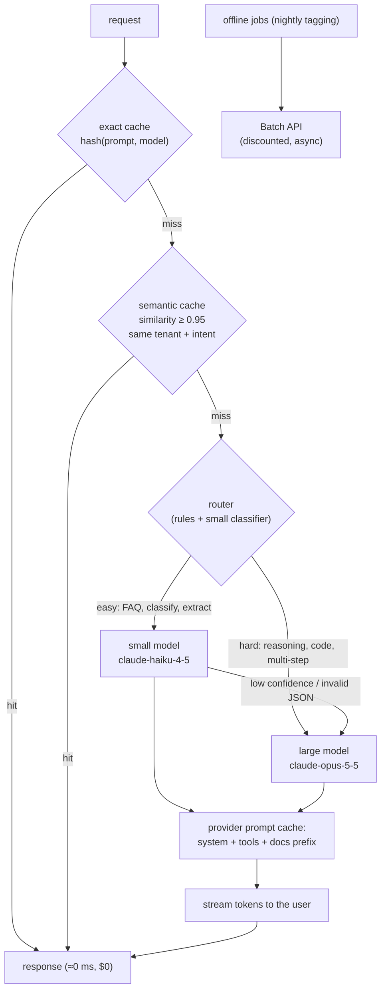
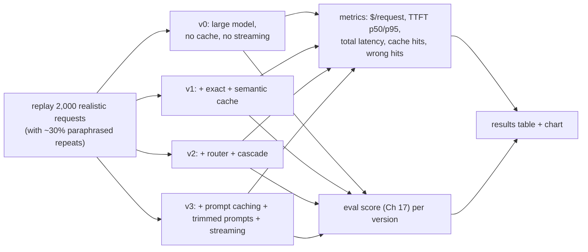

# Chapter 18 — Cost & Latency Optimization

> **Volume 5 — AI Systems Engineering** · [Contents](index.md) · ← [Chapter 17 — Evaluation](ch17-evaluation.md) · Next → [Chapter 19 — AI Security](ch19-ai-security.md)

---

## Concept

Caching (semantic + exact), batching, streaming, model routing, and reducing tokens.

**In one sentence:** you make LLM apps cheaper and faster by not calling the model when you don't have to (caching), sending fewer tokens when you do (prompt trimming and prompt caching), sending easy work to small models (routing), doing work in bulk (batching), and showing output as soon as it exists (streaming) — each verified against your evals so quality doesn't silently drop.

**Mental model — a busy café.** Pre-made popular drinks sit ready on the counter (cache). Simple orders go to the junior barista; complex ones to the head barista (routing). Ten identical orders are made in one go (batching). You hand over the coffee while the pastry is still warming (streaming). And you don't read the customer their whole order history before every cup (fewer tokens).

**Where cost and latency come from**

| Driver | Cost | Latency |
|--------|------|---------|
| input tokens | ✓ (per token) | prefill time grows with prompt length |
| **output tokens** | ✓✓ (priced several times higher than input) | decode is sequential: roughly tokens ÷ tokens-per-second |
| model size | bigger = pricier | bigger = slower per token |
| number of calls (agents, chains) | multiplies everything | sequential calls add up |
| network / queueing | — | TTFT under load |

**The toolbox**

| Technique | How | Typical effect | Risk |
|-----------|-----|----------------|------|
| **Exact cache** | key = hash(model, prompt, params) → stored response | 100% saving on repeats | only identical requests hit |
| **Semantic cache** | embed the query; if a past query is similar above a threshold, return its answer | hits paraphrases ("reset password" ≈ "forgot my password") | **wrong answers** on near-but-different queries ("cancel order 12" vs "cancel order 13"); needs a strict threshold and scoping |
| **Prompt caching** (provider-side) | mark a stable prefix (system prompt, tools, documents) as cacheable; later calls reuse it | cached input tokens cost a fraction and prefill is faster | the prefix must be byte-identical; put variable content last |
| **Model routing** | a cheap classifier or rules send easy requests to a small model, hard ones to a large model | often 50–80% cost reduction | misroutes → quality loss; monitor per route |
| Cascade | try the small model; escalate if confidence or validation fails | quality of the large model at a lower average cost | extra latency on escalations |
| **Batching** | offline: batch APIs (large discount, results within hours); self-hosted: continuous batching in vLLM ([Ch 4](ch04-inference-and-serving.md)) | throughput ↑, cost per token ↓ | batch APIs aren't real-time |
| **Streaming** | send tokens as they're generated | perceived latency ↓ dramatically (TTFT matters) | none — just do it for user-facing text |
| Token reduction | shorter system prompts, fewer and shorter examples, trimmed retrieved chunks, summarize history ([Ch 12](ch12-agent-memory.md)), ask for concise output, set `max_tokens` | linear savings | too aggressive → lost context |
| Parallelize | independent calls concurrently (`asyncio.gather`) | latency = the slowest call, not the sum | rate limits |
| Structured, short outputs | JSON with only needed fields | fewer output tokens | — |

**Measure first** — use the traces from [Ch 16](ch16-ai-observability.md): cost per request by route, tokens per step, cache hit rates, TTFT and total latency. Optimize the biggest line item, and re-run the eval ([Ch 17](ch17-evaluation.md)) after each change.

---

## Prereqs

* [Chapter 16 — AI Observability](ch16-ai-observability.md)

---

## Diagram

**A request path with cache hits, batching, and a small/large model router**



**Before and after (example numbers from one workload)**

```
                         before      after       change
 requests/day            100,000     100,000
 exact + semantic hits   0%          28%
 routed to small model   0%          55% of misses
 avg input tokens        6,200       2,900       prompt trimmed + cached prefix
 avg output tokens       480         260         "answer in ≤ 120 words"
 p50 TTFT                1.9 s       0.6 s       streaming + smaller model
 cost/day                $1,420      $310        −78%
 eval score              8.4         8.3         within the noise band ✅
```

**Semantic cache danger zone**

```
 cached query: "cancel order 1234"          similarity to new query
 new: "please cancel order #1234"           0.97 → hit ✓ (same intent, same entity)
 new: "cancel order 1235"                   0.96 → WRONG hit ✗ — must key on entities too
 new: "how do I cancel an order?"           0.88 → miss ✓
```

---

## Example

```python
import hashlib, json, anthropic, numpy as np
client = anthropic.Anthropic()

# 1) Exact cache
EXACT: dict[str, str] = {}
def exact_key(model, system, user): return hashlib.sha256(json.dumps([model, system, user]).encode()).hexdigest()

# 2) Semantic cache — scoped by tenant, only for "static" intents, strict threshold
class SemanticCache:
    def __init__(self, embed, threshold=0.95):
        self.embed, self.threshold, self.items = embed, threshold, []   # (tenant, vector, answer)
    def get(self, tenant, query):
        q = self.embed(query)
        best = max(((float(q @ v), a) for t, v, a in self.items if t == tenant), default=(0, None))
        return best[1] if best[0] >= self.threshold else None
    def put(self, tenant, query, answer):
        self.items.append((tenant, self.embed(query), answer))

# 3) Router: rules first, then a cheap classifier call
def route(user_msg: str) -> str:
    if len(user_msg) < 200 and any(k in user_msg.lower() for k in ("opening hours", "price", "reset password")):
        return "claude-haiku-4-5-20251001"
    verdict = client.messages.create(model="claude-haiku-4-5-20251001", max_tokens=5,
        messages=[{"role": "user", "content": f"Answer EASY or HARD only. Is this request simple FAQ/lookup (EASY) or multi-step reasoning/code (HARD)?\n\n{user_msg}"}])
    return "claude-opus-5-5" if "HARD" in verdict.content[0].text else "claude-haiku-4-5-20251001"

# 4) Provider prompt caching: mark the large, stable prefix as cacheable
POLICY_DOC = open("policy.md").read()          # thousands of tokens, identical every call
def answer(user_msg: str, tenant="t1", sem: SemanticCache | None = None) -> str:
    key = exact_key("any", "support-v14", user_msg)
    if key in EXACT: return EXACT[key]
    if sem and (hit := sem.get(tenant, user_msg)): return hit
    model = route(user_msg)
    with client.messages.stream(
        model=model, max_tokens=400,
        system=[{"type": "text", "text": "You are a concise support agent. Answer in at most 120 words."},
                {"type": "text", "text": POLICY_DOC, "cache_control": {"type": "ephemeral"}}],
        messages=[{"role": "user", "content": user_msg}],
    ) as stream:
        text = "".join(stream.text_stream)        # in a UI, forward each chunk as it arrives
    EXACT[key] = text
    if sem: sem.put(tenant, user_msg, text)
    return text
```

```python
# Offline work → the Message Batches API (asynchronous, discounted)
batch = client.messages.batches.create(requests=[
    {"custom_id": f"doc-{i}", "params": {"model": "claude-haiku-4-5-20251001", "max_tokens": 50,
     "messages": [{"role": "user", "content": f"Classify the sentiment: {t}"}]}}
    for i, t in enumerate(reviews)])
# poll client.messages.batches.retrieve(batch.id); then read results
```

---

## Exercises

1. Add a semantic cache.

   <details><summary>Solution</summary>Embed incoming queries, search past queries for the same tenant, and return the cached answer only above a strict threshold (tune it on labeled pairs of "same" vs "different" questions). Restrict it to intents whose answers don't depend on user-specific or changing data, include extracted entities (order IDs, dates) in the key, and set a TTL. Measure hit rate <i>and</i> wrong-hit rate on a test set.</details>

2. Build a model router by task difficulty.

   <details><summary>Solution</summary>Start with rules for obvious cases, then a cheap classifier (a small model with a one-word answer, or a trained logistic regression on embeddings). Label ~200 historical requests with which model is <i>needed</i> (run both, judge the outputs), and tune the router for high recall on HARD. Add a cascade: if the small model's output fails validation, retry on the large model. Report cost and eval score per route.</details>

3. Your system prompt is 4,000 tokens and changes every request because it includes the current timestamp at the top. What's the problem?

   <details><summary>Solution</summary>Provider prompt caching needs an identical prefix, so a timestamp at the start breaks every cache hit. Move variable content (time, user data) after the stable part, or into the user message.</details>

---

## Mini project

**An optimized pipeline with cache + routing, showing cost/latency before/after.**



**Steps**

1. Build a replayable request set from real or synthetic traffic, including paraphrases and near-miss queries.
2. Measure v0 (baseline) for cost, latency, and eval score.
3. Add each optimization one at a time and re-measure all three.
4. Track semantic-cache wrong hits explicitly; tune the threshold.
5. Produce a table and chart; keep only optimizations that don't drop the eval score beyond the noise band.

**Done when:** you show a large cost and latency reduction with the eval score unchanged within noise, and you can say what each technique contributed.

---

## Open source

* [`zilliztech/GPTCache`](https://github.com/zilliztech/GPTCache) — a semantic cache for LLM responses with pluggable embeddings, stores, and similarity evaluators.
* [`vllm-project/vllm`](https://github.com/vllm-project/vllm) (batching) — continuous batching, PagedAttention, and automatic prefix caching for self-hosted serving. See also `lm-sys/RouteLLM` for learned model routing.

---

## Interview

1. **"How do you cut LLM cost without hurting quality?"**
   <details><summary>Answer</summary>Measure cost per route first. Then: cache exact and (carefully) semantic repeats; use provider prompt caching for stable prefixes; trim prompts, examples, and retrieved context; cap and shorten outputs; route easy requests to smaller models with a cascade fallback; use batch APIs for offline work; cut unnecessary agent steps. Re-run the eval suite after each change and ship only changes whose quality stays within the noise band.</details>

2. **"Semantic vs exact cache?"**
   <details><summary>Answer</summary>An exact cache keys on the exact request, so it's always correct but hits only identical requests. A semantic cache matches by embedding similarity, so it hits paraphrases, but it can return wrong answers for queries that look similar but differ in an important detail (IDs, dates, negation, user-specific data). Use semantic caching only for stable, non-personalized intents, with strict thresholds, entity-aware keys, tenant scoping, TTLs, and measured false-hit rates.</details>

---

## Checklist

- [ ] cache aggressively
- [ ] route by difficulty
- [ ] stream and batch

---

> [Contents](index.md) · ← [Chapter 17 — Evaluation](ch17-evaluation.md) · Next → [Chapter 19 — AI Security](ch19-ai-security.md)
