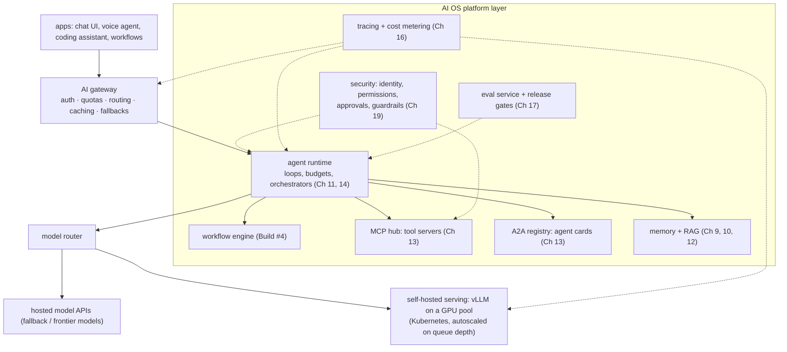
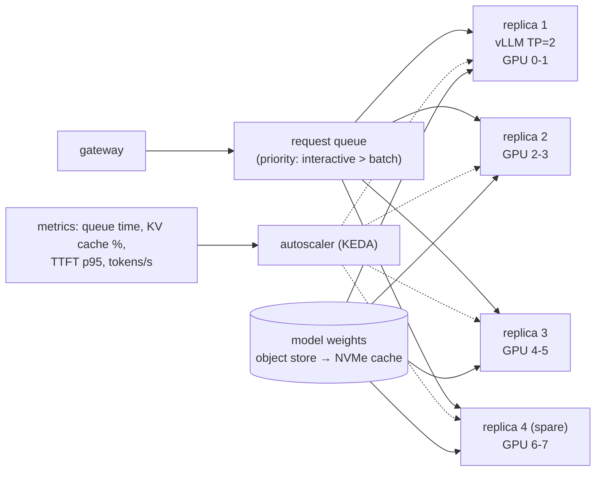
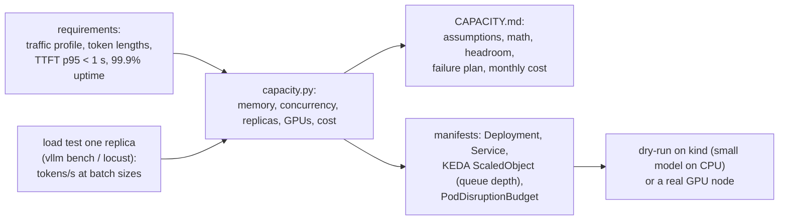
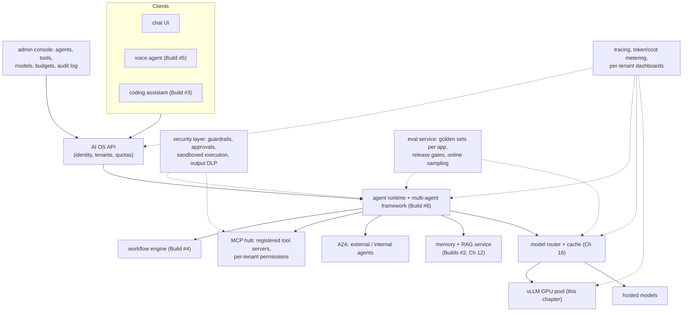

# Chapter 20 — GPU Infrastructure & the AI OS

> **Volume 5 — AI Systems Engineering** · [Contents](index.md) · ← [Chapter 19 — AI Security](ch19-ai-security.md)

---

## Concept

GPU serving infrastructure, model deployment, and integrating every prior chapter into one system.

**In one sentence:** serving models at scale means fitting weights and KV cache into GPU memory, keeping GPUs busy with batching, scaling replicas to demand behind a gateway — and an "AI OS" is the platform layer on top that gives every agent the same models, tools, memory, protocols, observability, evals, and security, the way an operating system gives every program the same CPU, files, and network.

**Mental model — a power plant and a city grid.** GPUs are the power plant: expensive, and wasted if idle. The serving layer (vLLM behind a gateway) is the grid that delivers power where it's needed. The AI OS is the city's utilities: water (models), roads (tools via MCP), mail (A2A), records office (memory), inspectors (evals, security), and meters (observability). Apps — your agents — just plug in.

**GPU memory: what has to fit**

| Item | Formula (rough) | 70B model example |
|------|-----------------|-------------------|
| Weights | parameters × bytes per parameter | FP16: 140 GB · FP8: 70 GB · INT4: ~35–40 GB |
| KV cache per token | 2 (K and V) × layers × KV heads × head dim × bytes | 80 × 2 × 8 × 128 × 2 B ≈ **0.31 MiB/token** (FP16 KV, grouped-query attention) |
| KV cache per sequence | per-token × context length | 1,800 tokens ≈ 0.59 GB |
| Activations, CUDA graphs, overhead | ~5–10% of memory | |

**Sizing a serving workload (worked example — estimates; validate with a real benchmark)**

```
 workload: peak 20 requests/s, avg 1,500 input + 300 output tokens
 model: 70B, FP8 weights, on 2 × H100 80 GB per replica (tensor parallel = 2)

 memory per replica:  160 GB × 0.9 usable = 144 GB − 70 GB weights = ~74 GB for KV cache
 KV per sequence:     0.3125 MiB × 1,800 tokens ≈ 0.59 GB → ~125 concurrent sequences per replica

 concurrency needed (Little's law): arrival rate × time in system
   decode ~30 tok/s per sequence → 300 tokens ≈ 10 s, + ~0.5 s prefill → ~10.5 s
   20 req/s × 10.5 s ≈ 210 concurrent sequences

 replicas: 210 ÷ (125 × 0.7 target utilization) ≈ 2.4 → 3 replicas, + 1 for failover/rollouts = 4
 GPUs: 4 replicas × 2 = 8 × H100
```

(Throughput per sequence and batch limits depend on the model, GPU, and engine — measure tokens/s at your target latency with a load test before buying.)

**Serving stack**

| Layer | Job | Tools |
|-------|-----|-------|
| Inference engine | continuous batching, PagedAttention, prefix caching, quantization, tensor parallelism, speculative decoding ([Ch 4](ch04-inference-and-serving.md), [Ch 5](ch05-quantization-and-efficiency.md)) | vLLM, SGLang, TensorRT-LLM, TGI |
| Model gateway | one API for many models (self-hosted + providers); auth, quotas, routing, fallbacks, caching ([Ch 18](ch18-cost-and-latency-optimization.md)) | LiteLLM, Envoy AI Gateway, custom |
| Orchestration | schedule GPU pods, health checks, rollouts | Kubernetes + NVIDIA GPU Operator, KServe, Ray Serve |
| Autoscaling | scale on queue depth / KV-cache usage / TTFT, not CPU | KEDA, HPA with custom metrics |
| Model storage | fast loading of big weights | object storage + local NVMe cache, pre-pulled images |

**Deployment practices** — pin model versions and engine images; warm up replicas before they take traffic (loading 70 GB takes minutes); canary new models with evals as the gate ([Ch 17](ch17-evaluation.md)); keep a fallback provider for overload; separate interactive and batch traffic (priority queues); watch GPU utilization, KV-cache usage, queue time, TTFT, and tokens/s.

**What is an "AI OS"?** Not a kernel — a platform layer that provides shared, governed services to every AI application:

| OS concept | AI OS equivalent | Chapter |
|------------|------------------|---------|
| CPU scheduler | model gateway + GPU serving + routing | 4, 18, 20 |
| processes | agents with budgets and permissions | 11, 14 |
| system calls / drivers | tools via **MCP** | 13 |
| inter-process communication | **A2A** between agents; workflow engine | 13, 14 |
| file system / memory | agent memory + RAG + vector stores | 9, 10, 12 |
| permissions | identity, tool allow-lists, approvals, guardrails | 8, 19 |
| logs / `top` | tracing, token and cost metering | 16 |
| test suite / CI | evals and release gates | 17 |

---

## Prereqs

* [Chapter 4 — Inference & Serving](ch04-inference-and-serving.md)
* [Chapter 18 — Cost & Latency Optimization](ch18-cost-and-latency-optimization.md)
* [Vol 4 — High-Level Design](../volume-4-high-level-design/index.md)

---

## Diagram

**A full AI platform architecture**



**The GPU pool**



**Where GPU memory goes (one replica, 2 × 80 GB)**

```
 ┌──────────────────── 160 GB ─────────────────────────────────────────────┐
 │ weights FP8 70 GB          │ KV cache ~74 GB (≈125 × 1.8k-token seqs) │▒│
 └────────────────────────────┴──────────────────────────────────────────┴─┘
                                                           reserve ~10% ─┘
```

---

## Example

```bash
# vLLM with an OpenAI-compatible API, tensor parallel over 2 GPUs, FP8, prefix caching
vllm serve meta-llama/Llama-3.3-70B-Instruct \
  --tensor-parallel-size 2 \
  --quantization fp8 \
  --max-model-len 8192 \
  --gpu-memory-utilization 0.90 \
  --enable-prefix-caching \
  --port 8000
```

```yaml
# Kubernetes Deployment (excerpt) for one vLLM replica on 2 GPUs
apiVersion: apps/v1
kind: Deployment
metadata: { name: llm-70b }
spec:
  replicas: 3
  selector: { matchLabels: { app: llm-70b } }
  template:
    metadata: { labels: { app: llm-70b } }
    spec:
      nodeSelector: { nvidia.com/gpu.product: NVIDIA-H100-80GB-HBM3 }
      containers:
        - name: vllm
          image: vllm/vllm-openai:v0.6.3        # pin the engine version
          args: ["--model", "/models/llama-3.3-70b", "--tensor-parallel-size", "2",
                 "--quantization", "fp8", "--gpu-memory-utilization", "0.90",
                 "--enable-prefix-caching"]
          resources: { limits: { nvidia.com/gpu: 2 } }
          ports: [{ containerPort: 8000 }]
          startupProbe:   { httpGet: { path: /health, port: 8000 }, failureThreshold: 60, periodSeconds: 10 }
          readinessProbe: { httpGet: { path: /health, port: 8000 }, periodSeconds: 5 }
          volumeMounts: [{ name: models, mountPath: /models }, { name: shm, mountPath: /dev/shm }]
      volumes:
        - { name: models, persistentVolumeClaim: { claimName: model-cache } }
        - { name: shm, emptyDir: { medium: Memory, sizeLimit: 16Gi } }
```

```python
# The gateway: one API, routed to self-hosted or hosted models, with fallback
import httpx, anthropic
hosted = anthropic.Anthropic()

async def complete(messages, tier: str):
    if tier == "local":
        try:
            async with httpx.AsyncClient(timeout=30) as c:
                r = await c.post("http://llm-70b:8000/v1/chat/completions",
                                 json={"model": "llama-3.3-70b", "messages": messages, "max_tokens": 512})
                r.raise_for_status()
                return r.json()["choices"][0]["message"]["content"]
        except (httpx.HTTPError, httpx.TimeoutException):
            pass                                  # overload or outage → fall back
    r = hosted.messages.create(model="claude-sonnet-5-5", max_tokens=512, messages=messages)
    return r.content[0].text
```

```python
# Capacity math as code (re-run with your measured numbers)
layers, kv_heads, head_dim, kv_bytes = 80, 8, 128, 2
kv_per_token = 2 * layers * kv_heads * head_dim * kv_bytes               # 327,680 B ≈ 0.31 MiB
free_kv = 2 * 80e9 * 0.90 - 70e9                                         # 74 GB
seqs_per_replica = free_kv / (kv_per_token * 1_800)                      # ≈ 125
concurrency = 20 * (300 / 30 + 0.5)                                      # ≈ 210
print(round(seqs_per_replica), round(concurrency / (seqs_per_replica * 0.7), 1))   # 125 2.4
```

---

## Exercises

1. Size GPU capacity for a serving workload.

   <details><summary>Solution</summary>Follow the worked example: (1) weights = params × bytes for your precision; (2) KV per token from the model config (layers, KV heads, head dim, KV dtype); (3) free memory = GPUs × HBM × utilization − weights; (4) concurrent sequences = free ÷ (KV per token × average context); (5) needed concurrency = arrival rate × average time in system (from measured tokens/s); (6) replicas = needed ÷ (per-replica capacity × target utilization), plus spares. Then load-test one replica to confirm tokens/s and TTFT at that batch size, and adjust.</details>

2. Architect an AI platform end to end.

   <details><summary>Solution</summary>Use the platform diagram: a gateway (auth, quotas, routing, caching, fallback), an agent runtime with budgets and orchestrators, an MCP hub for tools, an A2A registry, memory and RAG with per-user ACLs, security controls (identity, tool permissions, approvals, guardrails), an eval service gating releases, tracing and cost metering everywhere, and a serving layer mixing self-hosted vLLM on autoscaled GPUs with hosted models. State the SLOs (TTFT, availability), tenancy and isolation, and the failure modes (GPU node loss, provider outage, runaway agent).</details>

3. Your GPU utilization is 30% but users see high latency. What could be wrong?

   <details><summary>Solution</summary>Requests may not be batching (a low concurrency limit, a client that sends one request at a time, an engine misconfiguration), the queue may be blocked by very long prompts or outputs (set limits, split interactive and batch traffic), KV-cache memory may be exhausted so sequences get preempted, or time may be going to prefill of long contexts (enable prefix caching). Check queue time, KV-cache usage, and batch size metrics — not just GPU utilization.</details>

---

## Mini project

**A deployment manifest + capacity plan for a serving cluster.**



**Steps**

1. Write `capacity.py`: inputs (model config, precision, GPU type, traffic, token lengths, target utilization) → weights, KV per token, sequences per replica, replicas, GPUs, and monthly cost.
2. Benchmark one replica (a small model is fine if you lack GPUs) to measure tokens/s and TTFT at different concurrencies; feed the numbers back into the plan.
3. Manifests: Deployment with GPU limits, startup and readiness probes, shared memory; Service; KEDA scaling on queue depth or KV-cache usage; PodDisruptionBudget.
4. `CAPACITY.md`: assumptions, math, headroom, what happens when a node dies, and when to scale.

**Done when:** a reviewer can check every number in the plan from stated inputs, and the manifests deploy (at least on kind with a small model).

---

## Build #7

**An AI Operating System — agents, tools, memory, MCP/A2A, observability, eval, and security unified into one platform.**



**Steps**

1. **Kernel services first:** a unified API with identity and tenants; per-tenant quotas and budgets; an audit log of every agent action.
2. **Model layer:** the gateway with routing, caching, and fallback in front of a self-hosted model (vLLM, even a small one) and a hosted model.
3. **Tools and agents:** an MCP hub where tool servers are registered, versioned, and permissioned per tenant; A2A endpoints so platform agents can call and be called by other agents.
4. **Runtime:** reuse Build #6's framework and Build #4's workflow engine as the ways apps run agents; every run gets a budget, a trace, and a permission scope.
5. **Memory:** one memory/RAG service with per-user ACLs, used by all agents.
6. **Security:** guardrails on inputs and outputs, approval gates for sensitive tools, sandboxed code execution, and the red-team suite from Ch 19 in CI.
7. **Observability and evals:** traces and cost for every call across all apps; per-app golden sets; releases of prompts, models, or tools must pass their gates; online sampling watches production.
8. **Port the earlier builds** (coding assistant, voice agent, workflows) onto the platform, so each uses shared services instead of its own copies.
9. Write an architecture document with SLOs, the capacity plan, and failure modes (GPU node loss, provider outage, runaway agent, compromised tool server).

**Done when:** at least three earlier builds run on the platform through the same API; any agent run can be traced end to end with its cost; a new tool can be added via MCP and granted to one tenant without code changes to agents; a failing eval blocks a model or prompt release; the red-team suite passes; and killing a GPU replica or the hosted provider degrades gracefully instead of failing.

---

## Open source

* [`vllm-project/vllm`](https://github.com/vllm-project/vllm) — high-throughput serving: PagedAttention, continuous batching, prefix caching, tensor/pipeline parallelism, and an OpenAI-compatible server; see its docs on benchmarking and distributed serving.
* [`kubernetes/kubernetes`](https://github.com/kubernetes/kubernetes) (orchestration) — with the NVIDIA GPU Operator, KServe or Ray Serve for model serving, KEDA for event-driven autoscaling, and LiteLLM or Envoy AI Gateway as the model gateway.

---

## Interview

1. **"How do you serve models on GPUs at scale?"**
   <details><summary>Answer</summary>Start from the math: weights plus KV cache must fit in GPU memory, which sets the precision (FP8/INT4), the tensor parallelism, and the concurrent sequences per replica. Use an engine with continuous batching, PagedAttention, and prefix caching (vLLM, SGLang, TensorRT-LLM). Put replicas behind a gateway with queueing, priorities, routing, and fallback; autoscale on queue depth, KV-cache usage, or TTFT rather than CPU; warm up replicas before traffic; canary new models behind eval gates; and monitor TTFT, tokens/s, queue time, and cost per token. Size capacity with Little's law and a load test, plus failover headroom.</details>

2. **"What is an 'AI OS'?"**
   <details><summary>Answer</summary>A platform layer that gives every AI application shared, governed services — like an operating system gives programs CPU scheduling, file systems, IPC, and permissions. Here that means model access and routing on GPU and hosted backends, an agent runtime with budgets, tools via MCP, agent-to-agent communication via A2A, memory and RAG with access control, security controls (guardrails, approvals, sandboxes), observability with cost metering, and evals that gate releases. Teams build agents on it instead of re-implementing all of that per app.</details>

---

## Checklist

- [ ] size GPU capacity
- [ ] deploy a serving cluster
- [ ] integrate all subsystems into one coherent platform

---

> [Contents](index.md) · ← [Chapter 19 — AI Security](ch19-ai-security.md)
